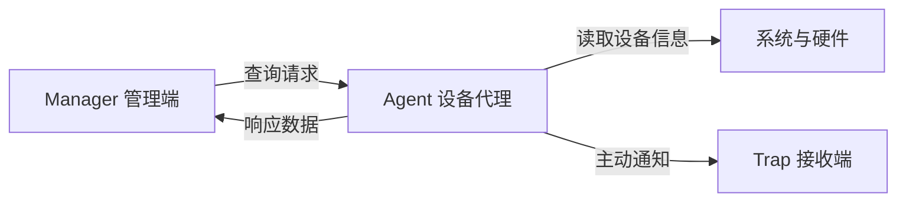

# SNMP 的 Manager 与 Agent

SNMP 通过管理端与设备代理协作读取和上报管理信息。

## 核心要点

- Manager 负责发起查询、保存数据、判断阈值和生成告警。
- Agent 运行在设备侧，暴露设备允许读取的管理对象。
- GET 是 Manager 请求、Agent 响应。
- Trap 是 Agent 主动向接收端发送事件。

---

## 本章测验

本章共 5 道单项选择题。

### 第 1 题

SNMP Manager 位于哪一侧并承担什么角色？

- A. 位于设备侧，只负责写日志
- B. 位于监控侧，负责查询、保存数据和判断阈值
- C. 位于防火墙侧，只转发 TCP
- D. 位于用户终端，只显示网页

选择完成后展开答案

正确答案：B. 位于监控侧，负责查询、保存数据和判断阈值

答案解析：Manager 是管理端，负责调度查询、处理结果和触发监控逻辑。

### 第 2 题

一次 SNMP GET 的基本交互顺序是什么？

- A. Agent 先要求 Manager 写配置
- B. 日志服务器先发 Trap
- C. Manager 只等待设备主动消息
- D. Manager 发请求，Agent 读取对象并返回响应

选择完成后展开答案

正确答案：D. Manager 发请求，Agent 读取对象并返回响应

答案解析：GET 是典型的请求响应流程，由 Manager 主动向设备 Agent 发起。

### 第 3 题

Agent 的主要职责是什么？

- A. 在设备侧暴露并读取允许访问的管理对象
- B. 替代所有监控存储
- C. 执行完整业务交易
- D. 保证网络永不丢包

选择完成后展开答案

正确答案：A. 在设备侧暴露并读取允许访问的管理对象

答案解析：Agent 将设备内部状态映射为可访问的 SNMP 对象，但只覆盖设备实现并授权的范围。

### 第 4 题

同一平台既要轮询指标又要接收事件，应如何理解组件关系？

- A. 必须使用同一个进程和端口
- B. Agent 应部署在监控端
- C. Manager 与 Trap 接收器可以是同平台的不同组件
- D. 无需任何事件关联

选择完成后展开答案

正确答案：C. Manager 与 Trap 接收器可以是同平台的不同组件

答案解析：查询调度与 Trap 接收职责不同，可以在一个平台中分别实现再汇总。

### 第 5 题

哪种说法错误地夸大了 Agent 能力？

- A. Agent 只能暴露已实现对象
- B. 设备内部存在的任何信息都必然可由 Manager 读取
- C. 访问还受授权限制
- D. 私有对象可能依赖厂商 MIB

选择完成后展开答案

正确答案：B. 设备内部存在的任何信息都必然可由 Manager 读取

答案解析：Agent 不会自动公开设备的一切，实际可见性由实现、MIB 和权限共同决定。

<!-- QUIZ_DATA_START
{
  "chapter": "06",
  "questions": [
    {
      "id": 1,
      "question": "SNMP Manager 位于哪一侧并承担什么角色？",
      "options": {
        "A": "位于设备侧，只负责写日志",
        "B": "位于监控侧，负责查询、保存数据和判断阈值",
        "C": "位于防火墙侧，只转发 TCP",
        "D": "位于用户终端，只显示网页"
      },
      "answer": "B",
      "explanation": "Manager 是管理端，负责调度查询、处理结果和触发监控逻辑。"
    },
    {
      "id": 2,
      "question": "一次 SNMP GET 的基本交互顺序是什么？",
      "options": {
        "A": "Agent 先要求 Manager 写配置",
        "B": "日志服务器先发 Trap",
        "C": "Manager 只等待设备主动消息",
        "D": "Manager 发请求，Agent 读取对象并返回响应"
      },
      "answer": "D",
      "explanation": "GET 是典型的请求响应流程，由 Manager 主动向设备 Agent 发起。"
    },
    {
      "id": 3,
      "question": "Agent 的主要职责是什么？",
      "options": {
        "A": "在设备侧暴露并读取允许访问的管理对象",
        "B": "替代所有监控存储",
        "C": "执行完整业务交易",
        "D": "保证网络永不丢包"
      },
      "answer": "A",
      "explanation": "Agent 将设备内部状态映射为可访问的 SNMP 对象，但只覆盖设备实现并授权的范围。"
    },
    {
      "id": 4,
      "question": "同一平台既要轮询指标又要接收事件，应如何理解组件关系？",
      "options": {
        "A": "必须使用同一个进程和端口",
        "B": "Agent 应部署在监控端",
        "C": "Manager 与 Trap 接收器可以是同平台的不同组件",
        "D": "无需任何事件关联"
      },
      "answer": "C",
      "explanation": "查询调度与 Trap 接收职责不同，可以在一个平台中分别实现再汇总。"
    },
    {
      "id": 5,
      "question": "哪种说法错误地夸大了 Agent 能力？",
      "options": {
        "A": "Agent 只能暴露已实现对象",
        "B": "设备内部存在的任何信息都必然可由 Manager 读取",
        "C": "访问还受授权限制",
        "D": "私有对象可能依赖厂商 MIB"
      },
      "answer": "B",
      "explanation": "Agent 不会自动公开设备的一切，实际可见性由实现、MIB 和权限共同决定。"
    }
  ]
}
QUIZ_DATA_END -->
