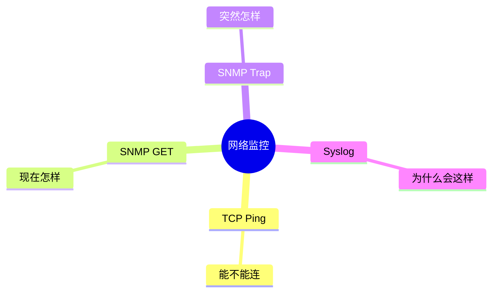

# 总结与延伸思考

一句话：四种方式各自回答一个问题，组合起来构成完整监控体系。

```mermaid
mindmap
  root((网络监控))
    TCP Ping
      能不能连
    SNMP GET
      现在怎样
    SNMP Trap
      突然怎样
    Syslog
      为什么会这样
```

## 核心要点

* TCP Ping 判断连通性
* SNMP GET 采集状态指标
* SNMP Trap 快速发现异常
* Syslog 提供详细原因
* 四者是分工关系 不是替代关系
