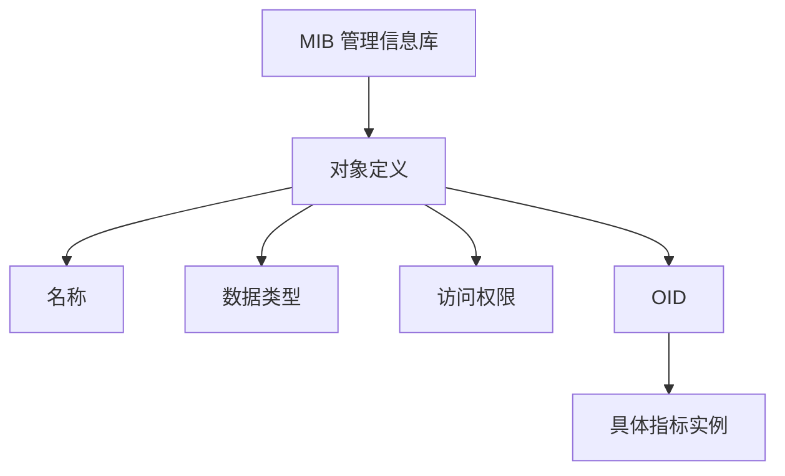

# MIB 与 OID

MIB 描述管理对象，OID 在树形命名空间中唯一定位对象。

## 核心要点

- MIB 是管理对象的定义集合，不是设备指标的历史数据库。
- OID 是层级化数字标识，用来定位管理对象。
- 对象定义还包含数据类型、访问方式与语义说明。
- 厂商私有 MIB 可扩展温度、电源和设备专有状态。

---

## 本章测验

本章共 5 道单项选择题。

### 第 1 题

MIB 最准确的定位是什么？

- A. 指标历史数据库
- B. 管理对象的定义集合或数据字典
- C. TCP 连接表的唯一名称
- D. 日志接收队列

选择完成后展开答案

正确答案：B. 管理对象的定义集合或数据字典

答案解析：MIB 描述对象名称、类型、访问方式和语义，不负责保存每次采集的历史值。

### 第 2 题

从定义到具体指标实例的关系是什么？

- A. OID 定义日志，MIB 建立 TCP
- B. 索引替代所有权限
- C. 时序库生成设备 MIB
- D. MIB 定义对象，OID 定位对象，索引可定位具体实例

选择完成后展开答案

正确答案：D. MIB 定义对象，OID 定位对象，索引可定位具体实例

答案解析：对象定义提供语义，OID 提供层级地址，表索引进一步定位接口等实例。

### 第 3 题

OID 的主要作用是什么？

- A. 在层级命名空间中标识管理对象
- B. 加密 Syslog 正文
- C. 确认 TCP 三次握手
- D. 自动计算业务成功率

选择完成后展开答案

正确答案：A. 在层级命名空间中标识管理对象

答案解析：OID 是树形结构中的数字标识，用于请求和识别 SNMP 对象。

### 第 4 题

查询到一个数字 OID 和枚举值但无法理解含义，最应先补充什么？

- A. 提高 TCP 超时时间
- B. 关闭 Agent 权限
- C. 对应的 MIB 定义与厂商文档
- D. 删除原始采集值

选择完成后展开答案

正确答案：C. 对应的 MIB 定义与厂商文档

答案解析：正确 MIB 能解释名称、类型、枚举、单位和对象语义。

### 第 5 题

哪种理解混淆了 MIB 与时序数据库？

- A. MIB 描述对象语义
- B. MIB 保存了每分钟采集的全部历史指标
- C. 时序库保存历史数值
- D. 厂商私有 MIB 可扩展专有对象

选择完成后展开答案

正确答案：B. MIB 保存了每分钟采集的全部历史指标

答案解析：历史样本由监控存储保存，MIB 是描述管理对象的定义集合。

<!-- QUIZ_DATA_START
{
  "chapter": "07",
  "questions": [
    {
      "id": 1,
      "question": "MIB 最准确的定位是什么？",
      "options": {
        "A": "指标历史数据库",
        "B": "管理对象的定义集合或数据字典",
        "C": "TCP 连接表的唯一名称",
        "D": "日志接收队列"
      },
      "answer": "B",
      "explanation": "MIB 描述对象名称、类型、访问方式和语义，不负责保存每次采集的历史值。"
    },
    {
      "id": 2,
      "question": "从定义到具体指标实例的关系是什么？",
      "options": {
        "A": "OID 定义日志，MIB 建立 TCP",
        "B": "索引替代所有权限",
        "C": "时序库生成设备 MIB",
        "D": "MIB 定义对象，OID 定位对象，索引可定位具体实例"
      },
      "answer": "D",
      "explanation": "对象定义提供语义，OID 提供层级地址，表索引进一步定位接口等实例。"
    },
    {
      "id": 3,
      "question": "OID 的主要作用是什么？",
      "options": {
        "A": "在层级命名空间中标识管理对象",
        "B": "加密 Syslog 正文",
        "C": "确认 TCP 三次握手",
        "D": "自动计算业务成功率"
      },
      "answer": "A",
      "explanation": "OID 是树形结构中的数字标识，用于请求和识别 SNMP 对象。"
    },
    {
      "id": 4,
      "question": "查询到一个数字 OID 和枚举值但无法理解含义，最应先补充什么？",
      "options": {
        "A": "提高 TCP 超时时间",
        "B": "关闭 Agent 权限",
        "C": "对应的 MIB 定义与厂商文档",
        "D": "删除原始采集值"
      },
      "answer": "C",
      "explanation": "正确 MIB 能解释名称、类型、枚举、单位和对象语义。"
    },
    {
      "id": 5,
      "question": "哪种理解混淆了 MIB 与时序数据库？",
      "options": {
        "A": "MIB 描述对象语义",
        "B": "MIB 保存了每分钟采集的全部历史指标",
        "C": "时序库保存历史数值",
        "D": "厂商私有 MIB 可扩展专有对象"
      },
      "answer": "B",
      "explanation": "历史样本由监控存储保存，MIB 是描述管理对象的定义集合。"
    }
  ]
}
QUIZ_DATA_END -->
