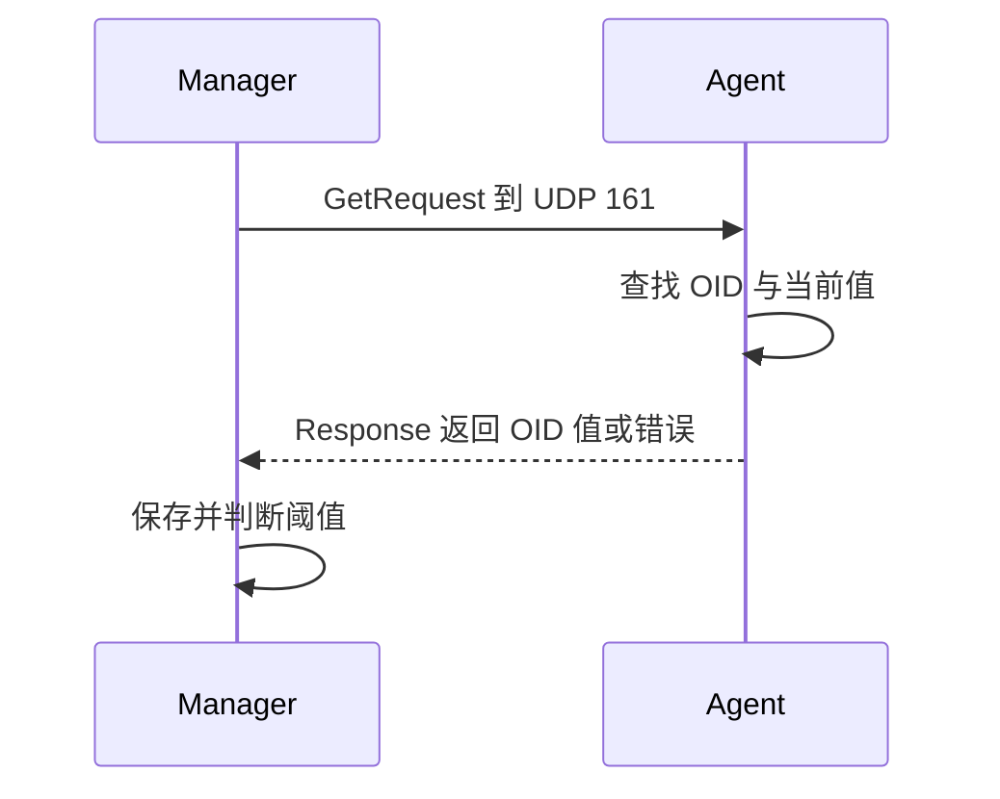

# SNMP GET 请求流程与端口

一次典型查询从 OID 请求开始，以结构化响应结束。

## 核心要点

- SNMP Agent 通常在 UDP 161 接收查询。
- 请求携带一个或多个 OID。
- 响应包含对应值或错误信息。
- UDP 无连接，超时与重试策略由管理端设计。

---

## 本章测验

本章共 5 道单项选择题。

### 第 1 题

SNMP Agent 接收查询的典型端口是什么？

- A. UDP 162
- B. UDP 161
- C. TCP 443
- D. TLS 6514

选择完成后展开答案

正确答案：B. UDP 161

答案解析：UDP 161 是 SNMP 查询的典型 Agent 端口；162 通常用于 Trap 接收。

### 第 2 题

一次 GET 的正确处理顺序是什么？

- A. 先发 Syslog，再建立 HTTP
- B. Agent 先关闭端口，再等待轮询
- C. Manager 只保存请求不处理响应
- D. 发送含 OID 的请求，Agent 查值并响应，Manager 保存并判断

选择完成后展开答案

正确答案：D. 发送含 OID 的请求，Agent 查值并响应，Manager 保存并判断

答案解析：GET 从 OID 请求开始，以响应值或错误结束，随后平台执行存储与阈值逻辑。

### 第 3 题

Manager 的超时与重试策略主要解决什么问题？

- A. UDP 请求或响应可能没有到达
- B. 让设备暴露不存在的 OID
- C. 保证业务交易成功
- D. 替代所有安全控制

选择完成后展开答案

正确答案：A. UDP 请求或响应可能没有到达

答案解析：典型 SNMP 查询使用 UDP，管理端需要有限等待和重试来处理无响应。

### 第 4 题

GET 返回对象不存在错误时，下一步最合理的检查是什么？

- A. 直接认定网络完全中断
- B. 把端口改为 162 发送查询
- C. 核对 OID、设备型号、MIB 和访问权限
- D. 忽略错误并伪造数值

选择完成后展开答案

正确答案：C. 核对 OID、设备型号、MIB 和访问权限

答案解析：对象错误更可能与标识、实现或授权有关，应沿这些环节排查。

### 第 5 题

哪种说法错误？

- A. 响应可能包含值或错误
- B. SNMP 协议会自动完成历史趋势与业务告警设计
- C. 平台负责保存历史数据
- D. 重试过多会增加设备负担

选择完成后展开答案

正确答案：B. SNMP 协议会自动完成历史趋势与业务告警设计

答案解析：SNMP 提供数据交换，趋势计算和告警规则属于监控平台职责。

<!-- QUIZ_DATA_START
{
  "chapter": "08",
  "questions": [
    {
      "id": 1,
      "question": "SNMP Agent 接收查询的典型端口是什么？",
      "options": {
        "A": "UDP 162",
        "B": "UDP 161",
        "C": "TCP 443",
        "D": "TLS 6514"
      },
      "answer": "B",
      "explanation": "UDP 161 是 SNMP 查询的典型 Agent 端口；162 通常用于 Trap 接收。"
    },
    {
      "id": 2,
      "question": "一次 GET 的正确处理顺序是什么？",
      "options": {
        "A": "先发 Syslog，再建立 HTTP",
        "B": "Agent 先关闭端口，再等待轮询",
        "C": "Manager 只保存请求不处理响应",
        "D": "发送含 OID 的请求，Agent 查值并响应，Manager 保存并判断"
      },
      "answer": "D",
      "explanation": "GET 从 OID 请求开始，以响应值或错误结束，随后平台执行存储与阈值逻辑。"
    },
    {
      "id": 3,
      "question": "Manager 的超时与重试策略主要解决什么问题？",
      "options": {
        "A": "UDP 请求或响应可能没有到达",
        "B": "让设备暴露不存在的 OID",
        "C": "保证业务交易成功",
        "D": "替代所有安全控制"
      },
      "answer": "A",
      "explanation": "典型 SNMP 查询使用 UDP，管理端需要有限等待和重试来处理无响应。"
    },
    {
      "id": 4,
      "question": "GET 返回对象不存在错误时，下一步最合理的检查是什么？",
      "options": {
        "A": "直接认定网络完全中断",
        "B": "把端口改为 162 发送查询",
        "C": "核对 OID、设备型号、MIB 和访问权限",
        "D": "忽略错误并伪造数值"
      },
      "answer": "C",
      "explanation": "对象错误更可能与标识、实现或授权有关，应沿这些环节排查。"
    },
    {
      "id": 5,
      "question": "哪种说法错误？",
      "options": {
        "A": "响应可能包含值或错误",
        "B": "SNMP 协议会自动完成历史趋势与业务告警设计",
        "C": "平台负责保存历史数据",
        "D": "重试过多会增加设备负担"
      },
      "answer": "B",
      "explanation": "SNMP 提供数据交换，趋势计算和告警规则属于监控平台职责。"
    }
  ]
}
QUIZ_DATA_END -->
