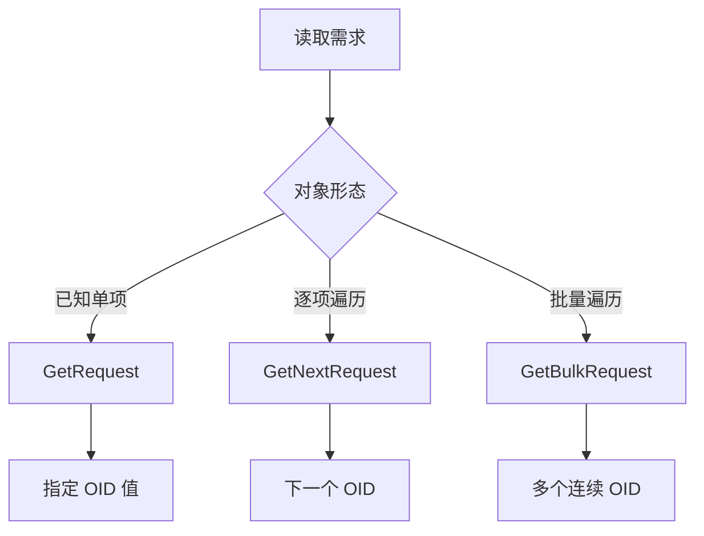

# GetRequest、GetNext 与 GetBulk

根据对象数量与表格结构选择合适的 SNMP 读取操作。

## 核心要点

- GetRequest 读取已知 OID。
- GetNextRequest 获取字典序中的下一个对象，常用于遍历。
- GetBulkRequest 批量取得连续对象，适合较大的表。
- GetBulk 属于 SNMPv2c 及后续版本能力。

---

## 本章测验

本章共 5 道单项选择题。

### 第 1 题

读取一个已知 OID 时最直接使用什么？

- A. GetNextRequest
- B. GetRequest
- C. GetBulkRequest
- D. SNMP Trap

选择完成后展开答案

正确答案：B. GetRequest

答案解析：GetRequest 适合直接读取一个或多个已知对象。

### 第 2 题

遍历较大接口表并减少往返时，通常优先评估什么？

- A. 只重复 GetRequest 单项查询
- B. 改用 TCP Ping 读取表格
- C. 等待 Syslog 自动给出全部指标
- D. GetBulkRequest

选择完成后展开答案

正确答案：D. GetBulkRequest

答案解析：GetBulk 可一次取得多个连续对象，适合批量读取表格。

### 第 3 题

GetNextRequest 的职责是什么？

- A. 返回字典序中的下一个 OID
- B. 确认 Trap 已送达
- C. 建立 TLS 连接
- D. 删除设备表项

选择完成后展开答案

正确答案：A. 返回字典序中的下一个 OID

答案解析：GetNext 沿 OID 树向后移动，可用于逐项遍历。

### 第 4 题

设备只支持 SNMPv1，却配置了 GetBulk，最可能需要怎样调整？

- A. 把 UDP 161 改为 TCP 443
- B. 让 Syslog 返回 OID
- C. 改用 GetNext 等该版本支持的操作
- D. 增加 Community 长度即可

选择完成后展开答案

正确答案：C. 改用 GetNext 等该版本支持的操作

答案解析：GetBulk 属于 SNMPv2c 及后续能力，v1 环境需采用支持的读取方式。

### 第 5 题

关于 GetBulk，哪种理解不正确？

- A. 它能减少往返次数
- B. 批量值越大永远越高效且没有副作用
- C. 响应大小受网络与设备能力影响
- D. 大批量可能增加设备处理压力

选择完成后展开答案

正确答案：B. 批量值越大永远越高效且没有副作用

答案解析：批量参数需要平衡效率、报文大小和设备负载，并非越大越好。

<!-- QUIZ_DATA_START
{
  "chapter": "09",
  "questions": [
    {
      "id": 1,
      "question": "读取一个已知 OID 时最直接使用什么？",
      "options": {
        "A": "GetNextRequest",
        "B": "GetRequest",
        "C": "GetBulkRequest",
        "D": "SNMP Trap"
      },
      "answer": "B",
      "explanation": "GetRequest 适合直接读取一个或多个已知对象。"
    },
    {
      "id": 2,
      "question": "遍历较大接口表并减少往返时，通常优先评估什么？",
      "options": {
        "A": "只重复 GetRequest 单项查询",
        "B": "改用 TCP Ping 读取表格",
        "C": "等待 Syslog 自动给出全部指标",
        "D": "GetBulkRequest"
      },
      "answer": "D",
      "explanation": "GetBulk 可一次取得多个连续对象，适合批量读取表格。"
    },
    {
      "id": 3,
      "question": "GetNextRequest 的职责是什么？",
      "options": {
        "A": "返回字典序中的下一个 OID",
        "B": "确认 Trap 已送达",
        "C": "建立 TLS 连接",
        "D": "删除设备表项"
      },
      "answer": "A",
      "explanation": "GetNext 沿 OID 树向后移动，可用于逐项遍历。"
    },
    {
      "id": 4,
      "question": "设备只支持 SNMPv1，却配置了 GetBulk，最可能需要怎样调整？",
      "options": {
        "A": "把 UDP 161 改为 TCP 443",
        "B": "让 Syslog 返回 OID",
        "C": "改用 GetNext 等该版本支持的操作",
        "D": "增加 Community 长度即可"
      },
      "answer": "C",
      "explanation": "GetBulk 属于 SNMPv2c 及后续能力，v1 环境需采用支持的读取方式。"
    },
    {
      "id": 5,
      "question": "关于 GetBulk，哪种理解不正确？",
      "options": {
        "A": "它能减少往返次数",
        "B": "批量值越大永远越高效且没有副作用",
        "C": "响应大小受网络与设备能力影响",
        "D": "大批量可能增加设备处理压力"
      },
      "answer": "B",
      "explanation": "批量参数需要平衡效率、报文大小和设备负载，并非越大越好。"
    }
  ]
}
QUIZ_DATA_END -->
