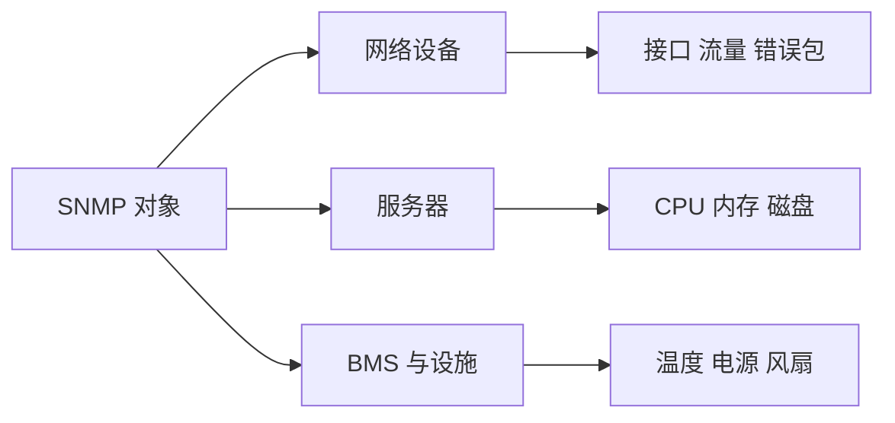

# SNMP 能监控哪些对象

SNMP 的覆盖范围取决于设备实际提供的标准与私有对象。

## 核心要点

- 网络设备常见对象包括接口状态、流量、错误包和运行时间。
- 服务器可在 Agent 支持下暴露 CPU、内存、磁盘与进程信息。
- BMS、UPS 和设施设备可提供温度、电源、风扇等状态。
- 监控系统不能读取设备没有实现或没有授权的对象。

---

## 本章测验

本章共 5 道单项选择题。

### 第 1 题

网络设备通过 SNMP 常提供哪类对象？

- A. 所有用户业务密码
- B. 接口状态、流量与错误包
- C. 完整网页源代码
- D. 未安装应用的内部数据

选择完成后展开答案

正确答案：B. 接口状态、流量与错误包

答案解析：接口、流量、错误包、运行时间和硬件状态是常见网络设备对象。

### 第 2 题

从监控目标到合理采集清单，正确流程是什么？

- A. 无差别读取全部 OID
- B. 先删除厂商 MIB
- C. 只依据对象名称猜单位
- D. 确定运维问题，再选择设备实际提供并授权的对象

选择完成后展开答案

正确答案：D. 确定运维问题，再选择设备实际提供并授权的对象

答案解析：应以运维目标驱动采集，并核对设备实现、权限、单位和语义。

### 第 3 题

BMS 或设施设备的典型 SNMP 对象是什么？

- A. 温度、电源、风扇与控制器状态
- B. 浏览器书签
- C. 代码仓库分支
- D. 用户视频播放进度

选择完成后展开答案

正确答案：A. 温度、电源、风扇与控制器状态

答案解析：设施监控常关注环境、供电和硬件健康状态。

### 第 4 题

同一温度指标在两个厂商设备上 OID 不同，最合理的做法是什么？

- A. 假设所有私有 OID 相同
- B. 放弃记录单位
- C. 按设备型号和 MIB 分别适配监控模板
- D. 用 TCP 延迟替代温度

选择完成后展开答案

正确答案：C. 按设备型号和 MIB 分别适配监控模板

答案解析：厂商私有对象可能不同，需要型号识别和模板映射。

### 第 5 题

哪种说法超出了 SNMP 的能力边界？

- A. 服务器指标依赖 Agent 支持
- B. 监控系统可以读取设备从未实现或授权的任何内部信息
- C. 对象需要单位和业务含义
- D. 采集规模会影响负载

选择完成后展开答案

正确答案：B. 监控系统可以读取设备从未实现或授权的任何内部信息

答案解析：SNMP 只能读取设备实际暴露且允许访问的对象。

<!-- QUIZ_DATA_START
{
  "chapter": "10",
  "questions": [
    {
      "id": 1,
      "question": "网络设备通过 SNMP 常提供哪类对象？",
      "options": {
        "A": "所有用户业务密码",
        "B": "接口状态、流量与错误包",
        "C": "完整网页源代码",
        "D": "未安装应用的内部数据"
      },
      "answer": "B",
      "explanation": "接口、流量、错误包、运行时间和硬件状态是常见网络设备对象。"
    },
    {
      "id": 2,
      "question": "从监控目标到合理采集清单，正确流程是什么？",
      "options": {
        "A": "无差别读取全部 OID",
        "B": "先删除厂商 MIB",
        "C": "只依据对象名称猜单位",
        "D": "确定运维问题，再选择设备实际提供并授权的对象"
      },
      "answer": "D",
      "explanation": "应以运维目标驱动采集，并核对设备实现、权限、单位和语义。"
    },
    {
      "id": 3,
      "question": "BMS 或设施设备的典型 SNMP 对象是什么？",
      "options": {
        "A": "温度、电源、风扇与控制器状态",
        "B": "浏览器书签",
        "C": "代码仓库分支",
        "D": "用户视频播放进度"
      },
      "answer": "A",
      "explanation": "设施监控常关注环境、供电和硬件健康状态。"
    },
    {
      "id": 4,
      "question": "同一温度指标在两个厂商设备上 OID 不同，最合理的做法是什么？",
      "options": {
        "A": "假设所有私有 OID 相同",
        "B": "放弃记录单位",
        "C": "按设备型号和 MIB 分别适配监控模板",
        "D": "用 TCP 延迟替代温度"
      },
      "answer": "C",
      "explanation": "厂商私有对象可能不同，需要型号识别和模板映射。"
    },
    {
      "id": 5,
      "question": "哪种说法超出了 SNMP 的能力边界？",
      "options": {
        "A": "服务器指标依赖 Agent 支持",
        "B": "监控系统可以读取设备从未实现或授权的任何内部信息",
        "C": "对象需要单位和业务含义",
        "D": "采集规模会影响负载"
      },
      "answer": "B",
      "explanation": "SNMP 只能读取设备实际暴露且允许访问的对象。"
    }
  ]
}
QUIZ_DATA_END -->
