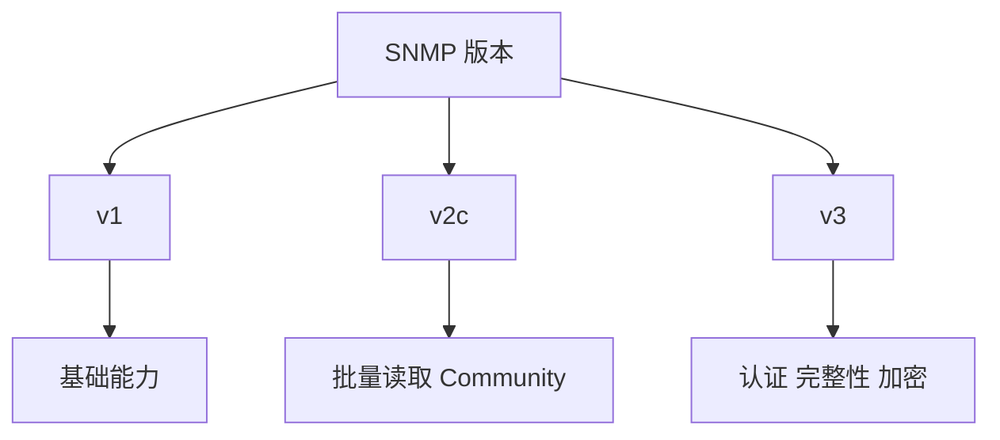

# SNMP 版本与安全边界

版本选择决定认证、完整性与加密能力。

## 核心要点

- SNMPv1 能力基础，仍可能出现在旧设备。
- SNMPv2c 支持 GetBulk，但 Community 不是强安全机制。
- SNMPv3 可提供用户认证、消息完整性与加密。
- 生产环境优先采用 SNMPv3、只读权限和网络访问控制。

---

## 本章测验

本章共 5 道单项选择题。

### 第 1 题

SNMPv2c 相比 v1 的一项典型能力是什么？

- A. 默认提供强加密
- B. 支持 GetBulk 批量读取
- C. 自动使用 TLS 6514
- D. 保证 Trap 不丢失

选择完成后展开答案

正确答案：B. 支持 GetBulk 批量读取

答案解析：GetBulk 是 v2c 及后续版本的重要读取能力，但 v2c 本身不提供现代强加密。

### 第 2 题

生产环境建立 SNMP 安全防线的合理组合是什么？

- A. 只依赖默认 Community
- B. 开放所有来源访问 UDP 161
- C. 把凭据写入日志方便排查
- D. SNMPv3、只读最小权限、ACL 与凭据管理

选择完成后展开答案

正确答案：D. SNMPv3、只读最小权限、ACL 与凭据管理

答案解析：协议安全、网络访问控制和最小权限需要叠加，而不是互相替代。

### 第 3 题

SNMPv3 可以提供什么？

- A. 用户认证、消息完整性与加密
- B. 业务事务自动回滚
- C. 日志索引与全文搜索
- D. TCP 端口健康证明

选择完成后展开答案

正确答案：A. 用户认证、消息完整性与加密

答案解析：v3 的核心安全改进是认证、完整性保护和可选加密。

### 第 4 题

旧设备只支持 v1，但业务要求较高安全性，最合理的处置是什么？

- A. 声称 v1 与 v3 安全性相同
- B. 将 Community 公开共享
- C. 限制网络访问并制定设备升级或隔离方案
- D. 关闭所有监控且不评估风险

选择完成后展开答案

正确答案：C. 限制网络访问并制定设备升级或隔离方案

答案解析：无法直接获得 v3 能力时，应通过隔离、白名单和升级规划降低风险。

### 第 5 题

哪种理解是错误的？

- A. 版本选择影响安全能力
- B. 启用 SNMPv3 后就不再需要 ACL 和最小权限
- C. 只读账户可降低泄露影响
- D. 迁移需要验证设备与平台兼容

选择完成后展开答案

正确答案：B. 启用 SNMPv3 后就不再需要 ACL 和最小权限

答案解析：v3 不能替代网络边界和权限控制，应与其他安全措施共同使用。

<!-- QUIZ_DATA_START
{
  "chapter": "11",
  "questions": [
    {
      "id": 1,
      "question": "SNMPv2c 相比 v1 的一项典型能力是什么？",
      "options": {
        "A": "默认提供强加密",
        "B": "支持 GetBulk 批量读取",
        "C": "自动使用 TLS 6514",
        "D": "保证 Trap 不丢失"
      },
      "answer": "B",
      "explanation": "GetBulk 是 v2c 及后续版本的重要读取能力，但 v2c 本身不提供现代强加密。"
    },
    {
      "id": 2,
      "question": "生产环境建立 SNMP 安全防线的合理组合是什么？",
      "options": {
        "A": "只依赖默认 Community",
        "B": "开放所有来源访问 UDP 161",
        "C": "把凭据写入日志方便排查",
        "D": "SNMPv3、只读最小权限、ACL 与凭据管理"
      },
      "answer": "D",
      "explanation": "协议安全、网络访问控制和最小权限需要叠加，而不是互相替代。"
    },
    {
      "id": 3,
      "question": "SNMPv3 可以提供什么？",
      "options": {
        "A": "用户认证、消息完整性与加密",
        "B": "业务事务自动回滚",
        "C": "日志索引与全文搜索",
        "D": "TCP 端口健康证明"
      },
      "answer": "A",
      "explanation": "v3 的核心安全改进是认证、完整性保护和可选加密。"
    },
    {
      "id": 4,
      "question": "旧设备只支持 v1，但业务要求较高安全性，最合理的处置是什么？",
      "options": {
        "A": "声称 v1 与 v3 安全性相同",
        "B": "将 Community 公开共享",
        "C": "限制网络访问并制定设备升级或隔离方案",
        "D": "关闭所有监控且不评估风险"
      },
      "answer": "C",
      "explanation": "无法直接获得 v3 能力时，应通过隔离、白名单和升级规划降低风险。"
    },
    {
      "id": 5,
      "question": "哪种理解是错误的？",
      "options": {
        "A": "版本选择影响安全能力",
        "B": "启用 SNMPv3 后就不再需要 ACL 和最小权限",
        "C": "只读账户可降低泄露影响",
        "D": "迁移需要验证设备与平台兼容"
      },
      "answer": "B",
      "explanation": "v3 不能替代网络边界和权限控制，应与其他安全措施共同使用。"
    }
  ]
}
QUIZ_DATA_END -->
