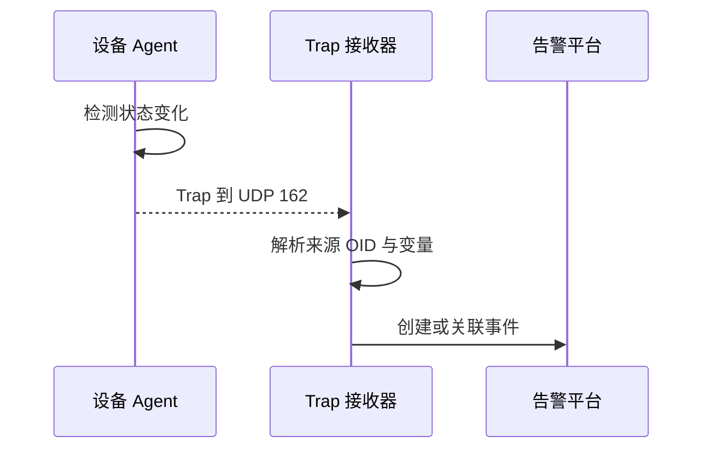

# SNMP Trap 的事件路径

设备检测到变化后，主动向典型 UDP 162 接收端发送事件。

## 核心要点

- Trap 通常由设备主动发出，不等待 Manager 查询。
- 接收端典型监听 UDP 162。
- 消息可包含设备来源、事件 OID、时间信息与变量绑定。
- 接收器负责解析，告警平台负责去重、关联和通知。

---

## 本章测验

本章共 5 道单项选择题。

### 第 1 题

SNMP Trap 的主要特点是什么？

- A. Manager 定时读取全部指标
- B. 设备检测到变化后主动发送事件
- C. 应用完成 TCP 三次握手
- D. 日志服务器查询数据库

选择完成后展开答案

正确答案：B. 设备检测到变化后主动发送事件

答案解析：Trap 是设备主动上报路径，不等待下一次 Manager 轮询。

### 第 2 题

Trap 从产生到形成告警的正确顺序是什么？

- A. 平台先删除事件、设备再查询 Manager
- B. 接收器先发送 GET、设备再启动
- C. 设备建立 HTTP 会话后写入 MIB
- D. 设备检测变化、发送 Trap、接收器解析、平台关联事件

选择完成后展开答案

正确答案：D. 设备检测变化、发送 Trap、接收器解析、平台关联事件

答案解析：事件需经过设备产生、传输、接收解析和平台处理多个环节。

### 第 3 题

Trap 接收器典型监听哪个端口？

- A. UDP 162
- B. UDP 161
- C. TCP 22
- D. TLS 443

选择完成后展开答案

正确答案：A. UDP 162

答案解析：UDP 162 是 Trap 的典型接收端口，实际部署需核对映射与策略。

### 第 4 题

收到带接口索引的 linkDown Trap 后，平台最合理的动作是什么？

- A. 直接删除设备
- B. 停止保存任何指标
- C. 映射接口、创建事件并触发 GET 复核
- D. 把索引当作故障原因

选择完成后展开答案

正确答案：C. 映射接口、创建事件并触发 GET 复核

答案解析：接口索引用于定位对象，GET 用于确认当前状态，平台再进行关联与通知。

### 第 5 题

哪种理解错误？

- A. Trap 可能没有应用层确认
- B. 普通 Trap 发送后一定能获知接收器是否成功处理
- C. 接收链路本身需要监控
- D. Trap 适合快速触发事件

选择完成后展开答案

正确答案：B. 普通 Trap 发送后一定能获知接收器是否成功处理

答案解析：普通 Trap 通常不等待确认，发送端可能不知道消息是否到达或被处理。

<!-- QUIZ_DATA_START
{
  "chapter": "13",
  "questions": [
    {
      "id": 1,
      "question": "SNMP Trap 的主要特点是什么？",
      "options": {
        "A": "Manager 定时读取全部指标",
        "B": "设备检测到变化后主动发送事件",
        "C": "应用完成 TCP 三次握手",
        "D": "日志服务器查询数据库"
      },
      "answer": "B",
      "explanation": "Trap 是设备主动上报路径，不等待下一次 Manager 轮询。"
    },
    {
      "id": 2,
      "question": "Trap 从产生到形成告警的正确顺序是什么？",
      "options": {
        "A": "平台先删除事件、设备再查询 Manager",
        "B": "接收器先发送 GET、设备再启动",
        "C": "设备建立 HTTP 会话后写入 MIB",
        "D": "设备检测变化、发送 Trap、接收器解析、平台关联事件"
      },
      "answer": "D",
      "explanation": "事件需经过设备产生、传输、接收解析和平台处理多个环节。"
    },
    {
      "id": 3,
      "question": "Trap 接收器典型监听哪个端口？",
      "options": {
        "A": "UDP 162",
        "B": "UDP 161",
        "C": "TCP 22",
        "D": "TLS 443"
      },
      "answer": "A",
      "explanation": "UDP 162 是 Trap 的典型接收端口，实际部署需核对映射与策略。"
    },
    {
      "id": 4,
      "question": "收到带接口索引的 linkDown Trap 后，平台最合理的动作是什么？",
      "options": {
        "A": "直接删除设备",
        "B": "停止保存任何指标",
        "C": "映射接口、创建事件并触发 GET 复核",
        "D": "把索引当作故障原因"
      },
      "answer": "C",
      "explanation": "接口索引用于定位对象，GET 用于确认当前状态，平台再进行关联与通知。"
    },
    {
      "id": 5,
      "question": "哪种理解错误？",
      "options": {
        "A": "Trap 可能没有应用层确认",
        "B": "普通 Trap 发送后一定能获知接收器是否成功处理",
        "C": "接收链路本身需要监控",
        "D": "Trap 适合快速触发事件"
      },
      "answer": "B",
      "explanation": "普通 Trap 通常不等待确认，发送端可能不知道消息是否到达或被处理。"
    }
  ]
}
QUIZ_DATA_END -->
