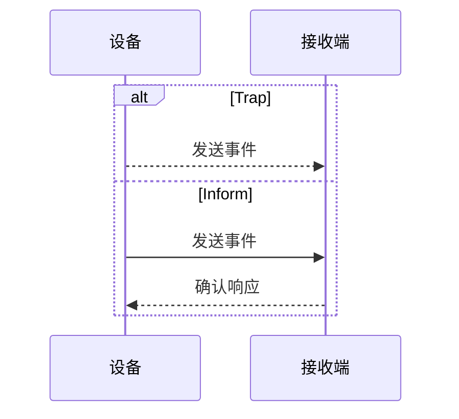

# Trap 与 Inform

两者都传递事件，但对接收确认的处理不同。

## 核心要点

- Trap 发送后通常不等待确认，开销低但可能无声丢失。
- Inform 要求接收端确认，可在未确认时重试。
- Inform 的可靠性更高，但会增加状态、流量与设备处理开销。
- 是否支持 Inform 取决于设备、版本与配置。

---

## 本章测验

本章共 5 道单项选择题。

### 第 1 题

Trap 与 Inform 最核心的区别是什么？

- A. Trap 只能传输日志正文
- B. Inform 需要接收确认，普通 Trap 通常不需要
- C. Inform 只能读取 CPU
- D. Trap 必须使用 TCP 443

选择完成后展开答案

正确答案：B. Inform 需要接收确认，普通 Trap 通常不需要

答案解析：两者都可传递事件，但 Inform 增加确认和可能的重试。

### 第 2 题

Inform 的基本交互顺序是什么？

- A. 接收端先删除 OID
- B. 设备只发送 RST
- C. Manager 先执行业务交易
- D. 设备发送 Inform，接收端返回确认，未确认时可重试

选择完成后展开答案

正确答案：D. 设备发送 Inform，接收端返回确认，未确认时可重试

答案解析：确认响应使发送端能够判断指定传输是否得到接收。

### 第 3 题

普通 Trap 的优势是什么？

- A. 流程轻量且发送开销较低
- B. 保证端到端告警处理成功
- C. 自动生成全部性能趋势
- D. 完全避免事件风暴

选择完成后展开答案

正确答案：A. 流程轻量且发送开销较低

答案解析：不等待确认让 Trap 更轻量，但也带来无声丢失的风险。

### 第 4 题

事件量很大且设备资源有限时，选择 Inform 前最应评估什么？

- A. 是否能替代全部 Syslog
- B. 是否能改变 MIB 定义
- C. 确认、重试带来的设备状态和流量开销
- D. 是否能让端口永久开放

选择完成后展开答案

正确答案：C. 确认、重试带来的设备状态和流量开销

答案解析：Inform 的可靠性收益伴随确认、状态和重试成本，告警风暴时尤需评估。

### 第 5 题

哪种说法不正确？

- A. 确认只覆盖指定链路
- B. Inform 收到确认就能保证后续解析和通知绝不失败
- C. 平台后续处理仍可能失败
- D. 两种方式都需监控接收管道

选择完成后展开答案

正确答案：B. Inform 收到确认就能保证后续解析和通知绝不失败

答案解析：传输确认不等于解析、队列、告警和通知的端到端成功。

<!-- QUIZ_DATA_START
{
  "chapter": "14",
  "questions": [
    {
      "id": 1,
      "question": "Trap 与 Inform 最核心的区别是什么？",
      "options": {
        "A": "Trap 只能传输日志正文",
        "B": "Inform 需要接收确认，普通 Trap 通常不需要",
        "C": "Inform 只能读取 CPU",
        "D": "Trap 必须使用 TCP 443"
      },
      "answer": "B",
      "explanation": "两者都可传递事件，但 Inform 增加确认和可能的重试。"
    },
    {
      "id": 2,
      "question": "Inform 的基本交互顺序是什么？",
      "options": {
        "A": "接收端先删除 OID",
        "B": "设备只发送 RST",
        "C": "Manager 先执行业务交易",
        "D": "设备发送 Inform，接收端返回确认，未确认时可重试"
      },
      "answer": "D",
      "explanation": "确认响应使发送端能够判断指定传输是否得到接收。"
    },
    {
      "id": 3,
      "question": "普通 Trap 的优势是什么？",
      "options": {
        "A": "流程轻量且发送开销较低",
        "B": "保证端到端告警处理成功",
        "C": "自动生成全部性能趋势",
        "D": "完全避免事件风暴"
      },
      "answer": "A",
      "explanation": "不等待确认让 Trap 更轻量，但也带来无声丢失的风险。"
    },
    {
      "id": 4,
      "question": "事件量很大且设备资源有限时，选择 Inform 前最应评估什么？",
      "options": {
        "A": "是否能替代全部 Syslog",
        "B": "是否能改变 MIB 定义",
        "C": "确认、重试带来的设备状态和流量开销",
        "D": "是否能让端口永久开放"
      },
      "answer": "C",
      "explanation": "Inform 的可靠性收益伴随确认、状态和重试成本，告警风暴时尤需评估。"
    },
    {
      "id": 5,
      "question": "哪种说法不正确？",
      "options": {
        "A": "确认只覆盖指定链路",
        "B": "Inform 收到确认就能保证后续解析和通知绝不失败",
        "C": "平台后续处理仍可能失败",
        "D": "两种方式都需监控接收管道"
      },
      "answer": "B",
      "explanation": "传输确认不等于解析、队列、告警和通知的端到端成功。"
    }
  ]
}
QUIZ_DATA_END -->
