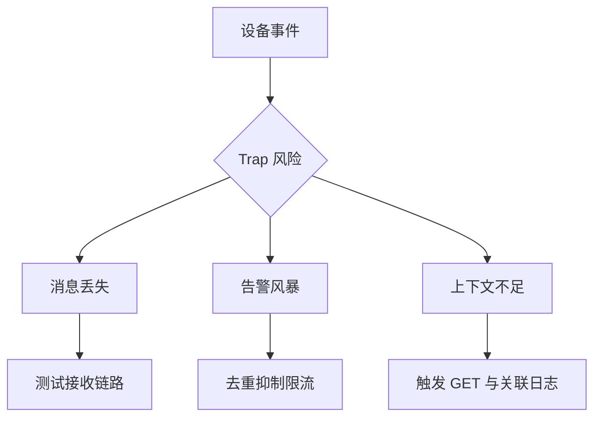

# Trap 丢失、风暴与上下文不足

即时事件很有价值，但接收链路需要面对三类典型风险。

## 核心要点

- UDP Trap 可能在网络或接收队列中丢失。
- 大量重复事件可能造成告警风暴。
- Trap 可能只报告结果，缺少发生原因与当前状态。
- 应使用链路自检、去重抑制、GET 复核和日志关联。

---

## 本章测验

本章共 5 道单项选择题。

### 第 1 题

Trap 接收链路的三类典型风险是什么？

- A. DNS、网页样式和屏幕分辨率
- B. 消息丢失、告警风暴和上下文不足
- C. CPU、内存和磁盘容量
- D. 认证、加密和证书轮换

选择完成后展开答案

正确答案：B. 消息丢失、告警风暴和上下文不足

答案解析：本章聚焦 Trap 是否到达、事件量是否失控以及消息是否足以解释故障。

### 第 2 题

面对 Trap 风险的合理处理链是什么？

- A. 关闭所有设备告警
- B. 只增加邮件收件人
- C. 把每条消息都独立升级为最高级别
- D. 测试接收链路、去重抑制、GET 复核并关联日志

选择完成后展开答案

正确答案：D. 测试接收链路、去重抑制、GET 复核并关联日志

答案解析：链路自检处理丢失，去重抑制处理风暴，GET 与日志补充状态和原因。

### 第 3 题

告警平台去重时应保留什么？

- A. 首个事件、重复计数、持续时间和状态变化
- B. 只保留最后一个字符
- C. 删除所有原始事件
- D. 把不同设备合并成同一来源

选择完成后展开答案

正确答案：A. 首个事件、重复计数、持续时间和状态变化

答案解析：有效降噪应保留事件演变证据，而不是简单丢弃所有重复消息。

### 第 4 题

收到内容很少的 linkDown Trap，最合理的补充动作是什么？

- A. 直接认定设备断电
- B. 停止接口监控
- C. 执行相关 OID 的 GET 并检索同设备 Syslog
- D. 只改变告警颜色

选择完成后展开答案

正确答案：C. 执行相关 OID 的 GET 并检索同设备 Syslog

答案解析：GET 确认当前状态，Syslog 提供可能的原因和时间线。

### 第 5 题

哪种结论是危险误区？

- A. 设备断电可能来不及发送
- B. 没有收到 Trap 就表示设备没有故障
- C. Agent 配置错误会造成沉默
- D. 接收队列故障可能丢消息

选择完成后展开答案

正确答案：B. 没有收到 Trap 就表示设备没有故障

答案解析：被动消息的缺失可能来自设备、配置、网络或平台，不能作为健康证明。

<!-- QUIZ_DATA_START
{
  "chapter": "15",
  "questions": [
    {
      "id": 1,
      "question": "Trap 接收链路的三类典型风险是什么？",
      "options": {
        "A": "DNS、网页样式和屏幕分辨率",
        "B": "消息丢失、告警风暴和上下文不足",
        "C": "CPU、内存和磁盘容量",
        "D": "认证、加密和证书轮换"
      },
      "answer": "B",
      "explanation": "本章聚焦 Trap 是否到达、事件量是否失控以及消息是否足以解释故障。"
    },
    {
      "id": 2,
      "question": "面对 Trap 风险的合理处理链是什么？",
      "options": {
        "A": "关闭所有设备告警",
        "B": "只增加邮件收件人",
        "C": "把每条消息都独立升级为最高级别",
        "D": "测试接收链路、去重抑制、GET 复核并关联日志"
      },
      "answer": "D",
      "explanation": "链路自检处理丢失，去重抑制处理风暴，GET 与日志补充状态和原因。"
    },
    {
      "id": 3,
      "question": "告警平台去重时应保留什么？",
      "options": {
        "A": "首个事件、重复计数、持续时间和状态变化",
        "B": "只保留最后一个字符",
        "C": "删除所有原始事件",
        "D": "把不同设备合并成同一来源"
      },
      "answer": "A",
      "explanation": "有效降噪应保留事件演变证据，而不是简单丢弃所有重复消息。"
    },
    {
      "id": 4,
      "question": "收到内容很少的 linkDown Trap，最合理的补充动作是什么？",
      "options": {
        "A": "直接认定设备断电",
        "B": "停止接口监控",
        "C": "执行相关 OID 的 GET 并检索同设备 Syslog",
        "D": "只改变告警颜色"
      },
      "answer": "C",
      "explanation": "GET 确认当前状态，Syslog 提供可能的原因和时间线。"
    },
    {
      "id": 5,
      "question": "哪种结论是危险误区？",
      "options": {
        "A": "设备断电可能来不及发送",
        "B": "没有收到 Trap 就表示设备没有故障",
        "C": "Agent 配置错误会造成沉默",
        "D": "接收队列故障可能丢消息"
      },
      "answer": "B",
      "explanation": "被动消息的缺失可能来自设备、配置、网络或平台，不能作为健康证明。"
    }
  ]
}
QUIZ_DATA_END -->
