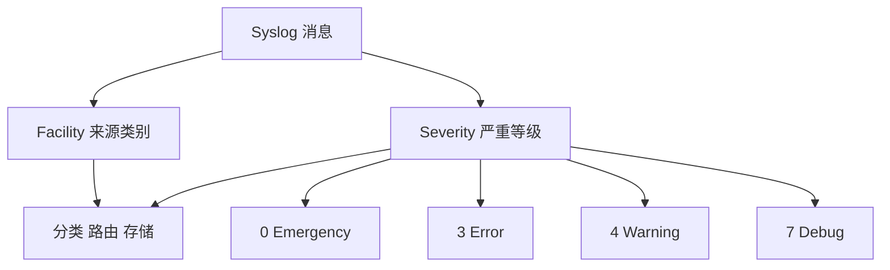

# Facility 与 Severity

Facility 表示来源类别，Severity 表示严重等级，两者共同帮助路由日志。

## 核心要点

- Severity 数值从 0 到 7，数值越小通常越严重。
- 0 为 Emergency，3 为 Error，4 为 Warning，7 为 Debug。
- Facility 用于区分内核、邮件、本地自定义等来源类别。
- 生产告警不能只看 Severity，还要结合设备、事件和业务影响。

---

## 本章测验

本章共 5 道单项选择题。

### 第 1 题

Syslog Severity 的数字与严重程度通常是什么关系？

- A. 数字越大越严重
- B. 数字越小通常越严重
- C. 所有数字严重程度相同
- D. 只允许使用 1 和 2

选择完成后展开答案

正确答案：B. 数字越小通常越严重

答案解析：Severity 从 0 到 7，0 最严重，7 通常用于 Debug。

### 第 2 题

Facility 与 Severity 进入平台后通常怎样使用？

- A. 共同建立 TCP 握手
- B. 替代设备地址
- C. 自动证明根因
- D. 结合来源类别与严重等级进行分类、路由和存储

选择完成后展开答案

正确答案：D. 结合来源类别与严重等级进行分类、路由和存储

答案解析：Facility 提供来源类别，Severity 提供发送方标记的级别，两者辅助处理策略。

### 第 3 题

Facility 主要表示什么？

- A. 日志的来源类别
- B. 具体设备是否在线
- C. 端口是否建立连接
- D. SNMP 用户密码

选择完成后展开答案

正确答案：A. 日志的来源类别

答案解析：Facility 用于区分内核、邮件或本地自定义等来源类别，不等同于主机身份。

### 第 4 题

某设备把低影响事件标记为 Error，平台应如何处理？

- A. 无条件触发最高级告警
- B. 删除该设备所有日志
- C. 结合事件类型、资产和业务影响重新映射优先级
- D. 把 Error 当作 Debug

选择完成后展开答案

正确答案：C. 结合事件类型、资产和业务影响重新映射优先级

答案解析：发送方 Severity 是输入，最终告警优先级应符合组织的风险与业务模型。

### 第 5 题

哪种理解不正确？

- A. 0 通常比 7 严重
- B. Severity 为 Error 就必然需要立即叫醒值班人员
- C. 平台应保留原始级别
- D. 最终优先级还要考虑业务影响

选择完成后展开答案

正确答案：B. Severity 为 Error 就必然需要立即叫醒值班人员

答案解析：日志级别并不自动等于值班策略，需要结合上下文和组织规则。

<!-- QUIZ_DATA_START
{
  "chapter": "17",
  "questions": [
    {
      "id": 1,
      "question": "Syslog Severity 的数字与严重程度通常是什么关系？",
      "options": {
        "A": "数字越大越严重",
        "B": "数字越小通常越严重",
        "C": "所有数字严重程度相同",
        "D": "只允许使用 1 和 2"
      },
      "answer": "B",
      "explanation": "Severity 从 0 到 7，0 最严重，7 通常用于 Debug。"
    },
    {
      "id": 2,
      "question": "Facility 与 Severity 进入平台后通常怎样使用？",
      "options": {
        "A": "共同建立 TCP 握手",
        "B": "替代设备地址",
        "C": "自动证明根因",
        "D": "结合来源类别与严重等级进行分类、路由和存储"
      },
      "answer": "D",
      "explanation": "Facility 提供来源类别，Severity 提供发送方标记的级别，两者辅助处理策略。"
    },
    {
      "id": 3,
      "question": "Facility 主要表示什么？",
      "options": {
        "A": "日志的来源类别",
        "B": "具体设备是否在线",
        "C": "端口是否建立连接",
        "D": "SNMP 用户密码"
      },
      "answer": "A",
      "explanation": "Facility 用于区分内核、邮件或本地自定义等来源类别，不等同于主机身份。"
    },
    {
      "id": 4,
      "question": "某设备把低影响事件标记为 Error，平台应如何处理？",
      "options": {
        "A": "无条件触发最高级告警",
        "B": "删除该设备所有日志",
        "C": "结合事件类型、资产和业务影响重新映射优先级",
        "D": "把 Error 当作 Debug"
      },
      "answer": "C",
      "explanation": "发送方 Severity 是输入，最终告警优先级应符合组织的风险与业务模型。"
    },
    {
      "id": 5,
      "question": "哪种理解不正确？",
      "options": {
        "A": "0 通常比 7 严重",
        "B": "Severity 为 Error 就必然需要立即叫醒值班人员",
        "C": "平台应保留原始级别",
        "D": "最终优先级还要考虑业务影响"
      },
      "answer": "B",
      "explanation": "日志级别并不自动等于值班策略，需要结合上下文和组织规则。"
    }
  ]
}
QUIZ_DATA_END -->
