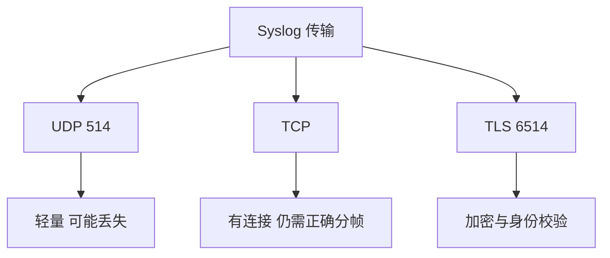

# Syslog 的 UDP、TCP 与 TLS

传输方式影响可靠性、开销与机密性。

## 核心要点

- 传统 UDP Syslog 常使用 514，轻量但没有交付保证。
- TCP 提供有连接传输，但应用仍需正确处理消息分帧与重连。
- Syslog over TLS 常使用 6514，可保护传输并支持身份校验。
- 端口是典型值，实际环境可能通过映射或策略调整。

---

## 本章测验

本章共 5 道单项选择题。

### 第 1 题

传统 UDP Syslog 常使用哪个端口？

- A. UDP 161
- B. UDP 514
- C. UDP 162
- D. TCP 5432

选择完成后展开答案

正确答案：B. UDP 514

答案解析：514 是传统 Syslog 的典型端口，实际环境仍需核对配置。

### 第 2 题

三种 Syslog 传输的正确比较是什么？

- A. UDP 保证交付，TCP 无连接，TLS 不加密
- B. 三者只有端口不同
- C. TLS 只能发送 SNMP OID
- D. UDP 轻量但可能丢失，TCP 有连接，TLS 增加加密与身份校验

选择完成后展开答案

正确答案：D. UDP 轻量但可能丢失，TCP 有连接，TLS 增加加密与身份校验

答案解析：传输方式影响交付特性、状态开销和安全保护。

### 第 3 题

TCP Syslog 为什么仍需消息分帧规则？

- A. TCP 是字节流，需要明确每条日志的边界
- B. TCP 不允许传输文本
- C. TCP 自动删除换行
- D. TCP 只支持固定长度 OID

选择完成后展开答案

正确答案：A. TCP 是字节流，需要明确每条日志的边界

答案解析：有连接传输不等于自动知道消息边界，发送和接收双方必须使用一致分帧。

### 第 4 题

日志包含敏感审计信息且设备支持时，应优先评估什么？

- A. 公开 UDP 514 给所有来源
- B. 把日志改成 TCP Ping
- C. Syslog over TLS 及证书管理
- D. 关闭身份校验

选择完成后展开答案

正确答案：C. Syslog over TLS 及证书管理

答案解析：TLS 可保护传输并支持身份校验，同时需要证书轮换和失败监控。

### 第 5 题

哪种说法错误？

- A. 连接中断仍可能造成缺口
- B. 使用 TCP 后日志就绝对不会丢失
- C. 接收应用故障仍可能丢消息
- D. 队列与缓存需要监控

选择完成后展开答案

正确答案：B. 使用 TCP 后日志就绝对不会丢失

答案解析：TCP 改善传输特性，但不能保证发送应用到最终存储的整个链路绝不丢失。

<!-- QUIZ_DATA_START
{
  "chapter": "18",
  "questions": [
    {
      "id": 1,
      "question": "传统 UDP Syslog 常使用哪个端口？",
      "options": {
        "A": "UDP 161",
        "B": "UDP 514",
        "C": "UDP 162",
        "D": "TCP 5432"
      },
      "answer": "B",
      "explanation": "514 是传统 Syslog 的典型端口，实际环境仍需核对配置。"
    },
    {
      "id": 2,
      "question": "三种 Syslog 传输的正确比较是什么？",
      "options": {
        "A": "UDP 保证交付，TCP 无连接，TLS 不加密",
        "B": "三者只有端口不同",
        "C": "TLS 只能发送 SNMP OID",
        "D": "UDP 轻量但可能丢失，TCP 有连接，TLS 增加加密与身份校验"
      },
      "answer": "D",
      "explanation": "传输方式影响交付特性、状态开销和安全保护。"
    },
    {
      "id": 3,
      "question": "TCP Syslog 为什么仍需消息分帧规则？",
      "options": {
        "A": "TCP 是字节流，需要明确每条日志的边界",
        "B": "TCP 不允许传输文本",
        "C": "TCP 自动删除换行",
        "D": "TCP 只支持固定长度 OID"
      },
      "answer": "A",
      "explanation": "有连接传输不等于自动知道消息边界，发送和接收双方必须使用一致分帧。"
    },
    {
      "id": 4,
      "question": "日志包含敏感审计信息且设备支持时，应优先评估什么？",
      "options": {
        "A": "公开 UDP 514 给所有来源",
        "B": "把日志改成 TCP Ping",
        "C": "Syslog over TLS 及证书管理",
        "D": "关闭身份校验"
      },
      "answer": "C",
      "explanation": "TLS 可保护传输并支持身份校验，同时需要证书轮换和失败监控。"
    },
    {
      "id": 5,
      "question": "哪种说法错误？",
      "options": {
        "A": "连接中断仍可能造成缺口",
        "B": "使用 TCP 后日志就绝对不会丢失",
        "C": "接收应用故障仍可能丢消息",
        "D": "队列与缓存需要监控"
      },
      "answer": "B",
      "explanation": "TCP 改善传输特性，但不能保证发送应用到最终存储的整个链路绝不丢失。"
    }
  ]
}
QUIZ_DATA_END -->
