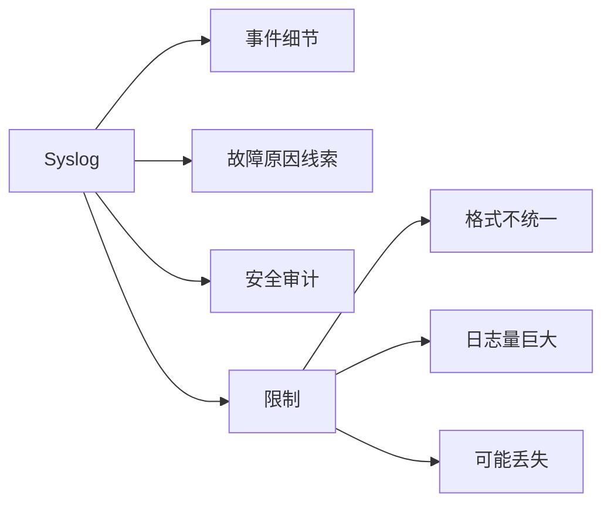

# Syslog 的价值与限制

Syslog 擅长解释事件，但不天然等于标准化指标或绝对事实。

## 核心要点

- Syslog 可记录登录、配置、接口、路由、ACL、重启和应用错误。
- 它适合建立详细时间线和审计链。
- 格式差异会增加解析与规范化成本。
- 没有日志不等于设备健康，日志内容也需要交叉验证。

---

## 本章测验

本章共 5 道单项选择题。

### 第 1 题

Syslog 相比纯状态指标最突出的价值是什么？

- A. 自动完成所有业务探测
- B. 提供事件细节、原因线索和审计上下文
- C. 保证每条日志格式一致
- D. 直接测量 TCP 握手延迟

选择完成后展开答案

正确答案：B. 提供事件细节、原因线索和审计上下文

答案解析：日志记录能解释事件过程，并支持故障时间线与安全审计。

### 第 2 题

建立可检索故障时间线的合理流程是什么？

- A. 只保存最新一条日志
- B. 删除时间字段
- C. 把所有主机名改成相同值
- D. 集中接收、统一时间、解析字段并按设备和事件关联

选择完成后展开答案

正确答案：D. 集中接收、统一时间、解析字段并按设备和事件关联

答案解析：时间一致、字段解析和来源关联是形成可靠时间线的基础。

### 第 3 题

日志平台面对高数据量时应承担什么职责？

- A. 控制接收吞吐、存储保留并监控丢弃与积压
- B. 让设备停止记录全部事件
- C. 用一条 TCP 检测替代所有日志
- D. 忽略磁盘与队列容量

选择完成后展开答案

正确答案：A. 控制接收吞吐、存储保留并监控丢弃与积压

答案解析：大量日志需要容量、保留和管道健康管理，避免噪声掩盖重要事件。

### 第 4 题

某时段没有任何设备日志，但 TCP 探测失败，正确判断是什么？

- A. 没有日志所以设备一定正常
- B. TCP 失败一定是误报
- C. 日志沉默不能证明健康，应继续检查发送与接收链路
- D. 立即删除该设备资产

选择完成后展开答案

正确答案：C. 日志沉默不能证明健康，应继续检查发送与接收链路

答案解析：设备未发送、网络丢失或接收平台故障都可能造成日志沉默。

### 第 5 题

哪项是常见误区？

- A. 保留原始消息
- B. 把发送方日志内容未经验证地视为绝对事实
- C. 与 GET 和 TCP 交叉验证
- D. 识别厂商格式差异

选择完成后展开答案

正确答案：B. 把发送方日志内容未经验证地视为绝对事实

答案解析：日志是发送方视角，可能漏记、时间不准或分类错误，需要其他证据验证。

<!-- QUIZ_DATA_START
{
  "chapter": "19",
  "questions": [
    {
      "id": 1,
      "question": "Syslog 相比纯状态指标最突出的价值是什么？",
      "options": {
        "A": "自动完成所有业务探测",
        "B": "提供事件细节、原因线索和审计上下文",
        "C": "保证每条日志格式一致",
        "D": "直接测量 TCP 握手延迟"
      },
      "answer": "B",
      "explanation": "日志记录能解释事件过程，并支持故障时间线与安全审计。"
    },
    {
      "id": 2,
      "question": "建立可检索故障时间线的合理流程是什么？",
      "options": {
        "A": "只保存最新一条日志",
        "B": "删除时间字段",
        "C": "把所有主机名改成相同值",
        "D": "集中接收、统一时间、解析字段并按设备和事件关联"
      },
      "answer": "D",
      "explanation": "时间一致、字段解析和来源关联是形成可靠时间线的基础。"
    },
    {
      "id": 3,
      "question": "日志平台面对高数据量时应承担什么职责？",
      "options": {
        "A": "控制接收吞吐、存储保留并监控丢弃与积压",
        "B": "让设备停止记录全部事件",
        "C": "用一条 TCP 检测替代所有日志",
        "D": "忽略磁盘与队列容量"
      },
      "answer": "A",
      "explanation": "大量日志需要容量、保留和管道健康管理，避免噪声掩盖重要事件。"
    },
    {
      "id": 4,
      "question": "某时段没有任何设备日志，但 TCP 探测失败，正确判断是什么？",
      "options": {
        "A": "没有日志所以设备一定正常",
        "B": "TCP 失败一定是误报",
        "C": "日志沉默不能证明健康，应继续检查发送与接收链路",
        "D": "立即删除该设备资产"
      },
      "answer": "C",
      "explanation": "设备未发送、网络丢失或接收平台故障都可能造成日志沉默。"
    },
    {
      "id": 5,
      "question": "哪项是常见误区？",
      "options": {
        "A": "保留原始消息",
        "B": "把发送方日志内容未经验证地视为绝对事实",
        "C": "与 GET 和 TCP 交叉验证",
        "D": "识别厂商格式差异"
      },
      "answer": "B",
      "explanation": "日志是发送方视角，可能漏记、时间不准或分类错误，需要其他证据验证。"
    }
  ]
}
QUIZ_DATA_END -->
