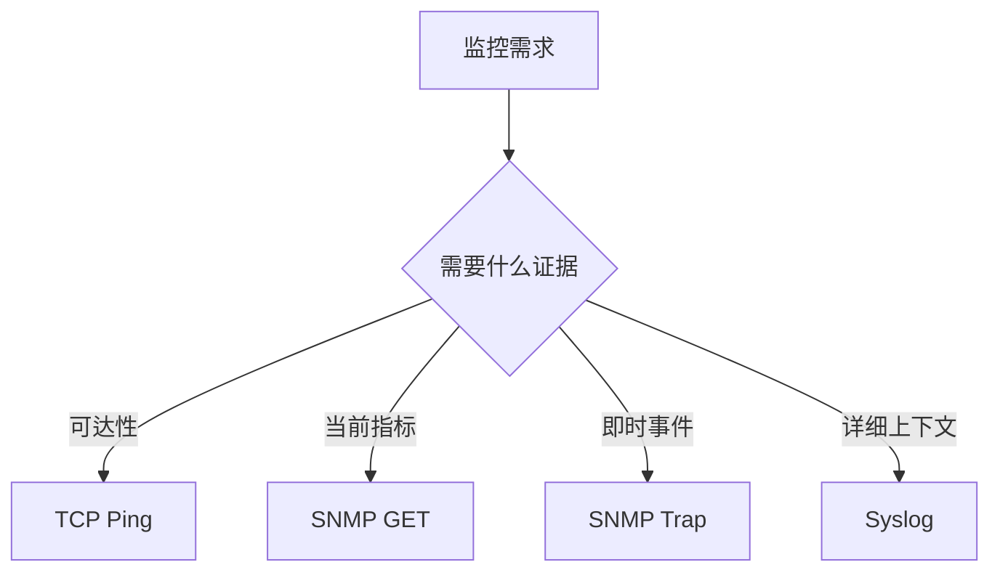

# 四种方式的统一对比

用方向、数据、实时性和诊断能力建立选择框架。

## 核心要点

- TCP Ping 主动检查业务端口，数据主要是成功、失败和延迟。
- SNMP GET 主动轮询结构化 OID，适合状态和趋势。
- SNMP Trap 被动接收结构化事件，实时性高但可能丢失。
- Syslog 被动接收日志，诊断细节强但格式和数据量更复杂。

## 讲解提示

| 方式 | 方向 | 典型端口 | 最适合回答 |
| --- | --- | --- | --- |
| TCP Ping | 监控端到目标 | 目标业务端口 | 端口能否连接 |
| SNMP GET | Manager 到 Agent | UDP 161 | 当前状态与趋势 |
| SNMP Trap | 设备到接收端 | UDP 162 | 刚发生的变化 |
| Syslog | 设备到日志端 | 514 或 TLS 6514 | 事件细节与原因 |

---

## 本章测验

本章共 5 道单项选择题。

### 第 1 题

哪种方式最适合持续获取结构化状态并绘制趋势？

- A. TCP Ping
- B. SNMP GET
- C. SNMP Trap
- D. Syslog

选择完成后展开答案

正确答案：B. SNMP GET

答案解析：GET 周期读取 OID 数值，适合保存历史和计算趋势。

### 第 2 题

从需求选择证据类型的正确映射是什么？

- A. 可达性用日志，指标用 TCP，事件用 GET，上下文用 Trap
- B. 四种需求全部只用 TCP
- C. 四种需求全部只用 Syslog
- D. 可达性用 TCP，当前指标用 GET，即时事件用 Trap，详细上下文用 Syslog

选择完成后展开答案

正确答案：D. 可达性用 TCP，当前指标用 GET，即时事件用 Trap，详细上下文用 Syslog

答案解析：应先明确需要回答的问题，再选择最匹配的通信方式。

### 第 3 题

哪种方式主要产出成功、失败和延迟？

- A. TCP Ping
- B. SNMP GET
- C. SNMP Trap
- D. Syslog

选择完成后展开答案

正确答案：A. TCP Ping

答案解析：TCP 检测结果集中在端口可连接性和响应时间，不直接提供设备内部指标。

### 第 4 题

需要快速发现变化并在随后确认当前状态，应采用什么组合？

- A. 只降低日志保留期
- B. 用 TCP 替代全部 OID
- C. Trap 触发 SNMP GET
- D. 等待下一次人工巡检

选择完成后展开答案

正确答案：C. Trap 触发 SNMP GET

答案解析：Trap 提供时效，GET 提供可重复确认的当前状态。

### 第 5 题

关于典型端口，哪种理解正确？

- A. 所有设备永远固定且不可修改
- B. 它们是常见默认值，实际端口和映射必须按环境核对
- C. 端口号能证明协议安全
- D. 知道端口就无需检查防火墙

选择完成后展开答案

正确答案：B. 它们是常见默认值，实际端口和映射必须按环境核对

答案解析：161、162、514 和 6514 是典型值，生产部署可能存在映射和策略差异。

<!-- QUIZ_DATA_START
{
  "chapter": "20",
  "questions": [
    {
      "id": 1,
      "question": "哪种方式最适合持续获取结构化状态并绘制趋势？",
      "options": {
        "A": "TCP Ping",
        "B": "SNMP GET",
        "C": "SNMP Trap",
        "D": "Syslog"
      },
      "answer": "B",
      "explanation": "GET 周期读取 OID 数值，适合保存历史和计算趋势。"
    },
    {
      "id": 2,
      "question": "从需求选择证据类型的正确映射是什么？",
      "options": {
        "A": "可达性用日志，指标用 TCP，事件用 GET，上下文用 Trap",
        "B": "四种需求全部只用 TCP",
        "C": "四种需求全部只用 Syslog",
        "D": "可达性用 TCP，当前指标用 GET，即时事件用 Trap，详细上下文用 Syslog"
      },
      "answer": "D",
      "explanation": "应先明确需要回答的问题，再选择最匹配的通信方式。"
    },
    {
      "id": 3,
      "question": "哪种方式主要产出成功、失败和延迟？",
      "options": {
        "A": "TCP Ping",
        "B": "SNMP GET",
        "C": "SNMP Trap",
        "D": "Syslog"
      },
      "answer": "A",
      "explanation": "TCP 检测结果集中在端口可连接性和响应时间，不直接提供设备内部指标。"
    },
    {
      "id": 4,
      "question": "需要快速发现变化并在随后确认当前状态，应采用什么组合？",
      "options": {
        "A": "只降低日志保留期",
        "B": "用 TCP 替代全部 OID",
        "C": "Trap 触发 SNMP GET",
        "D": "等待下一次人工巡检"
      },
      "answer": "C",
      "explanation": "Trap 提供时效，GET 提供可重复确认的当前状态。"
    },
    {
      "id": 5,
      "question": "关于典型端口，哪种理解正确？",
      "options": {
        "A": "所有设备永远固定且不可修改",
        "B": "它们是常见默认值，实际端口和映射必须按环境核对",
        "C": "端口号能证明协议安全",
        "D": "知道端口就无需检查防火墙"
      },
      "answer": "B",
      "explanation": "161、162、514 和 6514 是典型值，生产部署可能存在映射和策略差异。"
    }
  ]
}
QUIZ_DATA_END -->
