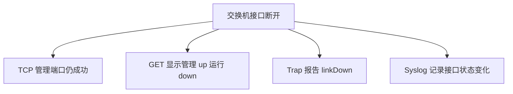

# 接口断开时四种证据

同一个接口故障，在四种监控手段中呈现为不同证据。

## 核心要点

- TCP 22 或 443 成功只说明交换机管理面仍可达。
- ifAdminStatus 为 up 且 ifOperStatus 为 down 表示已启用但实际断开。
- linkDown Trap 可快速指出接口索引。
- Syslog 可提供接口名称、协议状态和更详细上下文。

---

## 本章测验

本章共 5 道单项选择题。

### 第 1 题

接口断开时，TCP 22 或 443 仍成功能说明什么？

- A. 所有业务接口都正常
- B. 交换机管理面仍可从监控点连接
- C. 上联链路没有故障
- D. 下游业务一定可用

选择完成后展开答案

正确答案：B. 交换机管理面仍可从监控点连接

答案解析：管理端口成功仅覆盖管理路径，不代表发生故障的业务接口正常。

### 第 2 题

接口故障证据的合理组合顺序是什么？

- A. 先忽略 Trap，再删除日志
- B. 只等 TCP 自动给出根因
- C. 用 Severity 替代接口状态
- D. Trap 快速通知，GET 确认状态，Syslog 补上下文，TCP 验证影响

选择完成后展开答案

正确答案：D. Trap 快速通知，GET 确认状态，Syslog 补上下文，TCP 验证影响

答案解析：四种信号分别完成快速发现、状态确认、原因解释和影响定界。

### 第 3 题

ifAdminStatus 为 up 且 ifOperStatus 为 down 表示什么？

- A. 接口已配置启用，但实际运行链路断开
- B. 接口被管理员关闭且运行正常
- C. 设备一定整机断电
- D. 日志接收器未启动

选择完成后展开答案

正确答案：A. 接口已配置启用，但实际运行链路断开

答案解析：管理状态描述配置意图，运行状态描述实际链路。

### 第 4 题

收到 linkDown 且接口索引为 5，下一步怎样提高可读性和可信度？

- A. 把索引 5 当作错误码
- B. 只检查设备 CPU
- C. 映射接口名称并执行 GET 复核
- D. 忽略接口表

选择完成后展开答案

正确答案：C. 映射接口名称并执行 GET 复核

答案解析：索引需要映射到具体接口，GET 再确认当前管理与运行状态。

### 第 5 题

哪种结论属于扩大解释？

- A. 管理面与业务接口可能不同
- B. 交换机管理端口可连接，所以整台设备的所有接口和业务都正常
- C. Syslog 可提供接口上下文
- D. 多信号关联能提高诊断能力

选择完成后展开答案

正确答案：B. 交换机管理端口可连接，所以整台设备的所有接口和业务都正常

答案解析：管理端口成功不能覆盖其他接口、数据路径或下游业务。

<!-- QUIZ_DATA_START
{
  "chapter": "21",
  "questions": [
    {
      "id": 1,
      "question": "接口断开时，TCP 22 或 443 仍成功能说明什么？",
      "options": {
        "A": "所有业务接口都正常",
        "B": "交换机管理面仍可从监控点连接",
        "C": "上联链路没有故障",
        "D": "下游业务一定可用"
      },
      "answer": "B",
      "explanation": "管理端口成功仅覆盖管理路径，不代表发生故障的业务接口正常。"
    },
    {
      "id": 2,
      "question": "接口故障证据的合理组合顺序是什么？",
      "options": {
        "A": "先忽略 Trap，再删除日志",
        "B": "只等 TCP 自动给出根因",
        "C": "用 Severity 替代接口状态",
        "D": "Trap 快速通知，GET 确认状态，Syslog 补上下文，TCP 验证影响"
      },
      "answer": "D",
      "explanation": "四种信号分别完成快速发现、状态确认、原因解释和影响定界。"
    },
    {
      "id": 3,
      "question": "ifAdminStatus 为 up 且 ifOperStatus 为 down 表示什么？",
      "options": {
        "A": "接口已配置启用，但实际运行链路断开",
        "B": "接口被管理员关闭且运行正常",
        "C": "设备一定整机断电",
        "D": "日志接收器未启动"
      },
      "answer": "A",
      "explanation": "管理状态描述配置意图，运行状态描述实际链路。"
    },
    {
      "id": 4,
      "question": "收到 linkDown 且接口索引为 5，下一步怎样提高可读性和可信度？",
      "options": {
        "A": "把索引 5 当作错误码",
        "B": "只检查设备 CPU",
        "C": "映射接口名称并执行 GET 复核",
        "D": "忽略接口表"
      },
      "answer": "C",
      "explanation": "索引需要映射到具体接口，GET 再确认当前管理与运行状态。"
    },
    {
      "id": 5,
      "question": "哪种结论属于扩大解释？",
      "options": {
        "A": "管理面与业务接口可能不同",
        "B": "交换机管理端口可连接，所以整台设备的所有接口和业务都正常",
        "C": "Syslog 可提供接口上下文",
        "D": "多信号关联能提高诊断能力"
      },
      "answer": "B",
      "explanation": "管理端口成功不能覆盖其他接口、数据路径或下游业务。"
    }
  ]
}
QUIZ_DATA_END -->
