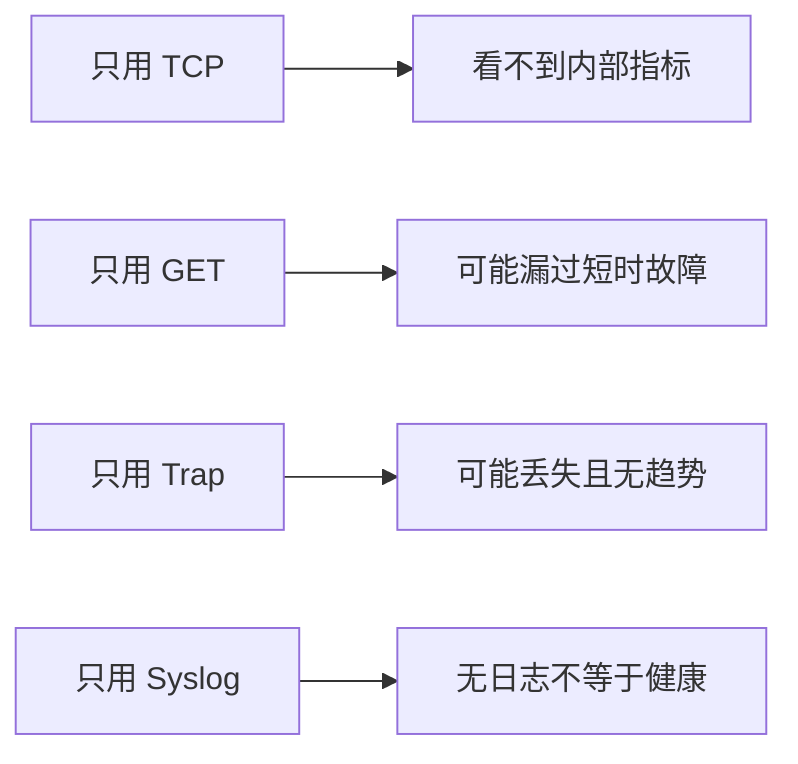

# 单一监控手段的四类盲区

每种方式都有无法独自回答的问题。

## 核心要点

- TCP 看不到 CPU、内存、风扇和内部接口状态。
- GET 存在轮询延迟，短时异常可能落在采样间隙。
- Trap 可能丢失，设备断电时甚至来不及发送。
- Syslog 格式不统一，也不适合持续获取精确性能数值。

---

## 本章测验

本章共 5 道单项选择题。

### 第 1 题

只使用 TCP 监控的主要盲区是什么？

- A. 无法判断任何端口可达性
- B. 看不到 CPU、内存、风扇和内部接口状态
- C. 一定会丢失所有日志
- D. 无法记录探测延迟

选择完成后展开答案

正确答案：B. 看不到 CPU、内存、风扇和内部接口状态

答案解析：TCP 适合外部端口可达性，但不直接读取设备内部指标。

### 第 2 题

单一监控手段与盲区的正确配对是什么？

- A. GET 保证即时，Trap 保证趋势，Syslog 保证交付
- B. TCP 提供全部原因，GET 提供全部业务
- C. 四种方式都没有盲区
- D. GET 可能漏短故障，Trap 可能丢失，Syslog 沉默不代表健康

选择完成后展开答案

正确答案：D. GET 可能漏短故障，Trap 可能丢失，Syslog 沉默不代表健康

答案解析：采样、传输和数据语义不同，每种手段都有明确缺口。

### 第 3 题

“没有异常证据”与“取得正常证据”为什么不同？

- A. 前者可能是监控链路沉默，后者来自实际检查结果
- B. 两者在任何情况下都相同
- C. 只有日志能产生正常证据
- D. 正常证据不需要时间范围

选择完成后展开答案

正确答案：A. 前者可能是监控链路沉默，后者来自实际检查结果

答案解析：缺失数据不能自动解释为正常，需确认采集与接收链路有效。

### 第 4 题

设备断电且没有 Trap 时，最适合补充哪类判断？

- A. 继续把沉默视为正常
- B. 只检查历史答案解析
- C. 使用 TCP 或周期 GET 的失败证据确认外部不可达
- D. 关闭接收器

选择完成后展开答案

正确答案：C. 使用 TCP 或周期 GET 的失败证据确认外部不可达

答案解析：主动探测能从外部观察设备无响应，补足被动消息无法发送的盲区。

### 第 5 题

哪种设计思路错误？

- A. 按证据类型组合工具
- B. 让一个简单状态灯独自承担发现、根因和业务影响判断
- C. 区分数据缺失与健康
- D. 把多信号关联成事件

选择完成后展开答案

正确答案：B. 让一个简单状态灯独自承担发现、根因和业务影响判断

答案解析：单一信号无法可靠覆盖状态、原因和影响，需要多层证据。

<!-- QUIZ_DATA_START
{
  "chapter": "22",
  "questions": [
    {
      "id": 1,
      "question": "只使用 TCP 监控的主要盲区是什么？",
      "options": {
        "A": "无法判断任何端口可达性",
        "B": "看不到 CPU、内存、风扇和内部接口状态",
        "C": "一定会丢失所有日志",
        "D": "无法记录探测延迟"
      },
      "answer": "B",
      "explanation": "TCP 适合外部端口可达性，但不直接读取设备内部指标。"
    },
    {
      "id": 2,
      "question": "单一监控手段与盲区的正确配对是什么？",
      "options": {
        "A": "GET 保证即时，Trap 保证趋势，Syslog 保证交付",
        "B": "TCP 提供全部原因，GET 提供全部业务",
        "C": "四种方式都没有盲区",
        "D": "GET 可能漏短故障，Trap 可能丢失，Syslog 沉默不代表健康"
      },
      "answer": "D",
      "explanation": "采样、传输和数据语义不同，每种手段都有明确缺口。"
    },
    {
      "id": 3,
      "question": "“没有异常证据”与“取得正常证据”为什么不同？",
      "options": {
        "A": "前者可能是监控链路沉默，后者来自实际检查结果",
        "B": "两者在任何情况下都相同",
        "C": "只有日志能产生正常证据",
        "D": "正常证据不需要时间范围"
      },
      "answer": "A",
      "explanation": "缺失数据不能自动解释为正常，需确认采集与接收链路有效。"
    },
    {
      "id": 4,
      "question": "设备断电且没有 Trap 时，最适合补充哪类判断？",
      "options": {
        "A": "继续把沉默视为正常",
        "B": "只检查历史答案解析",
        "C": "使用 TCP 或周期 GET 的失败证据确认外部不可达",
        "D": "关闭接收器"
      },
      "answer": "C",
      "explanation": "主动探测能从外部观察设备无响应，补足被动消息无法发送的盲区。"
    },
    {
      "id": 5,
      "question": "哪种设计思路错误？",
      "options": {
        "A": "按证据类型组合工具",
        "B": "让一个简单状态灯独自承担发现、根因和业务影响判断",
        "C": "区分数据缺失与健康",
        "D": "把多信号关联成事件"
      },
      "answer": "B",
      "explanation": "单一信号无法可靠覆盖状态、原因和影响，需要多层证据。"
    }
  ]
}
QUIZ_DATA_END -->
