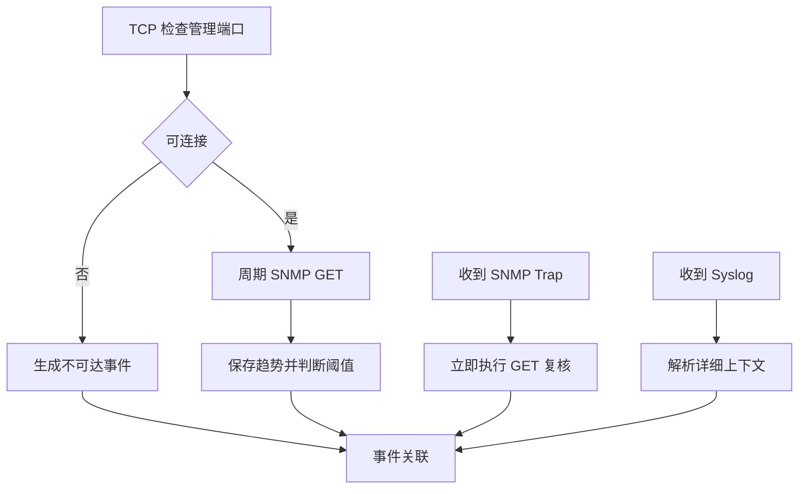

# 推荐的监控闭环

将周期探测、即时事件、二次确认和日志关联组成完整流程。

## 核心要点

- TCP 周期检查提供外部可达性证据。
- SNMP GET 保存当前状态与历史趋势。
- Trap 到达后立即触发 GET，确认当前事实。
- Syslog 与其他信号按设备和时间关联，补充原因与审计信息。

---

## 本章测验

本章共 5 道单项选择题。

### 第 1 题

推荐闭环中，Trap 到达后最关键的即时动作是什么？

- A. 删除 Trap
- B. 执行 SNMP GET 复核当前状态
- C. 停止轮询一天
- D. 只发送成功通知

选择完成后展开答案

正确答案：B. 执行 SNMP GET 复核当前状态

答案解析：Trap 表示变化瞬间，GET 用于确认事件发生后的当前事实。

### 第 2 题

完整监控闭环的合理路径是什么？

- A. 只采集不告警
- B. 只告警不验证恢复
- C. 每种协议独立通知且永不关联
- D. 周期探测与接收事件汇入关联，再告警、处置并验证恢复

选择完成后展开答案

正确答案：D. 周期探测与接收事件汇入关联，再告警、处置并验证恢复

答案解析：闭环从发现和确认开始，经过关联与处置，最后必须验证恢复。

### 第 3 题

事件关联组件应主要做什么？

- A. 按设备、对象、时间和事件类型合并多条证据
- B. 更改设备物理布线
- C. 替代所有安全控制
- D. 删除历史趋势

选择完成后展开答案

正确答案：A. 按设备、对象、时间和事件类型合并多条证据

答案解析：关联把 TCP、GET、Trap 和日志组合成一个更完整、低重复的事件。

### 第 4 题

收到不可达事件与同设备电源日志时，平台最合理的做法是什么？

- A. 分别发送大量重复告警
- B. 忽略电源日志
- C. 在同一时间窗口关联证据并评估共同根因
- D. 把不可达改成接口流量

选择完成后展开答案

正确答案：C. 在同一时间窗口关联证据并评估共同根因

答案解析：关联能把外部影响与内部原因线索合并，提高告警可操作性。

### 第 5 题

哪项不是监控闭环？

- A. Trap 触发 GET
- B. 只在触发时告警，修复后不再执行任何检查
- C. 日志参与原因分析
- D. 恢复后重做状态与业务验证

选择完成后展开答案

正确答案：B. 只在触发时告警，修复后不再执行任何检查

答案解析：没有恢复验证就无法确认问题真正解决，流程并未闭合。

<!-- QUIZ_DATA_START
{
  "chapter": "23",
  "questions": [
    {
      "id": 1,
      "question": "推荐闭环中，Trap 到达后最关键的即时动作是什么？",
      "options": {
        "A": "删除 Trap",
        "B": "执行 SNMP GET 复核当前状态",
        "C": "停止轮询一天",
        "D": "只发送成功通知"
      },
      "answer": "B",
      "explanation": "Trap 表示变化瞬间，GET 用于确认事件发生后的当前事实。"
    },
    {
      "id": 2,
      "question": "完整监控闭环的合理路径是什么？",
      "options": {
        "A": "只采集不告警",
        "B": "只告警不验证恢复",
        "C": "每种协议独立通知且永不关联",
        "D": "周期探测与接收事件汇入关联，再告警、处置并验证恢复"
      },
      "answer": "D",
      "explanation": "闭环从发现和确认开始，经过关联与处置，最后必须验证恢复。"
    },
    {
      "id": 3,
      "question": "事件关联组件应主要做什么？",
      "options": {
        "A": "按设备、对象、时间和事件类型合并多条证据",
        "B": "更改设备物理布线",
        "C": "替代所有安全控制",
        "D": "删除历史趋势"
      },
      "answer": "A",
      "explanation": "关联把 TCP、GET、Trap 和日志组合成一个更完整、低重复的事件。"
    },
    {
      "id": 4,
      "question": "收到不可达事件与同设备电源日志时，平台最合理的做法是什么？",
      "options": {
        "A": "分别发送大量重复告警",
        "B": "忽略电源日志",
        "C": "在同一时间窗口关联证据并评估共同根因",
        "D": "把不可达改成接口流量"
      },
      "answer": "C",
      "explanation": "关联能把外部影响与内部原因线索合并，提高告警可操作性。"
    },
    {
      "id": 5,
      "question": "哪项不是监控闭环？",
      "options": {
        "A": "Trap 触发 GET",
        "B": "只在触发时告警，修复后不再执行任何检查",
        "C": "日志参与原因分析",
        "D": "恢复后重做状态与业务验证"
      },
      "answer": "B",
      "explanation": "没有恢复验证就无法确认问题真正解决，流程并未闭合。"
    }
  ]
}
QUIZ_DATA_END -->
