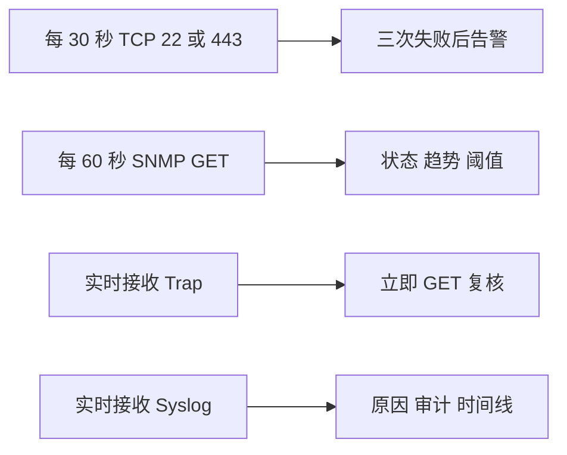

# 交换机监控策略示例

把四种方式落实为可执行的采集、复核与告警职责。

## 核心要点

- 示例周期是起点，不是适用于所有设备的固定标准。
- TCP 连续三次失败可减少瞬时丢包造成的抖动告警。
- GET 可采集 CPU、内存、运行时间、接口、错误包、温度、风扇与电源。
- Trap 与 Syslog 实时接收，并进入复核和关联流程。

---

## 本章测验

本章共 5 道单项选择题。

### 第 1 题

本章示例中的 TCP 检测周期是多少？

- A. 每 1 秒检查所有端口
- B. 每 30 秒检查 TCP 22 或 443
- C. 每 24 小时检查一次
- D. 只在人工操作时检查

选择完成后展开答案

正确答案：B. 每 30 秒检查 TCP 22 或 443

答案解析：30 秒是本章用于说明策略的示例值，不是所有环境的固定标准。

### 第 2 题

交换机监控的合理职责分配是什么？

- A. TCP 读取温度，GET 传日志，Trap 画趋势，Syslog 建连
- B. 四种方式只记录同一布尔值
- C. 只保留 Trap 并停用其余方式
- D. TCP 看管理可达，GET 采指标，Trap 触发复核，Syslog 补原因

选择完成后展开答案

正确答案：D. TCP 看管理可达，GET 采指标，Trap 触发复核，Syslog 补原因

答案解析：每类手段承担与其数据和时效特性匹配的职责。

### 第 3 题

连续三次 TCP 失败后再告警的主要目的是什么？

- A. 降低瞬时丢包或抖动造成的误告警
- B. 保证设备永不宕机
- C. 替代恢复检测
- D. 自动确定根因

选择完成后展开答案

正确答案：A. 降低瞬时丢包或抖动造成的误告警

答案解析：连续失败策略能抑制短暂波动，但仍需记录过程并在恢复时确认。

### 第 4 题

设备数量增加十倍时，应优先做什么？

- A. 直接把所有周期缩短十倍
- B. 取消超时限制
- C. 评估并发、错峰、队列、网络和存储容量
- D. 忽略设备处理能力

选择完成后展开答案

正确答案：C. 评估并发、错峰、队列、网络和存储容量

答案解析：规模增长会放大轮询和接收负载，必须通过容量测试和调度设计验证。

### 第 5 题

如何理解 30 秒和 60 秒这两个示例周期？

- A. 它们是所有生产设备的强制标准
- B. 它们是设计起点，实际值需按风险与容量调整
- C. 只要使用这些值就无需压测
- D. 周期与设备数量无关

选择完成后展开答案

正确答案：B. 它们是设计起点，实际值需按风险与容量调整

答案解析：轮询策略必须适配设备规模、重要性和平台处理能力。

<!-- QUIZ_DATA_START
{
  "chapter": "24",
  "questions": [
    {
      "id": 1,
      "question": "本章示例中的 TCP 检测周期是多少？",
      "options": {
        "A": "每 1 秒检查所有端口",
        "B": "每 30 秒检查 TCP 22 或 443",
        "C": "每 24 小时检查一次",
        "D": "只在人工操作时检查"
      },
      "answer": "B",
      "explanation": "30 秒是本章用于说明策略的示例值，不是所有环境的固定标准。"
    },
    {
      "id": 2,
      "question": "交换机监控的合理职责分配是什么？",
      "options": {
        "A": "TCP 读取温度，GET 传日志，Trap 画趋势，Syslog 建连",
        "B": "四种方式只记录同一布尔值",
        "C": "只保留 Trap 并停用其余方式",
        "D": "TCP 看管理可达，GET 采指标，Trap 触发复核，Syslog 补原因"
      },
      "answer": "D",
      "explanation": "每类手段承担与其数据和时效特性匹配的职责。"
    },
    {
      "id": 3,
      "question": "连续三次 TCP 失败后再告警的主要目的是什么？",
      "options": {
        "A": "降低瞬时丢包或抖动造成的误告警",
        "B": "保证设备永不宕机",
        "C": "替代恢复检测",
        "D": "自动确定根因"
      },
      "answer": "A",
      "explanation": "连续失败策略能抑制短暂波动，但仍需记录过程并在恢复时确认。"
    },
    {
      "id": 4,
      "question": "设备数量增加十倍时，应优先做什么？",
      "options": {
        "A": "直接把所有周期缩短十倍",
        "B": "取消超时限制",
        "C": "评估并发、错峰、队列、网络和存储容量",
        "D": "忽略设备处理能力"
      },
      "answer": "C",
      "explanation": "规模增长会放大轮询和接收负载，必须通过容量测试和调度设计验证。"
    },
    {
      "id": 5,
      "question": "如何理解 30 秒和 60 秒这两个示例周期？",
      "options": {
        "A": "它们是所有生产设备的强制标准",
        "B": "它们是设计起点，实际值需按风险与容量调整",
        "C": "只要使用这些值就无需压测",
        "D": "周期与设备数量无关"
      },
      "answer": "B",
      "explanation": "轮询策略必须适配设备规模、重要性和平台处理能力。"
    }
  ]
}
QUIZ_DATA_END -->
