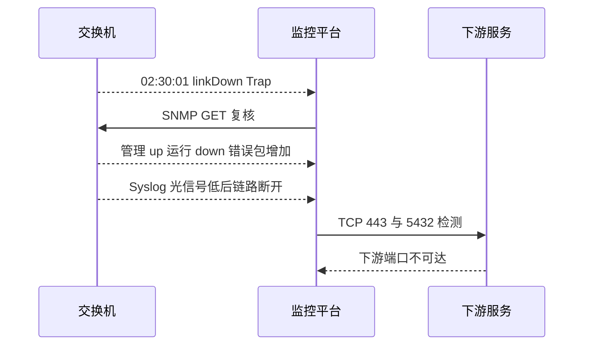

# 完整故障分析：从发现到定界

以上联端口故障为例，按时间顺序拼接四种证据。

## 核心要点

- Trap 最先通知上联接口 linkDown。
- GET 证明接口未被管理员关闭，但实际已断开且存在错误包。
- Syslog 给出光信号变弱到线路协议断开的时间线。
- TCP 证明交换机管理面仍在线，但下游业务端口不可达。

---

## 本章测验

本章共 5 道单项选择题。

### 第 1 题

完整案例中最先快速发现上联变化的信号是什么？

- A. 每日容量报告
- B. linkDown Trap
- C. 网页截图
- D. 数据库备份

选择完成后展开答案

正确答案：B. linkDown Trap

答案解析：Trap 在 02:30:01 报告接口变化，启动后续复核。

### 第 2 题

从发现到定界的正确顺序是什么？

- A. TCP 解释根因、日志读取 OID、GET 发送 Trap
- B. 先恢复再发现
- C. 只看单一端口后直接关闭事件
- D. Trap 发现、GET 确认、Syslog 解释、TCP 验证影响

选择完成后展开答案

正确答案：D. Trap 发现、GET 确认、Syslog 解释、TCP 验证影响

答案解析：四步依次回答变化、状态、原因和影响范围。

### 第 3 题

GET 返回管理 up、运行 down 和错误包增加，最合理的含义是什么？

- A. 接口未被管理员关闭，但实际断开且故障前可能有链路异常
- B. 接口配置为关闭且运行正常
- C. 整台交换机必然断电
- D. Syslog 时间一定错误

选择完成后展开答案

正确答案：A. 接口未被管理员关闭，但实际断开且故障前可能有链路异常

答案解析：管理与运行状态区分配置意图和实际链路，错误包为故障前异常提供线索。

### 第 4 题

Syslog 出现光信号低后接口断开，应如何表述根因？

- A. 仅凭一条日志即可绝对证明所有硬件根因
- B. 应忽略该时间线
- C. 这是强原因线索，仍需光功率、模块或现场检查确认
- D. 说明数据库端口故障

选择完成后展开答案

正确答案：C. 这是强原因线索，仍需光功率、模块或现场检查确认

答案解析：日志支持合理推测，但物理根因仍应通过对应测量和检查验证。

### 第 5 题

交换机管理端口正常而下游 443 和 5432 失败，哪项结论更准确？

- A. 整台交换机已经断电
- B. 交换机仍在线，但上联故障影响了下游业务路径
- C. 所有下游应用都正常
- D. TCP 检测已经证明光模块型号

选择完成后展开答案

正确答案：B. 交换机仍在线，但上联故障影响了下游业务路径

答案解析：管理面正常排除整机完全离线的一种可能，下游失败显示业务影响范围。

<!-- QUIZ_DATA_START
{
  "chapter": "25",
  "questions": [
    {
      "id": 1,
      "question": "完整案例中最先快速发现上联变化的信号是什么？",
      "options": {
        "A": "每日容量报告",
        "B": "linkDown Trap",
        "C": "网页截图",
        "D": "数据库备份"
      },
      "answer": "B",
      "explanation": "Trap 在 02:30:01 报告接口变化，启动后续复核。"
    },
    {
      "id": 2,
      "question": "从发现到定界的正确顺序是什么？",
      "options": {
        "A": "TCP 解释根因、日志读取 OID、GET 发送 Trap",
        "B": "先恢复再发现",
        "C": "只看单一端口后直接关闭事件",
        "D": "Trap 发现、GET 确认、Syslog 解释、TCP 验证影响"
      },
      "answer": "D",
      "explanation": "四步依次回答变化、状态、原因和影响范围。"
    },
    {
      "id": 3,
      "question": "GET 返回管理 up、运行 down 和错误包增加，最合理的含义是什么？",
      "options": {
        "A": "接口未被管理员关闭，但实际断开且故障前可能有链路异常",
        "B": "接口配置为关闭且运行正常",
        "C": "整台交换机必然断电",
        "D": "Syslog 时间一定错误"
      },
      "answer": "A",
      "explanation": "管理与运行状态区分配置意图和实际链路，错误包为故障前异常提供线索。"
    },
    {
      "id": 4,
      "question": "Syslog 出现光信号低后接口断开，应如何表述根因？",
      "options": {
        "A": "仅凭一条日志即可绝对证明所有硬件根因",
        "B": "应忽略该时间线",
        "C": "这是强原因线索，仍需光功率、模块或现场检查确认",
        "D": "说明数据库端口故障"
      },
      "answer": "C",
      "explanation": "日志支持合理推测，但物理根因仍应通过对应测量和检查验证。"
    },
    {
      "id": 5,
      "question": "交换机管理端口正常而下游 443 和 5432 失败，哪项结论更准确？",
      "options": {
        "A": "整台交换机已经断电",
        "B": "交换机仍在线，但上联故障影响了下游业务路径",
        "C": "所有下游应用都正常",
        "D": "TCP 检测已经证明光模块型号"
      },
      "answer": "B",
      "explanation": "管理面正常排除整机完全离线的一种可能，下游失败显示业务影响范围。"
    }
  ]
}
QUIZ_DATA_END -->
