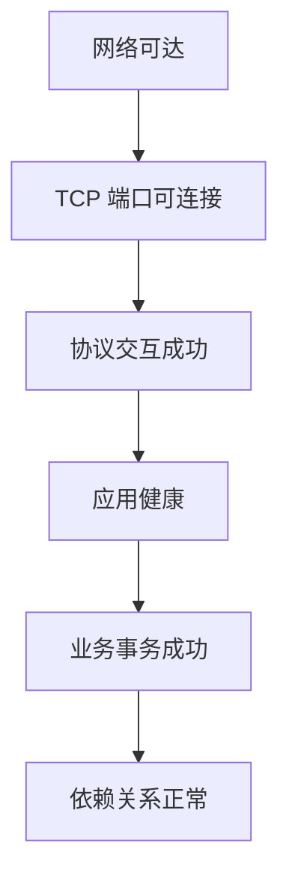

# 分层健康检查

端口成功只是健康链路的一层，不能替代协议、应用和业务验证。

## 核心要点

- TCP 成功不等于 HTTP 或其他应用协议成功。
- 协议成功不等于应用内部健康。
- 应用健康不等于端到端业务事务成功。
- 每一层应使用与该层语义匹配的检查和告警文案。

---

## 本章测验

本章共 5 道单项选择题。

### 第 1 题

分层健康检查中，TCP 端口可连接之后是哪一层？

- A. 直接跳到所有依赖正常
- B. 协议交互成功
- C. 只检查日志保留
- D. 重建 MIB

选择完成后展开答案

正确答案：B. 协议交互成功

答案解析：TCP 层之后还需验证 TLS、HTTP 或其他应用协议交互。

### 第 2 题

从底层到业务的合理检查顺序是什么？

- A. 业务、日志、MIB、端口
- B. 只检查 TCP 一层
- C. 先依赖再假设网络正常
- D. 网络、TCP、协议、应用、业务事务、依赖关系

选择完成后展开答案

正确答案：D. 网络、TCP、协议、应用、业务事务、依赖关系

答案解析：逐层检查能明确失败边界并避免扩大结论。

### 第 3 题

每层告警文案的基本要求是什么？

- A. 只描述该层实际验证到的事实
- B. 始终使用最严重措辞
- C. 把超时写成数据丢失
- D. 省略来源、目标和时间

选择完成后展开答案

正确答案：A. 只描述该层实际验证到的事实

答案解析：告警应与证据语义匹配，例如 TCP 超时不能直接写成整个业务宕机。

### 第 4 题

健康接口成功，但真实下单失败，下一步应检查什么？

- A. 只重复 ICMP Ping
- B. 认定用户操作错误
- C. 业务事务路径及数据库、队列等依赖
- D. 删除所有日志

选择完成后展开答案

正确答案：C. 业务事务路径及数据库、队列等依赖

答案解析：应用健康端点不一定覆盖完整业务流程，需执行端到端事务级验证。

### 第 5 题

哪种等式是错误的？

- A. 网络可达不保证端口开放
- B. TCP 成功等于业务及所有依赖都正常
- C. 协议成功不保证业务成功
- D. 不同层需要不同探测

选择完成后展开答案

正确答案：B. TCP 成功等于业务及所有依赖都正常

答案解析：TCP 只验证连接层，无法替代应用、业务和依赖检查。

<!-- QUIZ_DATA_START
{
  "chapter": "26",
  "questions": [
    {
      "id": 1,
      "question": "分层健康检查中，TCP 端口可连接之后是哪一层？",
      "options": {
        "A": "直接跳到所有依赖正常",
        "B": "协议交互成功",
        "C": "只检查日志保留",
        "D": "重建 MIB"
      },
      "answer": "B",
      "explanation": "TCP 层之后还需验证 TLS、HTTP 或其他应用协议交互。"
    },
    {
      "id": 2,
      "question": "从底层到业务的合理检查顺序是什么？",
      "options": {
        "A": "业务、日志、MIB、端口",
        "B": "只检查 TCP 一层",
        "C": "先依赖再假设网络正常",
        "D": "网络、TCP、协议、应用、业务事务、依赖关系"
      },
      "answer": "D",
      "explanation": "逐层检查能明确失败边界并避免扩大结论。"
    },
    {
      "id": 3,
      "question": "每层告警文案的基本要求是什么？",
      "options": {
        "A": "只描述该层实际验证到的事实",
        "B": "始终使用最严重措辞",
        "C": "把超时写成数据丢失",
        "D": "省略来源、目标和时间"
      },
      "answer": "A",
      "explanation": "告警应与证据语义匹配，例如 TCP 超时不能直接写成整个业务宕机。"
    },
    {
      "id": 4,
      "question": "健康接口成功，但真实下单失败，下一步应检查什么？",
      "options": {
        "A": "只重复 ICMP Ping",
        "B": "认定用户操作错误",
        "C": "业务事务路径及数据库、队列等依赖",
        "D": "删除所有日志"
      },
      "answer": "C",
      "explanation": "应用健康端点不一定覆盖完整业务流程，需执行端到端事务级验证。"
    },
    {
      "id": 5,
      "question": "哪种等式是错误的？",
      "options": {
        "A": "网络可达不保证端口开放",
        "B": "TCP 成功等于业务及所有依赖都正常",
        "C": "协议成功不保证业务成功",
        "D": "不同层需要不同探测"
      },
      "answer": "B",
      "explanation": "TCP 只验证连接层，无法替代应用、业务和依赖检查。"
    }
  ]
}
QUIZ_DATA_END -->
