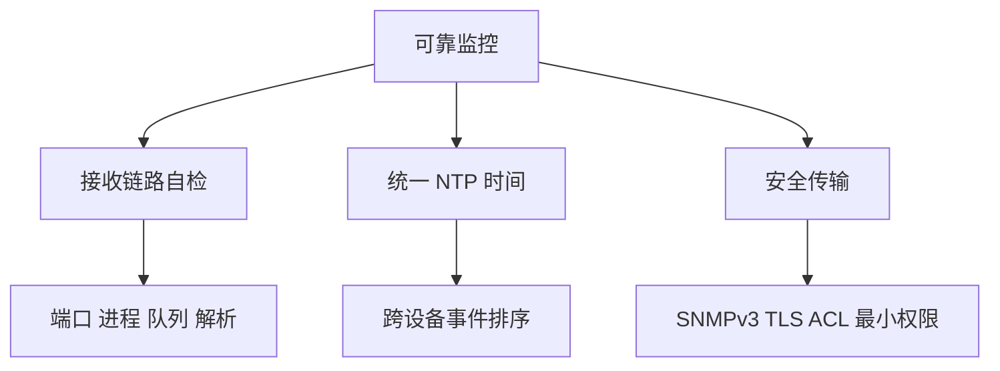

# 接收链路、时间与安全

可靠监控不仅观察设备，也要观察监控管道本身。

## 核心要点

- 定期测试 Trap，并监控接收进程、端口、队列和解析失败。
- 所有设备与平台应使用一致、可靠的 NTP 时间源。
- 生产优先 SNMPv3 与 Syslog over TLS。
- 同时限制监控源 IP，使用 ACL、防火墙白名单和只读最小权限。

---

## 本章测验

本章共 5 道单项选择题。

### 第 1 题

为什么要监控 Trap 接收链路本身？

- A. 接收器负责改变设备温度
- B. 接收器失效会让设备事件无法形成有效告警
- C. 接收器能替代 NTP
- D. 接收器保证业务交易

选择完成后展开答案

正确答案：B. 接收器失效会让设备事件无法形成有效告警

答案解析：端口、进程、队列或解析器故障都可能造成监控盲区。

### 第 2 题

提高监控证据可信度的合理组合是什么？

- A. 关闭时间同步并开放所有来源
- B. 只更换告警颜色
- C. 把凭据写入普通日志
- D. 链路自检、统一时间、SNMPv3 或 TLS、ACL 与最小权限

选择完成后展开答案

正确答案：D. 链路自检、统一时间、SNMPv3 或 TLS、ACL 与最小权限

答案解析：可靠性、时间一致性和安全控制共同决定监控数据是否可用可信。

### 第 3 题

统一 NTP 时间的主要作用是什么？

- A. 让跨设备事件可以按真实先后顺序关联
- B. 自动加密 SNMP
- C. 提高 TCP 端口数量
- D. 生成厂商 MIB

选择完成后展开答案

正确答案：A. 让跨设备事件可以按真实先后顺序关联

答案解析：时钟偏差会扭曲故障时间线，因此需要统一时间源并监控偏差。

### 第 4 题

测试 Trap 能到达进程，但告警仍缺失，下一步最应检查什么？

- A. 只检查显示器亮度
- B. 更换 TCP 业务端口
- C. 队列积压、解析失败和后续事件处理
- D. 假设平台完全正常

选择完成后展开答案

正确答案：C. 队列积压、解析失败和后续事件处理

答案解析：端口与进程存活只覆盖链路一部分，还要验证解析、队列、关联和通知。

### 第 5 题

哪种安全做法不正确？

- A. SNMP 账户采用只读权限
- B. 启用协议安全后把监控端口开放给任意来源
- C. Syslog 敏感链路优先 TLS
- D. 使用 ACL 限制监控源

选择完成后展开答案

正确答案：B. 启用协议安全后把监控端口开放给任意来源

答案解析：协议保护不能替代网络访问控制，端口仍应限制到授权来源。

<!-- QUIZ_DATA_START
{
  "chapter": "27",
  "questions": [
    {
      "id": 1,
      "question": "为什么要监控 Trap 接收链路本身？",
      "options": {
        "A": "接收器负责改变设备温度",
        "B": "接收器失效会让设备事件无法形成有效告警",
        "C": "接收器能替代 NTP",
        "D": "接收器保证业务交易"
      },
      "answer": "B",
      "explanation": "端口、进程、队列或解析器故障都可能造成监控盲区。"
    },
    {
      "id": 2,
      "question": "提高监控证据可信度的合理组合是什么？",
      "options": {
        "A": "关闭时间同步并开放所有来源",
        "B": "只更换告警颜色",
        "C": "把凭据写入普通日志",
        "D": "链路自检、统一时间、SNMPv3 或 TLS、ACL 与最小权限"
      },
      "answer": "D",
      "explanation": "可靠性、时间一致性和安全控制共同决定监控数据是否可用可信。"
    },
    {
      "id": 3,
      "question": "统一 NTP 时间的主要作用是什么？",
      "options": {
        "A": "让跨设备事件可以按真实先后顺序关联",
        "B": "自动加密 SNMP",
        "C": "提高 TCP 端口数量",
        "D": "生成厂商 MIB"
      },
      "answer": "A",
      "explanation": "时钟偏差会扭曲故障时间线，因此需要统一时间源并监控偏差。"
    },
    {
      "id": 4,
      "question": "测试 Trap 能到达进程，但告警仍缺失，下一步最应检查什么？",
      "options": {
        "A": "只检查显示器亮度",
        "B": "更换 TCP 业务端口",
        "C": "队列积压、解析失败和后续事件处理",
        "D": "假设平台完全正常"
      },
      "answer": "C",
      "explanation": "端口与进程存活只覆盖链路一部分，还要验证解析、队列、关联和通知。"
    },
    {
      "id": 5,
      "question": "哪种安全做法不正确？",
      "options": {
        "A": "SNMP 账户采用只读权限",
        "B": "启用协议安全后把监控端口开放给任意来源",
        "C": "Syslog 敏感链路优先 TLS",
        "D": "使用 ACL 限制监控源"
      },
      "answer": "B",
      "explanation": "协议保护不能替代网络访问控制，端口仍应限制到授权来源。"
    }
  ]
}
QUIZ_DATA_END -->
