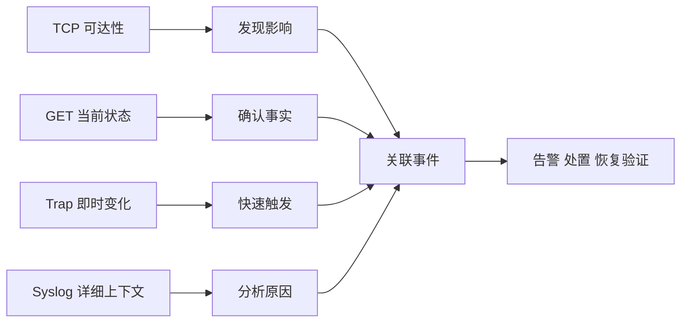

# 课程总结与延伸思考

从四个问题回到一个监控闭环，并明确下一步设计方向。

## 核心要点

- TCP Ping 看端口通不通，但不证明应用与业务健康。
- SNMP GET 看当前状态和趋势，受轮询周期与设备对象限制。
- SNMP Trap 报告刚发生的变化，需防丢失、风暴和上下文不足。
- Syslog 解释事件和可能原因，需统一时间、解析与安全传输。
- 下一步可研究容量规划、事件关联、告警降噪和端到端业务探测。

---

## 本章测验

本章共 5 道单项选择题。

### 第 1 题

课程总结中，哪种方式负责确认当前状态与趋势？

- A. TCP Ping
- B. SNMP GET
- C. SNMP Trap
- D. Syslog

选择完成后展开答案

正确答案：B. SNMP GET

答案解析：GET 周期读取结构化对象，用于当前状态、历史趋势和阈值判断。

### 第 2 题

从异常到恢复的完整闭环是什么？

- A. 只接收一次 Trap 后结束
- B. 只保存日志不处置
- C. 端口成功后删除全部历史
- D. 发现影响、确认状态、分析原因、处置并重新验证

选择完成后展开答案

正确答案：D. 发现影响、确认状态、分析原因、处置并重新验证

答案解析：监控闭环不仅发现故障，还要确认、解释、处置并验证恢复。

### 第 3 题

四种方式中，谁最适合提供详细事件上下文？

- A. Syslog
- B. TCP Ping
- C. SNMP GET
- D. SNMP Trap

选择完成后展开答案

正确答案：A. Syslog

答案解析：Syslog 往往包含事件文字、时间和原因线索，适合诊断与审计。

### 第 4 题

如果要让监控更接近真实用户体验，下一步应增加什么？

- A. 只增加 Trap 邮件数量
- B. 停止采集所有状态
- C. 协议、应用和端到端业务事务探测
- D. 把所有端口结果改成健康

选择完成后展开答案

正确答案：C. 协议、应用和端到端业务事务探测

答案解析：四种基础方式仍不足以证明用户业务成功，需要更高层的真实交互检查。

### 第 5 题

哪项综合理解正确？

- A. 任一种方式都能完全替代其余方式
- B. 四种证据各有边界，关联后才能形成更可靠的判断
- C. 没有消息就一定健康
- D. 端口成功就等于全部业务成功

选择完成后展开答案

正确答案：B. 四种证据各有边界，关联后才能形成更可靠的判断

答案解析：课程核心是尊重各信号的范围，并通过关联构建从发现到恢复的闭环。

<!-- QUIZ_DATA_START
{
  "chapter": "28",
  "questions": [
    {
      "id": 1,
      "question": "课程总结中，哪种方式负责确认当前状态与趋势？",
      "options": {
        "A": "TCP Ping",
        "B": "SNMP GET",
        "C": "SNMP Trap",
        "D": "Syslog"
      },
      "answer": "B",
      "explanation": "GET 周期读取结构化对象，用于当前状态、历史趋势和阈值判断。"
    },
    {
      "id": 2,
      "question": "从异常到恢复的完整闭环是什么？",
      "options": {
        "A": "只接收一次 Trap 后结束",
        "B": "只保存日志不处置",
        "C": "端口成功后删除全部历史",
        "D": "发现影响、确认状态、分析原因、处置并重新验证"
      },
      "answer": "D",
      "explanation": "监控闭环不仅发现故障，还要确认、解释、处置并验证恢复。"
    },
    {
      "id": 3,
      "question": "四种方式中，谁最适合提供详细事件上下文？",
      "options": {
        "A": "Syslog",
        "B": "TCP Ping",
        "C": "SNMP GET",
        "D": "SNMP Trap"
      },
      "answer": "A",
      "explanation": "Syslog 往往包含事件文字、时间和原因线索，适合诊断与审计。"
    },
    {
      "id": 4,
      "question": "如果要让监控更接近真实用户体验，下一步应增加什么？",
      "options": {
        "A": "只增加 Trap 邮件数量",
        "B": "停止采集所有状态",
        "C": "协议、应用和端到端业务事务探测",
        "D": "把所有端口结果改成健康"
      },
      "answer": "C",
      "explanation": "四种基础方式仍不足以证明用户业务成功，需要更高层的真实交互检查。"
    },
    {
      "id": 5,
      "question": "哪项综合理解正确？",
      "options": {
        "A": "任一种方式都能完全替代其余方式",
        "B": "四种证据各有边界，关联后才能形成更可靠的判断",
        "C": "没有消息就一定健康",
        "D": "端口成功就等于全部业务成功"
      },
      "answer": "B",
      "explanation": "课程核心是尊重各信号的范围，并通过关联构建从发现到恢复的闭环。"
    }
  ]
}
QUIZ_DATA_END -->
