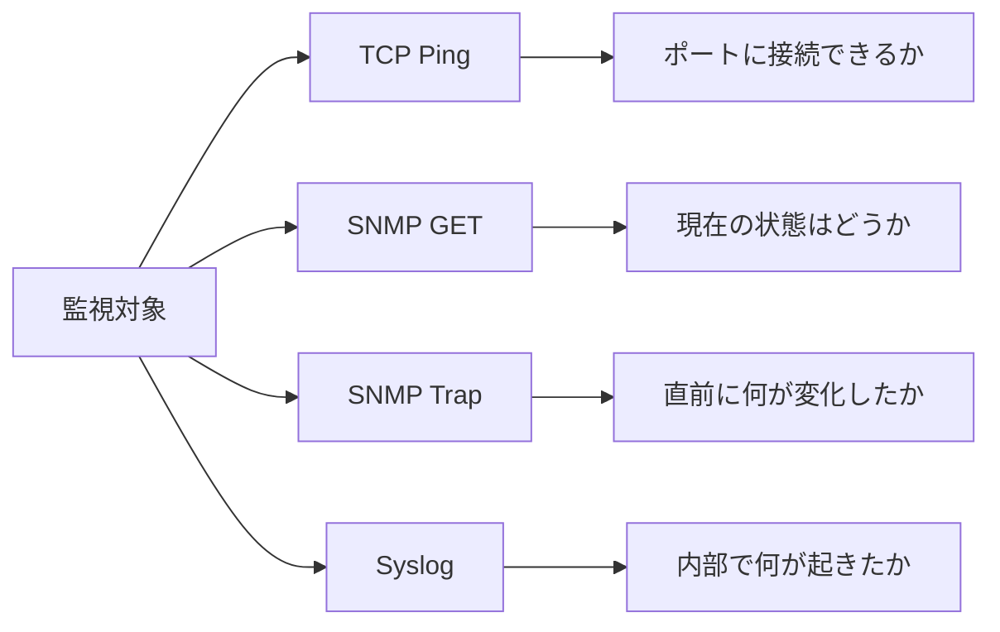

# 4つの通信方式が答える4つの問い

まず全体像をつかみましょう。4つの手段は互いを置き換えるものではなく、相互に補完します。

## 重要ポイント

- TCP Ping は、対象のTCPポートへ接続できるかを確認します。
- SNMP GET は、デバイスの現在のステータスとパフォーマンス インジケーターを読み取ります。
- SNMP Trap は、機器が自発的に報告したイベントを受信します。
- Syslog は、イベントの詳細、原因の手掛かり、監査記録を提供します。
- TCP Ping は、TCP に基づく検出方法であり、独立した標準プロトコルではありません。

---

## 章末クイズ

この章には5問の四択問題があります。

### 第 1 問

TCP Ping は主にどの質問に答えますか?

- A. デバイスの現在の CPU 使用率はどれくらいですか
- B. ターゲットの TCP ポートが接続を確立できるかどうか
- C. デバイスはどのような変更を積極的に報告しましたか?
- D. デバイス内にどのような詳細なイベントが記録されるか

回答を選んだ後に解答を開く

正解：B. ターゲットの TCP ポートが接続を確立できるかどうか

解説：TCP Ping は、指定された TCP ポートの接続性に重点を置いています。ステータス メトリック、アクティブなイベント、および詳細なログは、それぞれ GET、Trap、Syslog によって提供される方が適切です。

### 第 2 問

この章の 4 つの観察の観点に適合する対応関係はどれですか?

- A. TCP はログを調べ、GET はポートを調べ、Trap は傾向を調べ、Syslog は温度を調べます。
- B. TCP は構成を調べ、GET は監査を調べ、Trap は容量を調べ、Syslog はルーティングを調べます。
- C. TCP は業務結果を調べ、GET はすべての理由を調べ、Trap は過去の傾向を調べ、Syslog はポートを調べます。
- D. TCP は到達可能性を調べ、GET は現在のステータスを調べ、Trap は即時の変更を調べ、Syslog はイベントの詳細を調べます。

回答を選んだ後に解答を開く

正解：D. TCP は到達可能性を調べ、GET は現在のステータスを調べ、Trap は即時の変更を調べ、Syslog はイベントの詳細を調べます。

解説：4 つの方法はそれぞれ異なる質問に答え、到達可能性、ステータス、変更、コンテキストをカバーするために組み合わせて使用できます。

### 第 3 問

TCP Ping の技術的な位置付けを正確に説明しているのはどれですか?

- A. 独立した標準プロトコルではなく、TCPに基づく接続検出方式です。
- B. SNMPのリクエストタイプです
- C. Syslog の信頼できるトランスポート モードです。
- D. ICMP Echo の公式別名です

回答を選んだ後に解答を開く

正解：A. 独立した標準プロトコルではなく、TCPに基づく接続検出方式です。

解説：TCP Ping は、TCP ポートを介した接続検出を指す一般名です。これは、SNMP や Syslog のような独立した標準プロトコルではありません。

### 第 4 問

監視プラットフォームはインターフェイス変更通知を受け取りましたが、詳細な理由を知る必要があります。次のステップとして何を確認するのが最善でしょうか?

- A. TCP接続確立のみを繰り返す
- B. 次のトラップを待っているだけです
- C. 関連する Syslog レコード
- D. すべてのポーリング タスクを閉じる

回答を選んだ後に解答を開く

正解：C. 関連する Syslog レコード

解説：syslog には、多くの場合、デバイスの内部イベント、タイミング、原因に関する手がかりが含まれています。 TCP と Traps だけでは、同じレベルの詳細なコンテキストを提供できません。

### 第 5 問

次の理解のうち、よくある誤解はどれですか?

- A. 証拠の種類に基づいてコミュニケーション方法を選択する
- B. 他の 3 つの方法に代わる汎用監視プロトコルを探しています
- C. さまざまな信号を 1 つのイベントに関連付ける
- D. ポートの到達可能性と業務の健全性を区別する

回答を選んだ後に解答を開く

正解：B. 他の 3 つの方法に代わる汎用監視プロトコルを探しています

解説：4 つの方法は補完的であり、1 つの方法だけですべての監視問題をカバーできるわけではありません。

<!-- QUIZ_DATA_START
{
  "chapter": "01",
  "questions": [
    {
      "id": 1,
      "question": "TCP Ping は主にどの質問に答えますか?",
      "options": {
        "A": "デバイスの現在の CPU 使用率はどれくらいですか",
        "B": "ターゲットの TCP ポートが接続を確立できるかどうか",
        "C": "デバイスはどのような変更を積極的に報告しましたか?",
        "D": "デバイス内にどのような詳細なイベントが記録されるか"
      },
      "answer": "B",
      "explanation": "TCP Ping は、指定された TCP ポートの接続性に重点を置いています。ステータス メトリック、アクティブなイベント、および詳細なログは、それぞれ GET、Trap、Syslog によって提供される方が適切です。"
    },
    {
      "id": 2,
      "question": "この章の 4 つの観察の観点に適合する対応関係はどれですか?",
      "options": {
        "A": "TCP はログを調べ、GET はポートを調べ、Trap は傾向を調べ、Syslog は温度を調べます。",
        "B": "TCP は構成を調べ、GET は監査を調べ、Trap は容量を調べ、Syslog はルーティングを調べます。",
        "C": "TCP は業務結果を調べ、GET はすべての理由を調べ、Trap は過去の傾向を調べ、Syslog はポートを調べます。",
        "D": "TCP は到達可能性を調べ、GET は現在のステータスを調べ、Trap は即時の変更を調べ、Syslog はイベントの詳細を調べます。"
      },
      "answer": "D",
      "explanation": "4 つの方法はそれぞれ異なる質問に答え、到達可能性、ステータス、変更、コンテキストをカバーするために組み合わせて使用できます。"
    },
    {
      "id": 3,
      "question": "TCP Ping の技術的な位置付けを正確に説明しているのはどれですか?",
      "options": {
        "A": "独立した標準プロトコルではなく、TCPに基づく接続検出方式です。",
        "B": "SNMPのリクエストタイプです",
        "C": "Syslog の信頼できるトランスポート モードです。",
        "D": "ICMP Echo の公式別名です"
      },
      "answer": "A",
      "explanation": "TCP Ping は、TCP ポートを介した接続検出を指す一般名です。これは、SNMP や Syslog のような独立した標準プロトコルではありません。"
    },
    {
      "id": 4,
      "question": "監視プラットフォームはインターフェイス変更通知を受け取りましたが、詳細な理由を知る必要があります。次のステップとして何を確認するのが最善でしょうか?",
      "options": {
        "A": "TCP接続確立のみを繰り返す",
        "B": "次のトラップを待っているだけです",
        "C": "関連する Syslog レコード",
        "D": "すべてのポーリング タスクを閉じる"
      },
      "answer": "C",
      "explanation": "syslog には、多くの場合、デバイスの内部イベント、タイミング、原因に関する手がかりが含まれています。 TCP と Traps だけでは、同じレベルの詳細なコンテキストを提供できません。"
    },
    {
      "id": 5,
      "question": "次の理解のうち、よくある誤解はどれですか?",
      "options": {
        "A": "証拠の種類に基づいてコミュニケーション方法を選択する",
        "B": "他の 3 つの方法に代わる汎用監視プロトコルを探しています",
        "C": "さまざまな信号を 1 つのイベントに関連付ける",
        "D": "ポートの到達可能性と業務の健全性を区別する"
      },
      "answer": "B",
      "explanation": "4 つの方法は補完的であり、1 つの方法だけですべての監視問題をカバーできるわけではありません。"
    }
  ]
}
QUIZ_DATA_END -->
