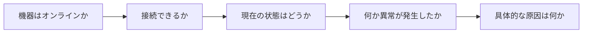

# なぜ4つの監視方式が必要なのか

一言で言うと：単一の監視手段だけでは、機器の状態に関するすべての疑問には答えられない。

## 核心ポイント

* TCP Ping は「接続できるか」に答える
* SNMP GET は「今どうなっているか」に答える
* SNMP Trap は「今何が起きたか」に答える
* Syslog は「なぜそうなったか」に答える
* 4つの方式が組み合わさって完全な監視体制を構成する
