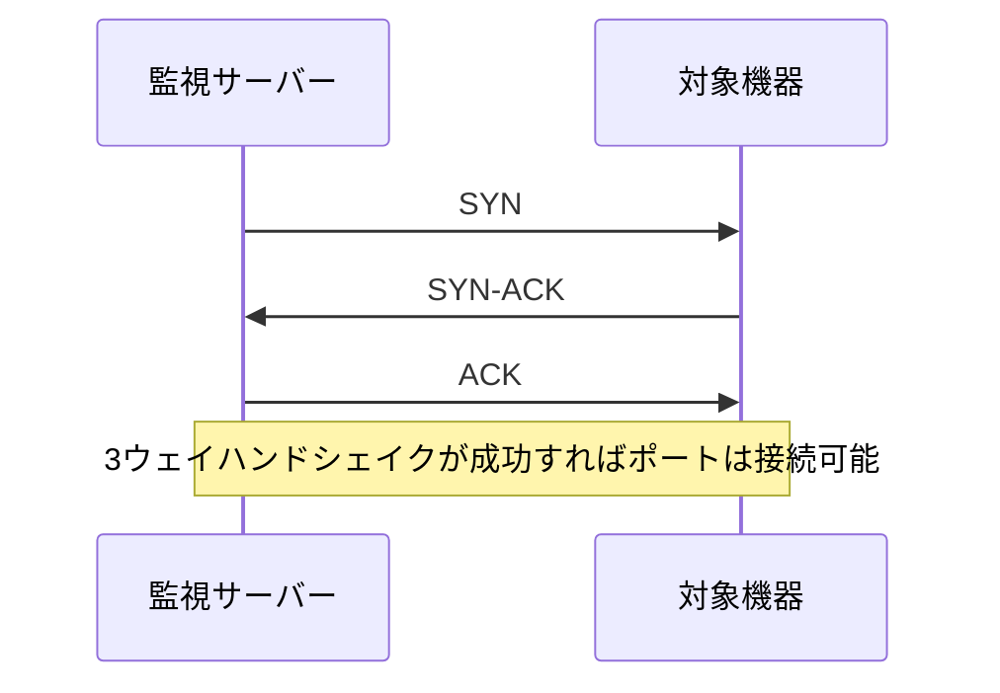

# TCP Ping：ポートの疎通確認

一言で言うと：TCP Pingは、TCP接続の確立を試みることで、指定したポートが利用可能かどうかを判断する。

## 核心ポイント

* 検査対象は特定のポートであり、ホスト全体ではない
* 80 443 22 3306 などのポート検査によく使われる
* ICMP Pingとは異なり、ICMPはネットワーク層の疎通を確認する
* ファイアウォールがICMPを禁止していても特定ポートへの接続は許可されている場合がある
* サービスがリッスンしているかを素早く判断するのに適している
