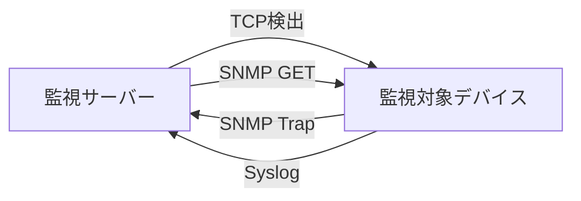

# アクティブ検出とパッシブ受信

監視システムと機器間の責任を通信方向から理解します。

## 重要ポイント

- TCP 検出と SNMP GET は通常、監視サーバーによって開始されます。
- SNMP Trapと Syslog は通常、デバイスまたはアプリケーションによってアクティブに送信されます。
- アクティブな検出は繰り返し確認できますが、パッシブなメッセージはタイムリーですが、失われる可能性があります。
- 完全なシステムには、スケジューラ、受信機、ストレージ、およびアラート相関が同時に必要です。

---

## 章末クイズ

この章には5問の四択問題があります。

### 第 1 問

通常、監視サーバーによって開始される 2 つの方法はどれですか?

- A. SNMP Trapと Syslog
- B. TCP 検出と SNMP GET
- C. TCP 検出と Syslog
- D. SNMP GET と SNMP Trap

回答を選んだ後に解答を開く

正解：B. TCP 検出と SNMP GET

解説：TCP 検出と GET は両方とも、監視側によってオンデマンドまたは定期的に要求されます。トラップと Syslog は通常、デバイスによってアクティブに送信されます。

### 第 2 問

どの通信方向の組み合わせが正しいでしょうか?

- A. デバイスは監視側に GET を送信し、監視側はデバイスに Trap を送信します。
- B. 監視側はTCPのみを受信し、機器はSyslogのみを受信します。
- C. 4 つの方法すべてにおいて、最初に監視側でセッションを確立する必要があります。
- D. 監視側はデバイスにGETを送信し、デバイスは監視側にTrapを送信します。

回答を選んだ後に解答を開く

正解：D. 監視側はデバイスにGETを送信し、デバイスは監視側にTrapを送信します。

解説：GET はマネージャーのリクエストとエージェントの応答です。トラップはデバイスによって受信側にアクティブに送信されます。

### 第 3 問

アクティブ検出の最も顕著な制御機能は何ですか?

- A. 監視側はサイクルをスケジュールし、失敗後にポリシーに従って再試行できます。
- B. デバイスが失敗の原因を送信する必要があることを確認する
- C. すべてのネットワークパケット損失を自動的に排除します
- D. 検出負荷を考慮する必要がない

回答を選んだ後に解答を開く

正解：A. 監視側はサイクルをスケジュールし、失敗後にポリシーに従って再試行できます。

解説：アクティブ プローブは監視側によってスケジュールされるため、頻度、タイムアウト、再試行を制御できますが、パケット損失や負荷がないという保証はありません。

### 第 4 問

デバイスの電源が突然失われ、イベントを送信する時間がなくなった場合、問題を外部に明らかにする可能性が最も高いのはどの種類の証拠でしょうか?

- A. デバイス再発行待ちのトラップ
- B. 過去の Syslog が空かどうかのみをチェックします
- C. 定期的なアクティブ検出が失敗する
- D. メッセージがないことを正常と解釈する

回答を選んだ後に解答を開く

正解：C. 定期的なアクティブ検出が失敗する

解説：デバイスの電源がオフの場合、パッシブ メッセージが失われる可能性があり、外部 TCP または GET プローブの失敗により、デバイスが到達不能であるという証拠が得られる可能性があります。

### 第 5 問

「能動的」と「受動的」の正しい理解は何ですか?

- A. アクティブなメッセージのみが通常を意味します
- B. これは誰が最初に通信を開始するかを記述するものであり、正常か失敗かを直接示すものではありません。
- C. 受動的なメッセージは失敗のみを示します
- D. パッシブモードは受信機を必要としません

回答を選んだ後に解答を開く

正解：B. これは誰が最初に通信を開始するかを記述するものであり、正常か失敗かを直接示すものではありません。

解説：アクティブとパッシブは通信開始の指示であり、健康状態のラベルではありません。

<!-- QUIZ_DATA_START
{
  "chapter": "02",
  "questions": [
    {
      "id": 1,
      "question": "通常、監視サーバーによって開始される 2 つの方法はどれですか?",
      "options": {
        "A": "SNMP Trapと Syslog",
        "B": "TCP 検出と SNMP GET",
        "C": "TCP 検出と Syslog",
        "D": "SNMP GET と SNMP Trap"
      },
      "answer": "B",
      "explanation": "TCP 検出と GET は両方とも、監視側によってオンデマンドまたは定期的に要求されます。トラップと Syslog は通常、デバイスによってアクティブに送信されます。"
    },
    {
      "id": 2,
      "question": "どの通信方向の組み合わせが正しいでしょうか?",
      "options": {
        "A": "デバイスは監視側に GET を送信し、監視側はデバイスに Trap を送信します。",
        "B": "監視側はTCPのみを受信し、機器はSyslogのみを受信します。",
        "C": "4 つの方法すべてにおいて、最初に監視側でセッションを確立する必要があります。",
        "D": "監視側はデバイスにGETを送信し、デバイスは監視側にTrapを送信します。"
      },
      "answer": "D",
      "explanation": "GET はマネージャーのリクエストとエージェントの応答です。トラップはデバイスによって受信側にアクティブに送信されます。"
    },
    {
      "id": 3,
      "question": "アクティブ検出の最も顕著な制御機能は何ですか?",
      "options": {
        "A": "監視側はサイクルをスケジュールし、失敗後にポリシーに従って再試行できます。",
        "B": "デバイスが失敗の原因を送信する必要があることを確認する",
        "C": "すべてのネットワークパケット損失を自動的に排除します",
        "D": "検出負荷を考慮する必要がない"
      },
      "answer": "A",
      "explanation": "アクティブ プローブは監視側によってスケジュールされるため、頻度、タイムアウト、再試行を制御できますが、パケット損失や負荷がないという保証はありません。"
    },
    {
      "id": 4,
      "question": "デバイスの電源が突然失われ、イベントを送信する時間がなくなった場合、問題を外部に明らかにする可能性が最も高いのはどの種類の証拠でしょうか?",
      "options": {
        "A": "デバイス再発行待ちのトラップ",
        "B": "過去の Syslog が空かどうかのみをチェックします",
        "C": "定期的なアクティブ検出が失敗する",
        "D": "メッセージがないことを正常と解釈する"
      },
      "answer": "C",
      "explanation": "デバイスの電源がオフの場合、パッシブ メッセージが失われる可能性があり、外部 TCP または GET プローブの失敗により、デバイスが到達不能であるという証拠が得られる可能性があります。"
    },
    {
      "id": 5,
      "question": "「能動的」と「受動的」の正しい理解は何ですか?",
      "options": {
        "A": "アクティブなメッセージのみが通常を意味します",
        "B": "これは誰が最初に通信を開始するかを記述するものであり、正常か失敗かを直接示すものではありません。",
        "C": "受動的なメッセージは失敗のみを示します",
        "D": "パッシブモードは受信機を必要としません"
      },
      "answer": "B",
      "explanation": "アクティブとパッシブは通信開始の指示であり、健康状態のラベルではありません。"
    }
  ]
}
QUIZ_DATA_END -->
