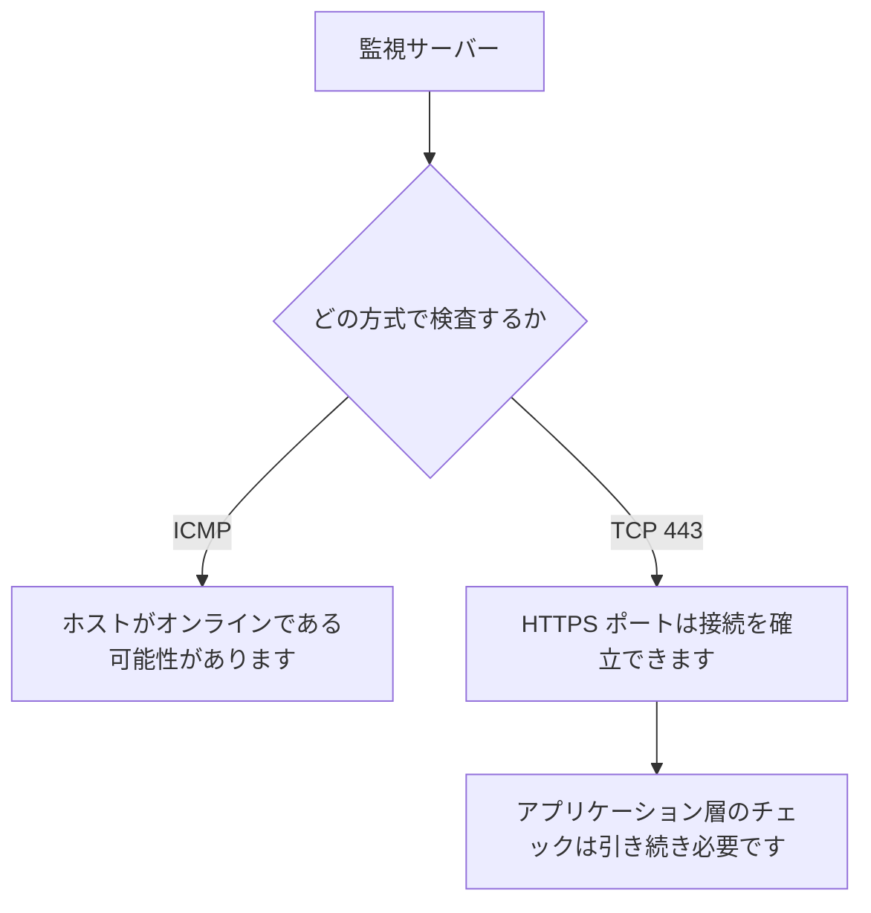

# TCP Ping と ICMP Ping

ICMPが制限されている場合は、実際のサービスポートとの接続性を確認してください。

## 重要ポイント

- ICMP が成功しても、サービス ポートが使用可能であることを意味するわけではありません。
- TCP 検査には、ルーティング、ファイアウォール、オペレーティング システムの応答、ポート リスニングが含まれます。
- クラウド セキュリティ グループ、企業ファイアウォール、負荷分散環境によって ICMP が制限される場合があります。
- TCP 443 の成功は、TCP 接続が確立されたことを証明するだけであり、HTTP または業務が成功したことを証明するものではありません。

---

## 章末クイズ

この章には5問の四択問題があります。

### 第 1 問

ICMP Ping が成功したという最も合理的な結論は何ですか?

- A. HTTPS 業務は成功する必要があります
- B. ターゲット ホストがオンラインで、ICMP パスが利用可能である可能性があります。
- C. すべての TCP ポートが開いています
- D. データベースの依存関係は正常でなければなりません

回答を選んだ後に解答を開く

正解：B. ターゲット ホストがオンラインで、ICMP パスが利用可能である可能性があります。

解説：ICMP の成功は、対応するネットワーク メッセージを送受信できることを証明することしかできませんが、特定のポート、アプリケーション、または依存関係の健全性を証明することはできません。

### 第 2 問

TCP 443 の検出にはどのような重要な条件が関係しますか?

- A. DNS が適切に機能する必要があるだけです
- B. CPU がしきい値を超えないことのみが必要です
- C. トラップを発行する必要があるのはデバイスのみです
- D. ルートが到達可能で、ファイアウォールが許可し、オペレーティング システムが応答し、443 がリッスンしています。

回答を選んだ後に解答を開く

正解：D. ルートが到達可能で、ファイアウォールが許可し、オペレーティング システムが応答し、443 がリッスンしています。

解説：TCP 接続の確立は、ネットワーク パス、アクセス制御、ターゲット プロトコル スタック、ポート リスニングなどの複数のリンクにまたがります。

### 第 3 問

TCP 443 の成功を最もよく表しているのはどれですか?

- A. 現在の監視ポイントからその時点でターゲットポート443へのTCP接続を確立できます。
- B. ウェブサイトのすべてのページは正しいです
- C. TLS 証明書は有効である必要があります
- D. バックエンドデータベースが利用可能である必要があります

回答を選んだ後に解答を開く

正解：A. 現在の監視ポイントからその時点でターゲットポート443へのTCP接続を確立できます。

解説：TCP 証拠は送信元、宛先、ポート、時刻を保持する必要があり、TLS、HTTP、または業務層に拡張することはできません。

### 第 4 問

クラウド セキュリティ グループは ICMP を無効にしますが、HTTPS は許可します。実際のアクセスパスを確認するには何を優先すればよいでしょうか？

- A. ローカルループバックアドレスのみをチェックします
- B. デバイスが Syslog を送信するまで待ちます
- C. 監視ポイントからTCP 443検出を実行
- D. ICMP 障害をダウンタイムとして直接定義する

回答を選んだ後に解答を開く

正解：C. 監視ポイントからTCP 443検出を実行

解説：TCP 443 検出では、実際に許可されているサービス ポートに沿った接続パスを検証できます。これは、このシナリオにより適しています。

### 第 5 問

どのステートメントが過剰推論ですか?

- A. TCP 障害はさまざまな理由で発生する可能性があります
- B. TCP 443 は成功するため、業務 システム全体は完全に正常です
- C. TCP が成功した後も、アプリケーション層のチェックが必要です。
- D. テストの結論にはモニタリングのソースを示す必要があります

回答を選んだ後に解答を開く

正解：B. TCP 443 は成功するため、業務 システム全体は完全に正常です

解説：ポート接続の確立は TCP 層のみをカバーしており、アプリケーションのロジック、データ、依存関係が正常であることを証明することはできません。

<!-- QUIZ_DATA_START
{
  "chapter": "03",
  "questions": [
    {
      "id": 1,
      "question": "ICMP Ping が成功したという最も合理的な結論は何ですか?",
      "options": {
        "A": "HTTPS 業務は成功する必要があります",
        "B": "ターゲット ホストがオンラインで、ICMP パスが利用可能である可能性があります。",
        "C": "すべての TCP ポートが開いています",
        "D": "データベースの依存関係は正常でなければなりません"
      },
      "answer": "B",
      "explanation": "ICMP の成功は、対応するネットワーク メッセージを送受信できることを証明することしかできませんが、特定のポート、アプリケーション、または依存関係の健全性を証明することはできません。"
    },
    {
      "id": 2,
      "question": "TCP 443 の検出にはどのような重要な条件が関係しますか?",
      "options": {
        "A": "DNS が適切に機能する必要があるだけです",
        "B": "CPU がしきい値を超えないことのみが必要です",
        "C": "トラップを発行する必要があるのはデバイスのみです",
        "D": "ルートが到達可能で、ファイアウォールが許可し、オペレーティング システムが応答し、443 がリッスンしています。"
      },
      "answer": "D",
      "explanation": "TCP 接続の確立は、ネットワーク パス、アクセス制御、ターゲット プロトコル スタック、ポート リスニングなどの複数のリンクにまたがります。"
    },
    {
      "id": 3,
      "question": "TCP 443 の成功を最もよく表しているのはどれですか?",
      "options": {
        "A": "現在の監視ポイントからその時点でターゲットポート443へのTCP接続を確立できます。",
        "B": "ウェブサイトのすべてのページは正しいです",
        "C": "TLS 証明書は有効である必要があります",
        "D": "バックエンドデータベースが利用可能である必要があります"
      },
      "answer": "A",
      "explanation": "TCP 証拠は送信元、宛先、ポート、時刻を保持する必要があり、TLS、HTTP、または業務層に拡張することはできません。"
    },
    {
      "id": 4,
      "question": "クラウド セキュリティ グループは ICMP を無効にしますが、HTTPS は許可します。実際のアクセスパスを確認するには何を優先すればよいでしょうか？",
      "options": {
        "A": "ローカルループバックアドレスのみをチェックします",
        "B": "デバイスが Syslog を送信するまで待ちます",
        "C": "監視ポイントからTCP 443検出を実行",
        "D": "ICMP 障害をダウンタイムとして直接定義する"
      },
      "answer": "C",
      "explanation": "TCP 443 検出では、実際に許可されているサービス ポートに沿った接続パスを検証できます。これは、このシナリオにより適しています。"
    },
    {
      "id": 5,
      "question": "どのステートメントが過剰推論ですか?",
      "options": {
        "A": "TCP 障害はさまざまな理由で発生する可能性があります",
        "B": "TCP 443 は成功するため、業務 システム全体は完全に正常です",
        "C": "TCP が成功した後も、アプリケーション層のチェックが必要です。",
        "D": "テストの結論にはモニタリングのソースを示す必要があります"
      },
      "answer": "B",
      "explanation": "ポート接続の確立は TCP 層のみをカバーしており、アプリケーションのロジック、データ、依存関係が正常であることを証明することはできません。"
    }
  ]
}
QUIZ_DATA_END -->
