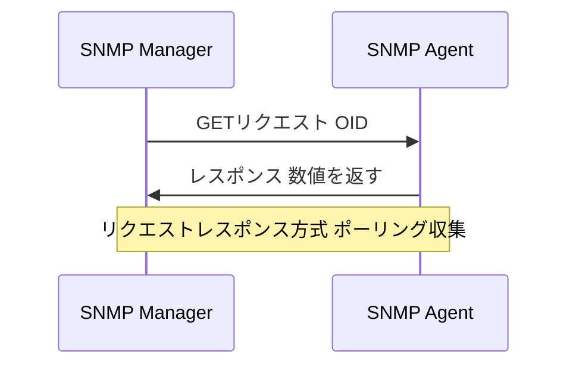

# SNMP GET：機器の状態を能動的に問い合わせる

一言で言うと：監視サーバーがOIDを通じて機器に具体的な指標を問い合わせる。

## 核心ポイント

* UDP 161番ポートを使用する
* OIDによって具体的な指標を特定する
* CPU メモリ インターフェースのトラフィック 稼働時間などを問い合わせできる
* SNMPv3は認証と暗号化に対応しており本番環境に適している
* ポーリング方式のため適切な収集間隔を設定する必要がある
