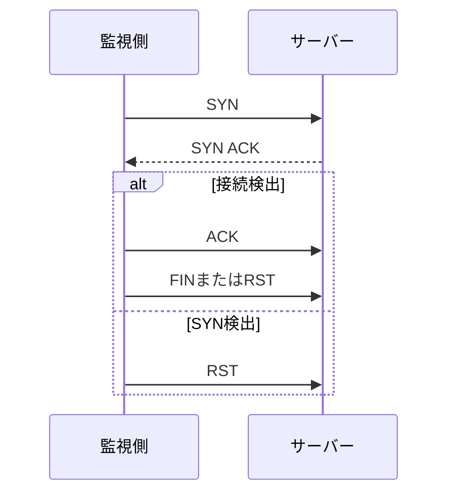

# TCP 3 ウェイ ハンドシェイクと 2 つの検出

ハンドシェイク プロセスにおける TCP Connect と TCP SYN 検出の違いを理解します。

## 重要ポイント

- 接続検出により、オペレーティング システムの接続を介した 3 ウェイ ハンドシェイクが完了します。
- SYN 検出では通常、SYN-ACK を受信した後、完全な接続を確立せずに RST を送信します。
- Connect は実装が簡単で、一般ユーザーでも実行できますが、実際には接続リソースを占有します。
- SYN 検出のオーバーヘッドは低くなりますが、通常は生のメッセージ機能とより高い権限が必要です。

---

## 章末クイズ

この章には5問の四択問題があります。

### 第 1 問

TCP Connect 検出は何をしますか?

- A. 1 つの OID のみを読み取ります
- B. 接続を通じて完全な 3 ウェイ ハンドシェイクを完了する
- C. デバイスログのみを受信する
- D. SYN 送信後の応答を処理しない

回答を選んだ後に解答を開く

正解：B. 接続を通じて完全な 3 ウェイ ハンドシェイクを完了する

解説：Connect は実際の TCP 接続の確立を検出し、SYN、SYN-ACK、および ACK を完了します。

### 第 2 問

通常、SYN-ACK を受信した後、TCP SYN 検出はどのように処理されますか?

- A. Syslog 確認の送信
- B. SNMP GetBulkを実行する
- C. アプリケーションセッションを維持し続ける
- D. 完全な接続を完了せずに RST を送信する

回答を選んだ後に解答を開く

正解：D. 完全な接続を完了せずに RST を送信する

解説：SYN 検出では、SYN-ACK を使用してポートが開いていることを判断し、完全な接続確立を回避するために通常は RST で終了します。

### 第 3 問

接続検出の実際的な利点は何ですか?

- A. 実装は簡単で、通常は通常のユーザー権限で実行できます。
- B. サーバーリソースを占有しない
- C. 業務取引の成功を証明できる
- D. ネットワーク接続レコードは生成されません

回答を選んだ後に解答を開く

正解：A. 実装は簡単で、通常は通常のユーザー権限で実行できます。

解説：Connect はオペレーティング システム インターフェイスに依存しており、通常は権限要件が低くなります。ただし、実際の接続は確立され、TCP 層のみが認証されます。

### 第 4 問

高頻度検出がターゲットの接続リソースに敏感で、環境が元のパケット機能を許可する場合、どの方法を評価できますか?

- A. 履歴ログのみを表示する
- B. すべてのポート監視をオフにする
- C. TCP SYN 検出
- D. GETをトラップに変更

回答を選んだ後に解答を開く

正解：C. TCP SYN 検出

解説：SYN 検出では完全な接続は完了しないため、接続リソースの使用量が削減される可能性がありますが、アクセス許可とメッセージ オーバーヘッドを評価する必要があります。

### 第 5 問

2 種類の TCP 検出について間違っているのはどれですか?

- A. Connect は実際の接続を確立します
- B. ハンドシェイク関連のチェックが成功している限り、業務トランザクションが完了したことを証明できます。
- C. SYN 検出には通常、より高い権限が必要です
- D. どちらも TCP 層に対して直接認証のみ可能です

回答を選んだ後に解答を開く

正解：B. ハンドシェイク関連のチェックが成功している限り、業務トランザクションが完了したことを証明できます。

解説：TCP ハンドシェイクの成功は、TLS、HTTP、アプリケーション ロジック、または業務 トランザクションの成功と同じではありません。

<!-- QUIZ_DATA_START
{
  "chapter": "04",
  "questions": [
    {
      "id": 1,
      "question": "TCP Connect 検出は何をしますか?",
      "options": {
        "A": "1 つの OID のみを読み取ります",
        "B": "接続を通じて完全な 3 ウェイ ハンドシェイクを完了する",
        "C": "デバイスログのみを受信する",
        "D": "SYN 送信後の応答を処理しない"
      },
      "answer": "B",
      "explanation": "Connect は実際の TCP 接続の確立を検出し、SYN、SYN-ACK、および ACK を完了します。"
    },
    {
      "id": 2,
      "question": "通常、SYN-ACK を受信した後、TCP SYN 検出はどのように処理されますか?",
      "options": {
        "A": "Syslog 確認の送信",
        "B": "SNMP GetBulkを実行する",
        "C": "アプリケーションセッションを維持し続ける",
        "D": "完全な接続を完了せずに RST を送信する"
      },
      "answer": "D",
      "explanation": "SYN 検出では、SYN-ACK を使用してポートが開いていることを判断し、完全な接続確立を回避するために通常は RST で終了します。"
    },
    {
      "id": 3,
      "question": "接続検出の実際的な利点は何ですか?",
      "options": {
        "A": "実装は簡単で、通常は通常のユーザー権限で実行できます。",
        "B": "サーバーリソースを占有しない",
        "C": "業務取引の成功を証明できる",
        "D": "ネットワーク接続レコードは生成されません"
      },
      "answer": "A",
      "explanation": "Connect はオペレーティング システム インターフェイスに依存しており、通常は権限要件が低くなります。ただし、実際の接続は確立され、TCP 層のみが認証されます。"
    },
    {
      "id": 4,
      "question": "高頻度検出がターゲットの接続リソースに敏感で、環境が元のパケット機能を許可する場合、どの方法を評価できますか?",
      "options": {
        "A": "履歴ログのみを表示する",
        "B": "すべてのポート監視をオフにする",
        "C": "TCP SYN 検出",
        "D": "GETをトラップに変更"
      },
      "answer": "C",
      "explanation": "SYN 検出では完全な接続は完了しないため、接続リソースの使用量が削減される可能性がありますが、アクセス許可とメッセージ オーバーヘッドを評価する必要があります。"
    },
    {
      "id": 5,
      "question": "2 種類の TCP 検出について間違っているのはどれですか?",
      "options": {
        "A": "Connect は実際の接続を確立します",
        "B": "ハンドシェイク関連のチェックが成功している限り、業務トランザクションが完了したことを証明できます。",
        "C": "SYN 検出には通常、より高い権限が必要です",
        "D": "どちらも TCP 層に対して直接認証のみ可能です"
      },
      "answer": "B",
      "explanation": "TCP ハンドシェイクの成功は、TLS、HTTP、アプリケーション ロジック、または業務 トランザクションの成功と同じではありません。"
    }
  ]
}
QUIZ_DATA_END -->
