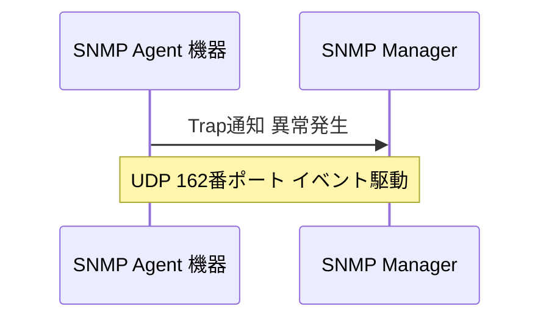

# SNMP Trap：機器が異常を能動的に通知する

一言で言うと：機器は異常を検知すると、ポーリングを待たずに能動的に監視サーバーへ通知する。

## 核心ポイント

* UDP 162番ポートを使用する
* 機器側が能動的に送信し サーバー側からの問い合わせは不要
* よくあるイベントは インターフェース切断 電源障害 温度異常 機器の再起動
* 従来のTrapには確認機構がなく 失われる可能性がある
* Informは確認応答付きの通知方式で より信頼性が高い
