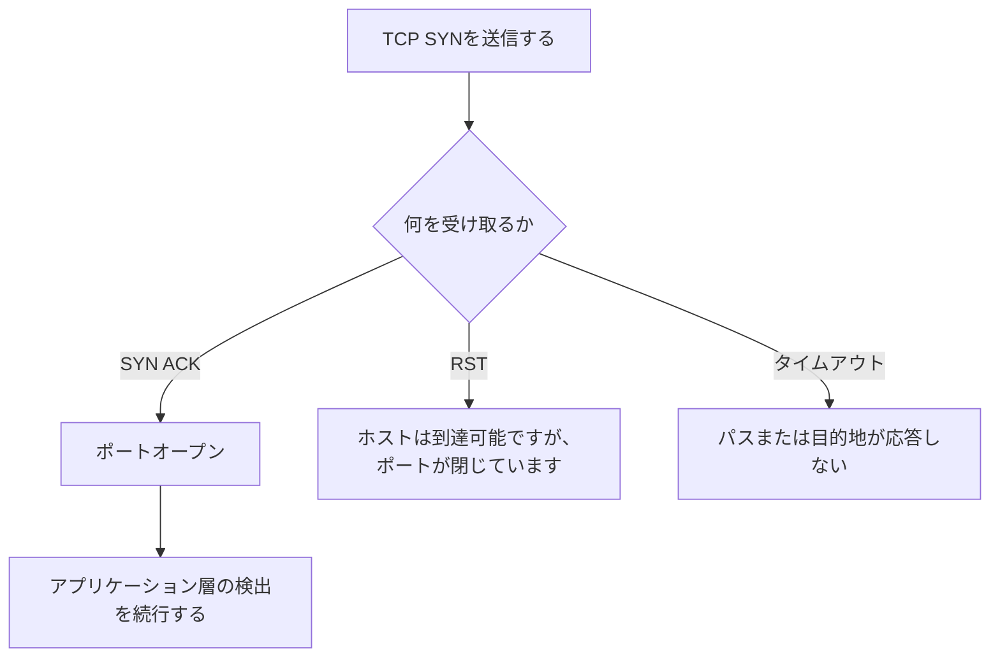

# TCP 検出結果と制限事項

SYN-ACK、RST、タイムアウトを賢明で実用的な結論に変えます。

## 重要ポイント

- SYN-ACK は通常、宛先ポートが開いていることを示します。
- RST は通常、ターゲット ホストに到達可能であるが、ポートがリッスンしていないか、明示的に拒否されたことを意味します。
- タイムアウトは、パケット損失、フィルタリング、ルーティングの失敗、またはターゲットのダウンタイムによって発生する可能性があります。
- TCP の成功は、アプリケーションのコンテンツ、依存サービス、および業務結果が正常であることを証明するものではありません。

---

## 章末クイズ

この章には5問の四択問題があります。

### 第 1 問

SYN-ACK の受信は通常何を意味しますか?

- A. ターゲットCPUは正常である必要があります
- B. 宛先の TCP ポートが開いています
- C. ターゲットがトラップを送信したところです
- D. アプリケーションによって返されるコンテンツは正しい必要があります

回答を選んだ後に解答を開く

正解：B. 宛先の TCP ポートが開いています

解説：SYN-ACK は、ターゲットがハンドシェイクを続行する意思があることを示すため、通常、ポートは開いています。

### 第 2 問

RST を受け取った場合、最も合理的な説明はどれですか?

- A. ターゲットの電源をオフにする必要があります
- B. DNS障害に違いない
- C. SNMP 認証情報が不正である必要があります
- D. ホストまたはパスは応答していますが、ポートが閉じられているか、接続が明示的に拒否されています。

回答を選んだ後に解答を開く

正解：D. ホストまたはパスは応答していますが、ポートが閉じられているか、接続が明示的に拒否されています。

解説：RST は明示的な TCP 応答であり、多くの場合、ポートがリッスンしていない場合、またはポリシーが積極的に拒否している場合に使用されます。

### 第 3 問

TCP タイムアウト診断があいまいなのはなぜですか?

- A. パケット損失、フィルタリング、ルーティング、または宛先の障害によりタイムアウトが発生する可能性があります
- B. タイムアウトはアプリケーション コードによってのみ発生する可能性があります
- C. タイムアウトは RST の受信と同等です
- D. タイムアウトはポートが開いていることを証明します

回答を選んだ後に解答を開く

正解：A. パケット損失、フィルタリング、ルーティング、または宛先の障害によりタイムアウトが発生する可能性があります

解説：サイレント破棄と返送なしが複数の段階で発生する可能性があるため、さらなる測位には他の信号が必要です。

### 第 4 問

TCP ポートが開いた後、Web サイトの機能を確認したい場合は、何を続けるべきでしょうか?

- A. TCP プローブ頻度のみを増加させます
- B. すべてのログ収集を停止する
- C. TLS、HTTP、または業務層検査を実行する
- D. Treat open ports as the final word

回答を選んだ後に解答を開く

正解：C. TLS、HTTP、または業務層検査を実行する

解説：ポートのオープンは階層化検査の 1 ステップにすぎず、アプリケーションとサービスはセマンティック検出と一致する必要があります。

### 第 5 問

最も慎重で正確な警告コピーはどれですか?

- A. サーバーが永久に損傷しました
- B. 監視ポイントからターゲット ポートへのアクセスがタイムアウトになるため、他の証拠を使用して場所を特定する必要があります。
- C. すべてのネットワーク機器がダウンしています
- D. データベースのデータが失われてしまいました

回答を選んだ後に解答を開く

正解：B. 監視ポイントからターゲット ポートへのアクセスがタイムアウトになるため、他の証拠を使用して場所を特定する必要があります。

解説：タイムアウトの証拠は、現在のパスが予期した応答を受信しなかったことを示すだけであり、根本原因を直接判断することはできません。

<!-- QUIZ_DATA_START
{
  "chapter": "05",
  "questions": [
    {
      "id": 1,
      "question": "SYN-ACK の受信は通常何を意味しますか?",
      "options": {
        "A": "ターゲットCPUは正常である必要があります",
        "B": "宛先の TCP ポートが開いています",
        "C": "ターゲットがトラップを送信したところです",
        "D": "アプリケーションによって返されるコンテンツは正しい必要があります"
      },
      "answer": "B",
      "explanation": "SYN-ACK は、ターゲットがハンドシェイクを続行する意思があることを示すため、通常、ポートは開いています。"
    },
    {
      "id": 2,
      "question": "RST を受け取った場合、最も合理的な説明はどれですか?",
      "options": {
        "A": "ターゲットの電源をオフにする必要があります",
        "B": "DNS障害に違いない",
        "C": "SNMP 認証情報が不正である必要があります",
        "D": "ホストまたはパスは応答していますが、ポートが閉じられているか、接続が明示的に拒否されています。"
      },
      "answer": "D",
      "explanation": "RST は明示的な TCP 応答であり、多くの場合、ポートがリッスンしていない場合、またはポリシーが積極的に拒否している場合に使用されます。"
    },
    {
      "id": 3,
      "question": "TCP タイムアウト診断があいまいなのはなぜですか?",
      "options": {
        "A": "パケット損失、フィルタリング、ルーティング、または宛先の障害によりタイムアウトが発生する可能性があります",
        "B": "タイムアウトはアプリケーション コードによってのみ発生する可能性があります",
        "C": "タイムアウトは RST の受信と同等です",
        "D": "タイムアウトはポートが開いていることを証明します"
      },
      "answer": "A",
      "explanation": "サイレント破棄と返送なしが複数の段階で発生する可能性があるため、さらなる測位には他の信号が必要です。"
    },
    {
      "id": 4,
      "question": "TCP ポートが開いた後、Web サイトの機能を確認したい場合は、何を続けるべきでしょうか?",
      "options": {
        "A": "TCP プローブ頻度のみを増加させます",
        "B": "すべてのログ収集を停止する",
        "C": "TLS、HTTP、または業務層検査を実行する",
        "D": "Treat open ports as the final word"
      },
      "answer": "C",
      "explanation": "ポートのオープンは階層化検査の 1 ステップにすぎず、アプリケーションとサービスはセマンティック検出と一致する必要があります。"
    },
    {
      "id": 5,
      "question": "最も慎重で正確な警告コピーはどれですか?",
      "options": {
        "A": "サーバーが永久に損傷しました",
        "B": "監視ポイントからターゲット ポートへのアクセスがタイムアウトになるため、他の証拠を使用して場所を特定する必要があります。",
        "C": "すべてのネットワーク機器がダウンしています",
        "D": "データベースのデータが失われてしまいました"
      },
      "answer": "B",
      "explanation": "タイムアウトの証拠は、現在のパスが予期した応答を受信しなかったことを示すだけであり、根本原因を直接判断することはできません。"
    }
  ]
}
QUIZ_DATA_END -->
