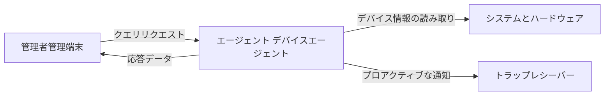

# SNMPマネージャーとエージェント

SNMP は、管理側を通じてデバイス エージェントと連携して、管理情報を読み取り、報告します。

## 重要ポイント

- マネージャーは、クエリの開始、データの保存、しきい値の決定、およびアラートの生成を担当します。
- エージェントはデバイス側で実行され、デバイスが読み取りを許可する管理オブジェクトを公開します。
- GET は、マネージャーのリクエストとエージェントの応答です。
- トラップとは、エージェントがイベントを受信側に積極的に送信することです。

---

## 章末クイズ

この章には5問の四択問題があります。

### 第 1 問

SNMP マネージャーはどちら側にあり、どのような役割を果たしますか?

- A. デバイス側に配置され、ログの書き込みのみを担当します
- B. 監視側に位置し、データのクエリ、保存、しきい値の判断を担当します。
- C. ファイアウォール側に位置し、TCP のみを転送します
- D. ユーザー端末上にあり、Webページのみを表示します

回答を選んだ後に解答を開く

正解：B. 監視側に位置し、データのクエリ、保存、しきい値の判断を担当します。

解説：マネージャーは管理側であり、クエリのスケジュール設定、結果の処理、監視ロジックのトリガーを担当します。

### 第 2 問

SNMP GET の基本的な対話シーケンスは何ですか?

- A. エージェントはまずマネージャーに設定を書くように依頼します
- B. ログサーバーが最初にトラップを送信します
- C. マネージャーはデバイスからの一方的なメッセージのみを待ちます
- D. マネージャーがリクエストを送信し、エージェントがオブジェクトを読み取って応答を返します。

回答を選んだ後に解答を開く

正解：D. マネージャーがリクエストを送信し、エージェントがオブジェクトを読み取って応答を返します。

解説：GET は、Manager によってデバイス Agent に対して開始される、一般的な要求応答プロセスです。

### 第 3 問

エージェントの主な責任は何ですか?

- A. デバイス側でアクセスを許可された管理オブジェクトを公開および読み取ります
- B. すべての監視ストレージを置き換えます
- C. 業務トランザクション全体を実行する
- D. ネットワークがパケットを失わないようにする

回答を選んだ後に解答を開く

正解：A. デバイス側でアクセスを許可された管理オブジェクトを公開および読み取ります

解説：エージェントは、デバイスの内部状態をアクセス可能な SNMP オブジェクトにマップしますが、その範囲はデバイスが実装および許可する範囲に限られます。

### 第 4 問

同じプラットフォームは、インジケーターのポーリングとイベントの受信の両方を行う必要があります。構成要素の関係をどのように理解すればよいでしょうか?

- A. 同じプロセスとポートを使用する必要があります
- B. 監視側にエージェントを導入する必要がある
- C. マネージャーとトラップ レシーバーは同じプラットフォームの異なるコンポーネントにすることができます
- D. イベントの相関関係は必要ありません

回答を選んだ後に解答を開く

正解：C. マネージャーとトラップ レシーバーは同じプラットフォームの異なるコンポーネントにすることができます

解説：クエリのスケジューリングとトラップ受信の責任は異なり、再要約は 1 つのプラットフォームで個別に実装できます。

### 第 5 問

エージェントの能力を誤って誇張しているのはどれですか?

- A. エージェントは実装されたオブジェクトのみを公開できます
- B. デバイス内に存在する情報はすべて、マネージャーが読み取ることができる必要があります。
- C. アクセスには認証制限も適用されます
- D. プライベート オブジェクトはベンダー MIB に依存する場合があります

回答を選んだ後に解答を開く

正解：B. デバイス内に存在する情報はすべて、マネージャーが読み取ることができる必要があります。

解説：エージェントはデバイスに関するすべてを自動的に公開するわけではありません。実際の可視性は、実装、MIB、および権限の組み合わせによって決まります。

<!-- QUIZ_DATA_START
{
  "chapter": "06",
  "questions": [
    {
      "id": 1,
      "question": "SNMP マネージャーはどちら側にあり、どのような役割を果たしますか?",
      "options": {
        "A": "デバイス側に配置され、ログの書き込みのみを担当します",
        "B": "監視側に位置し、データのクエリ、保存、しきい値の判断を担当します。",
        "C": "ファイアウォール側に位置し、TCP のみを転送します",
        "D": "ユーザー端末上にあり、Webページのみを表示します"
      },
      "answer": "B",
      "explanation": "マネージャーは管理側であり、クエリのスケジュール設定、結果の処理、監視ロジックのトリガーを担当します。"
    },
    {
      "id": 2,
      "question": "SNMP GET の基本的な対話シーケンスは何ですか?",
      "options": {
        "A": "エージェントはまずマネージャーに設定を書くように依頼します",
        "B": "ログサーバーが最初にトラップを送信します",
        "C": "マネージャーはデバイスからの一方的なメッセージのみを待ちます",
        "D": "マネージャーがリクエストを送信し、エージェントがオブジェクトを読み取って応答を返します。"
      },
      "answer": "D",
      "explanation": "GET は、Manager によってデバイス Agent に対して開始される、一般的な要求応答プロセスです。"
    },
    {
      "id": 3,
      "question": "エージェントの主な責任は何ですか?",
      "options": {
        "A": "デバイス側でアクセスを許可された管理オブジェクトを公開および読み取ります",
        "B": "すべての監視ストレージを置き換えます",
        "C": "業務トランザクション全体を実行する",
        "D": "ネットワークがパケットを失わないようにする"
      },
      "answer": "A",
      "explanation": "エージェントは、デバイスの内部状態をアクセス可能な SNMP オブジェクトにマップしますが、その範囲はデバイスが実装および許可する範囲に限られます。"
    },
    {
      "id": 4,
      "question": "同じプラットフォームは、インジケーターのポーリングとイベントの受信の両方を行う必要があります。構成要素の関係をどのように理解すればよいでしょうか?",
      "options": {
        "A": "同じプロセスとポートを使用する必要があります",
        "B": "監視側にエージェントを導入する必要がある",
        "C": "マネージャーとトラップ レシーバーは同じプラットフォームの異なるコンポーネントにすることができます",
        "D": "イベントの相関関係は必要ありません"
      },
      "answer": "C",
      "explanation": "クエリのスケジューリングとトラップ受信の責任は異なり、再要約は 1 つのプラットフォームで個別に実装できます。"
    },
    {
      "id": 5,
      "question": "エージェントの能力を誤って誇張しているのはどれですか?",
      "options": {
        "A": "エージェントは実装されたオブジェクトのみを公開できます",
        "B": "デバイス内に存在する情報はすべて、マネージャーが読み取ることができる必要があります。",
        "C": "アクセスには認証制限も適用されます",
        "D": "プライベート オブジェクトはベンダー MIB に依存する場合があります"
      },
      "answer": "B",
      "explanation": "エージェントはデバイスに関するすべてを自動的に公開するわけではありません。実際の可視性は、実装、MIB、および権限の組み合わせによって決まります。"
    }
  ]
}
QUIZ_DATA_END -->
