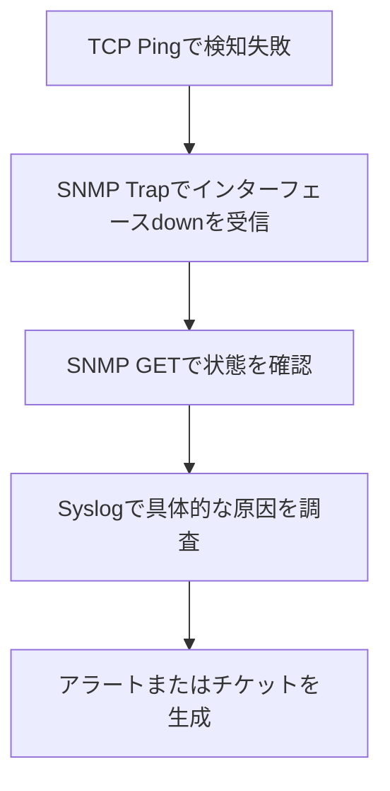

# 総合シナリオ：ルーターのインターフェース障害調査

一言で言うと：4つの監視方式が連携し、あるインターフェース障害の調査プロセスを完全に再現する。

## 核心ポイント

* 第1段階 TCP PingでSSHポートの接続タイムアウトを検知
* 第2段階 SNMP Trapがインターフェースdownイベントを報告
* 第3段階 SNMP GETでインターフェースの現在の状態とトラフィックを確認
* 第4段階 Syslogで原因が信号消失であることが判明
* 4つの段階を組み合わせて初めて完全な結論に至る
