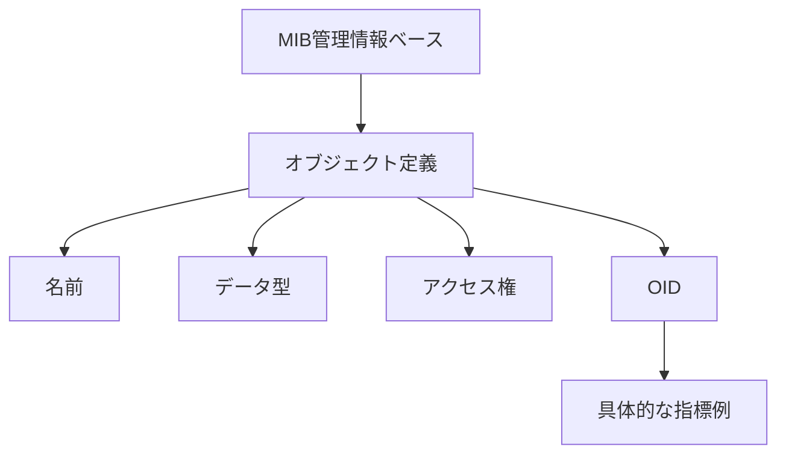

# MIBとOID

MIB は管理オブジェクトを記述し、OID はツリー名前空間内でオブジェクトを一意に見つけます。

## 重要ポイント

- MIB は、管理オブジェクトの定義されたコレクションであり、デバイス インジケーターの履歴データベースではありません。
- OID は、管理オブジェクトを見つけるために使用される階層的なデジタル ID です。
- オブジェクト定義には、データ型、アクセス方法、セマンティック記述も含まれます。
- ベンダープライベート MIB は、温度、電力、およびデバイス固有のステータスを拡張します。

---

## 章末クイズ

この章には5問の四択問題があります。

### 第 1 問

MIB の最も正確な位置はどれですか?

- A. 指標履歴データベース
- B. 管理オブジェクトの定義コレクションまたはデータ ディクショナリ
- C. TCP 接続テーブルの一意の名前
- D. ログ受信キュー

回答を選んだ後に解答を開く

正解：B. 管理オブジェクトの定義コレクションまたはデータ ディクショナリ

解説：MIB はオブジェクト名、タイプ、アクセス方法、セマンティクスを記述しますが、各コレクションの履歴値を保存する責任はありません。

### 第 2 問

定義と具体的な指標インスタンスとの関係は何ですか?

- A. OID定義ログ、MIB確立TCP
- B. インデックスはすべての権限をオーバーライドします
- C. タイミングライブラリ生成デバイスMIB
- D. MIB はオブジェクトを定義し、OID はオブジェクトを特定し、インデックスは特定のインスタンスを特定します。

回答を選んだ後に解答を開く

正解：D. MIB はオブジェクトを定義し、OID はオブジェクトを特定し、インデックスは特定のインスタンスを特定します。

解説：オブジェクト定義はセマンティクスを提供し、OID は階層アドレスを提供し、テーブル インデックスはインターフェイスなどのインスタンスをさらに特定します。

### 第 3 問

OIDの主な機能は何ですか?

- A. 階層型名前空間内の管理対象オブジェクトを識別する
- B. 暗号化された Syslog テキスト
- C. TCP スリーウェイ ハンドシェイクを確認する
- D. 業務の成功率を自動計算

回答を選んだ後に解答を開く

正解：A. 階層型名前空間内の管理対象オブジェクトを識別する

解説：OID は、SNMP オブジェクトの要求と識別に使用されるツリー構造内の数値識別子です。

### 第 4 問

数値の OID と列挙値は見つかりましたが、意味が理解できません。最初に何を追加すればよいでしょうか?

- A. TCPのタイムアウト時間を延長する
- B. エージェント権限をオフにする
- C. 対応する MIB 定義とベンダーのドキュメント
- D. 元のコレクション値を削除します

回答を選んだ後に解答を開く

正解：C. 対応する MIB 定義とベンダーのドキュメント

解説：正しい MIB は、名前、タイプ、列挙、単位、およびオブジェクトのセマンティクスを解釈できます。

### 第 5 問

MIB と時系列データベースを混同しているのはどれですか?

- A. MIB はオブジェクトのセマンティクスを記述します
- B. MIB は毎分収集されるすべての履歴インジケーターを保存します
- C. タイミング ライブラリは履歴値を保存します
- D. ベンダー プライベート MIB の拡張可能な独自オブジェクト

回答を選んだ後に解答を開く

正解：B. MIB は毎分収集されるすべての履歴インジケーターを保存します

解説：履歴サンプルはストレージを監視することで保存され、MIB は管理オブジェクトを記述する定義の集合です。

<!-- QUIZ_DATA_START
{
  "chapter": "07",
  "questions": [
    {
      "id": 1,
      "question": "MIB の最も正確な位置はどれですか?",
      "options": {
        "A": "指標履歴データベース",
        "B": "管理オブジェクトの定義コレクションまたはデータ ディクショナリ",
        "C": "TCP 接続テーブルの一意の名前",
        "D": "ログ受信キュー"
      },
      "answer": "B",
      "explanation": "MIB はオブジェクト名、タイプ、アクセス方法、セマンティクスを記述しますが、各コレクションの履歴値を保存する責任はありません。"
    },
    {
      "id": 2,
      "question": "定義と具体的な指標インスタンスとの関係は何ですか?",
      "options": {
        "A": "OID定義ログ、MIB確立TCP",
        "B": "インデックスはすべての権限をオーバーライドします",
        "C": "タイミングライブラリ生成デバイスMIB",
        "D": "MIB はオブジェクトを定義し、OID はオブジェクトを特定し、インデックスは特定のインスタンスを特定します。"
      },
      "answer": "D",
      "explanation": "オブジェクト定義はセマンティクスを提供し、OID は階層アドレスを提供し、テーブル インデックスはインターフェイスなどのインスタンスをさらに特定します。"
    },
    {
      "id": 3,
      "question": "OIDの主な機能は何ですか?",
      "options": {
        "A": "階層型名前空間内の管理対象オブジェクトを識別する",
        "B": "暗号化された Syslog テキスト",
        "C": "TCP スリーウェイ ハンドシェイクを確認する",
        "D": "業務の成功率を自動計算"
      },
      "answer": "A",
      "explanation": "OID は、SNMP オブジェクトの要求と識別に使用されるツリー構造内の数値識別子です。"
    },
    {
      "id": 4,
      "question": "数値の OID と列挙値は見つかりましたが、意味が理解できません。最初に何を追加すればよいでしょうか?",
      "options": {
        "A": "TCPのタイムアウト時間を延長する",
        "B": "エージェント権限をオフにする",
        "C": "対応する MIB 定義とベンダーのドキュメント",
        "D": "元のコレクション値を削除します"
      },
      "answer": "C",
      "explanation": "正しい MIB は、名前、タイプ、列挙、単位、およびオブジェクトのセマンティクスを解釈できます。"
    },
    {
      "id": 5,
      "question": "MIB と時系列データベースを混同しているのはどれですか?",
      "options": {
        "A": "MIB はオブジェクトのセマンティクスを記述します",
        "B": "MIB は毎分収集されるすべての履歴インジケーターを保存します",
        "C": "タイミング ライブラリは履歴値を保存します",
        "D": "ベンダー プライベート MIB の拡張可能な独自オブジェクト"
      },
      "answer": "B",
      "explanation": "履歴サンプルはストレージを監視することで保存され、MIB は管理オブジェクトを記述する定義の集合です。"
    }
  ]
}
QUIZ_DATA_END -->
