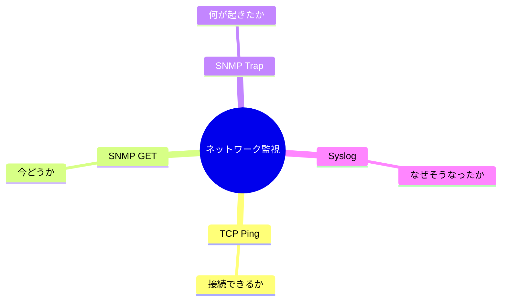

# まとめと発展的な考察

一言で言うと：4つの方式はそれぞれ一つの疑問に答え、組み合わさることで完全な監視体制を構成する。

```mermaid
mindmap
  root((ネットワーク監視))
    TCP Ping
      接続できるか
    SNMP GET
      今どうか
    SNMP Trap
      何が起きたか
    Syslog
      なぜそうなったか
```

## 核心ポイント

* TCP Pingは疎通性を判断する
* SNMP GETは状態指標を収集する
* SNMP Trapは異常を素早く発見する
* Syslogは詳細な原因を提供する
* 4つは代替関係ではなく役割分担の関係である
