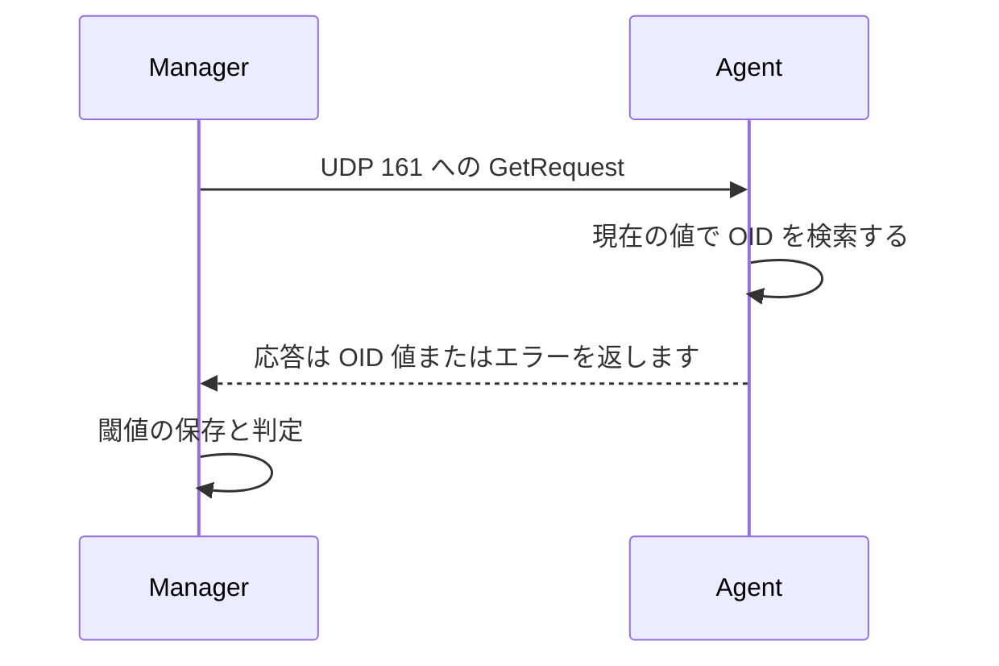

# SNMP GET リクエストのプロセスとポート

一般的なクエリは OID リクエストで始まり、構造化されたレスポンスで終わります。

## 重要ポイント

- SNMP エージェントは通常、UDP 161 でクエリを受信します。
- リクエストには 1 つ以上の OID が含まれます。
- 応答には、対応する値またはエラー メッセージが含まれます。
- UDP はコネクションレスであり、タイムアウトと再試行の戦略は管理側によって設計されます。

---

## 章末クイズ

この章には5問の四択問題があります。

### 第 1 問

SNMP エージェントがクエリを受信する一般的なポートは何ですか?

- A. UDP 162
- B. UDP 161
- C. TCP 443
- D. TLS 6514

回答を選んだ後に解答を開く

正解：B. UDP 161

解説：UDP 161 は、SNMP クエリの一般的なエージェント ポートです。 162 は通常、トラップ受信に使用されます。

### 第 2 問

GET を処理する正しい順序は何ですか?

- A. 最初に Syslog を送信し、次に HTTP を確立します
- B. エージェントはまずポートを閉じてからポーリングを待ちます
- C. マネージャーはリクエストを保存するだけで、レスポンスは処理しません
- D. OID を含むリクエストを送信し、エージェントが値を確認して応答し、マネージャーが保存して決定します。

回答を選んだ後に解答を開く

正解：D. OID を含むリクエストを送信し、エージェントが値を確認して応答し、マネージャーが保存して決定します。

解説：GET は OID リクエストで始まり、レスポンス値またはエラーで終わります。その後、プラットフォームはストレージとしきい値処理のロジックを実行します。

### 第 3 問

Manager のタイムアウトおよび再試行戦略は主にどのような問題を解決しますか?

- A. UDPリクエストまたはレスポンスが到着しない可能性があります
- B. デバイスに存在しない OID を公開させる
- C. 業務取引の成功を保証する
- D. すべてのセキュリティ制御をオーバーライドします

回答を選んだ後に解答を開く

正解：A. UDPリクエストまたはレスポンスが到着しない可能性があります

解説：一般的な SNMP クエリでは UDP が使用され、応答なしを処理するために管理側で制限付きの待機と再試行が必要になります。

### 第 4 問

GET がエラーなしでオブジェクトを返した場合に確認する最も論理的な次のステップは何ですか?

- A. ネットワークが完全に切断されたことを直接判断する
- B. ポートを 162 に変更してクエリを送信します
- C. OID、デバイスモデル、MIB、およびアクセス許可を確認する
- D. エラーと偽の値を無視する

回答を選んだ後に解答を開く

正解：C. OID、デバイスモデル、MIB、およびアクセス許可を確認する

解説：オブジェクト エラーは識別、実装、または承認に関連している可能性が高いため、これらの方向に沿って調査する必要があります。

### 第 5 問

どの記述が間違っていますか?

- A. 応答には値またはエラーが含まれる可能性があります
- B. SNMP プロトコルは、過去の傾向と業務 アラートの設計を自動的に完了します。
- C. プラットフォームは履歴データを保存する責任があります
- D. 再試行が多すぎるとデバイスの負荷が増加します

回答を選んだ後に解答を開く

正解：B. SNMP プロトコルは、過去の傾向と業務 アラートの設計を自動的に完了します。

解説：SNMP はデータ交換を提供し、傾向の計算とアラート ルールは監視プラットフォームの役割を果たします。

<!-- QUIZ_DATA_START
{
  "chapter": "08",
  "questions": [
    {
      "id": 1,
      "question": "SNMP エージェントがクエリを受信する一般的なポートは何ですか?",
      "options": {
        "A": "UDP 162",
        "B": "UDP 161",
        "C": "TCP 443",
        "D": "TLS 6514"
      },
      "answer": "B",
      "explanation": "UDP 161 は、SNMP クエリの一般的なエージェント ポートです。 162 は通常、トラップ受信に使用されます。"
    },
    {
      "id": 2,
      "question": "GET を処理する正しい順序は何ですか?",
      "options": {
        "A": "最初に Syslog を送信し、次に HTTP を確立します",
        "B": "エージェントはまずポートを閉じてからポーリングを待ちます",
        "C": "マネージャーはリクエストを保存するだけで、レスポンスは処理しません",
        "D": "OID を含むリクエストを送信し、エージェントが値を確認して応答し、マネージャーが保存して決定します。"
      },
      "answer": "D",
      "explanation": "GET は OID リクエストで始まり、レスポンス値またはエラーで終わります。その後、プラットフォームはストレージとしきい値処理のロジックを実行します。"
    },
    {
      "id": 3,
      "question": "Manager のタイムアウトおよび再試行戦略は主にどのような問題を解決しますか?",
      "options": {
        "A": "UDPリクエストまたはレスポンスが到着しない可能性があります",
        "B": "デバイスに存在しない OID を公開させる",
        "C": "業務取引の成功を保証する",
        "D": "すべてのセキュリティ制御をオーバーライドします"
      },
      "answer": "A",
      "explanation": "一般的な SNMP クエリでは UDP が使用され、応答なしを処理するために管理側で制限付きの待機と再試行が必要になります。"
    },
    {
      "id": 4,
      "question": "GET がエラーなしでオブジェクトを返した場合に確認する最も論理的な次のステップは何ですか?",
      "options": {
        "A": "ネットワークが完全に切断されたことを直接判断する",
        "B": "ポートを 162 に変更してクエリを送信します",
        "C": "OID、デバイスモデル、MIB、およびアクセス許可を確認する",
        "D": "エラーと偽の値を無視する"
      },
      "answer": "C",
      "explanation": "オブジェクト エラーは識別、実装、または承認に関連している可能性が高いため、これらの方向に沿って調査する必要があります。"
    },
    {
      "id": 5,
      "question": "どの記述が間違っていますか?",
      "options": {
        "A": "応答には値またはエラーが含まれる可能性があります",
        "B": "SNMP プロトコルは、過去の傾向と業務 アラートの設計を自動的に完了します。",
        "C": "プラットフォームは履歴データを保存する責任があります",
        "D": "再試行が多すぎるとデバイスの負荷が増加します"
      },
      "answer": "B",
      "explanation": "SNMP はデータ交換を提供し、傾向の計算とアラート ルールは監視プラットフォームの役割を果たします。"
    }
  ]
}
QUIZ_DATA_END -->
