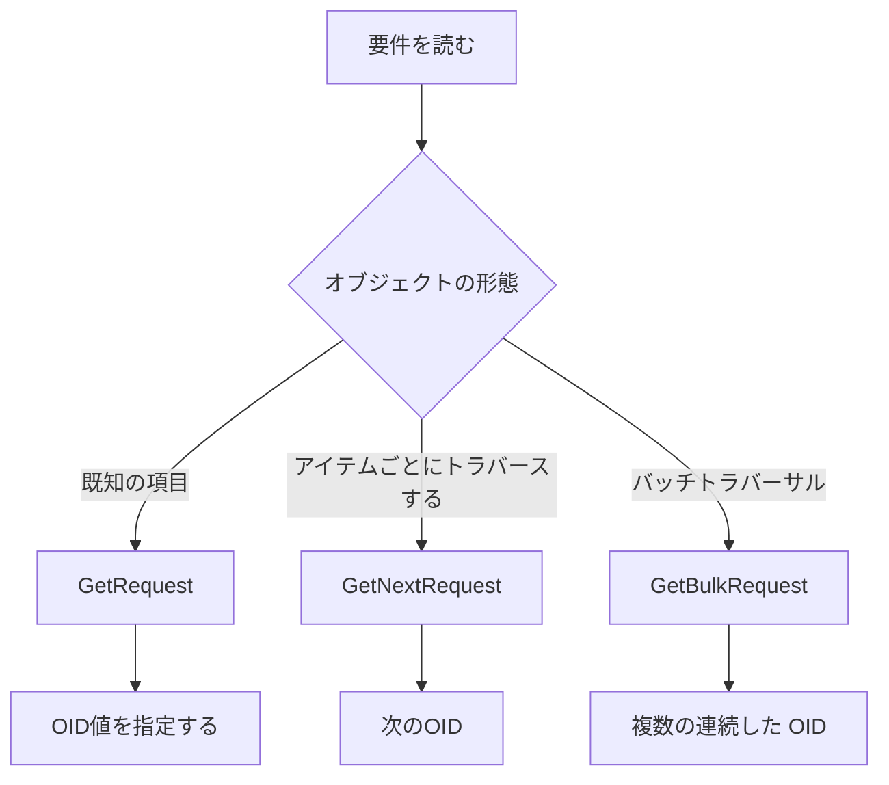

# GetRequest、GetNext、および GetBulk

オブジェクトの数とテーブル構造に基づいて、適切な SNMP 読み取り操作を選択します。

## 重要ポイント

- GetRequest は既知の OID を読み取ります。
- GetNextRequest は、辞書順で次のオブジェクトを取得し、トラバーサルによく使用されます。
- GetBulkRequest は、連続オブジェクトをバッチで取得します。これは、より大きなテーブルに適しています。
- GetBulk は、SNMPv2c 以降のバージョンの機能に属します。

---

## 章末クイズ

この章には5問の四択問題があります。

### 第 1 問

既知の OID を読み取るときに最も簡単に使用できるものは何ですか?

- A. GetNextRequest
- B. GetRequest
- C. GetBulkRequest
- D. SNMP Trap

回答を選んだ後に解答を開く

正解：B. GetRequest

解説：GetRequest は、1 つ以上の既知のオブジェクトを直接読み取るのに適しています。

### 第 2 問

より大きなインターフェイス テーブルを走査してラウンド トリップを減らす場合、通常は何が最初に評価されますか?

- A. GetRequest 単一クエリのみを繰り返す
- B. 代わりに TCP Ping を使用してテーブルを読み取ります
- C. Syslog がすべてのインジケーターを自動的に表示するまで待ちます
- D. GetBulkRequest

回答を選んだ後に解答を開く

正解：D. GetBulkRequest

解説：GetBulk は、連続した複数のオブジェクトを一度に取得できるため、テーブルの一括読み取りに適しています。

### 第 3 問

GetNextRequest の責任は何ですか?

- A. 辞書順で次の OID を返します。
- B. トラップが配信されたことを確認する
- C. TLS接続を確立する
- D. デバイスエントリの削除

回答を選んだ後に解答を開く

正解：A. 辞書順で次の OID を返します。

解説：GetNext は OID ツリーに沿って後方に移動し、項目ごとの走査に使用できます。

### 第 4 問

デバイスは SNMPv1 のみをサポートしますが、GetBulk は構成されています。どのような調整を行う必要がある可能性が最も高いでしょうか?

- A. UDP 161をTCP 443へ変更する
- B. Syslog に OID を返させる
- C. 代わりに、GetNext など、このバージョンでサポートされている操作を使用してください。
- D. コミュニティの長さを増やすだけです

回答を選んだ後に解答を開く

正解：C. 代わりに、GetNext など、このバージョンでサポートされている操作を使用してください。

解説：GetBulk は SNMPv2c 以降の機能に属しており、v1 環境ではサポートされている読み取りメソッドを使用する必要があります。

### 第 5 問

GetBulk についての理解が間違っているのはどれですか?

- A. 往復回数が減ります
- B. バッチサイズが大きいほど常に効率が高く、副作用はありません。
- C. 応答サイズはネットワークとデバイスの機能に影響されます
- D. バッチが大きいと、装置の処理圧力が増加する可能性があります

回答を選んだ後に解答を開く

正解：B. バッチサイズが大きいほど常に効率が高く、副作用はありません。

解説：バッチ パラメーターでは、効率、パケット サイズ、デバイス負荷のバランスをとる必要があります。大きいほど必ずしも良いとは限りません。

<!-- QUIZ_DATA_START
{
  "chapter": "09",
  "questions": [
    {
      "id": 1,
      "question": "既知の OID を読み取るときに最も簡単に使用できるものは何ですか?",
      "options": {
        "A": "GetNextRequest",
        "B": "GetRequest",
        "C": "GetBulkRequest",
        "D": "SNMP Trap"
      },
      "answer": "B",
      "explanation": "GetRequest は、1 つ以上の既知のオブジェクトを直接読み取るのに適しています。"
    },
    {
      "id": 2,
      "question": "より大きなインターフェイス テーブルを走査してラウンド トリップを減らす場合、通常は何が最初に評価されますか?",
      "options": {
        "A": "GetRequest 単一クエリのみを繰り返す",
        "B": "代わりに TCP Ping を使用してテーブルを読み取ります",
        "C": "Syslog がすべてのインジケーターを自動的に表示するまで待ちます",
        "D": "GetBulkRequest"
      },
      "answer": "D",
      "explanation": "GetBulk は、連続した複数のオブジェクトを一度に取得できるため、テーブルの一括読み取りに適しています。"
    },
    {
      "id": 3,
      "question": "GetNextRequest の責任は何ですか?",
      "options": {
        "A": "辞書順で次の OID を返します。",
        "B": "トラップが配信されたことを確認する",
        "C": "TLS接続を確立する",
        "D": "デバイスエントリの削除"
      },
      "answer": "A",
      "explanation": "GetNext は OID ツリーに沿って後方に移動し、項目ごとの走査に使用できます。"
    },
    {
      "id": 4,
      "question": "デバイスは SNMPv1 のみをサポートしますが、GetBulk は構成されています。どのような調整を行う必要がある可能性が最も高いでしょうか?",
      "options": {
        "A": "UDP 161をTCP 443へ変更する",
        "B": "Syslog に OID を返させる",
        "C": "代わりに、GetNext など、このバージョンでサポートされている操作を使用してください。",
        "D": "コミュニティの長さを増やすだけです"
      },
      "answer": "C",
      "explanation": "GetBulk は SNMPv2c 以降の機能に属しており、v1 環境ではサポートされている読み取りメソッドを使用する必要があります。"
    },
    {
      "id": 5,
      "question": "GetBulk についての理解が間違っているのはどれですか?",
      "options": {
        "A": "往復回数が減ります",
        "B": "バッチサイズが大きいほど常に効率が高く、副作用はありません。",
        "C": "応答サイズはネットワークとデバイスの機能に影響されます",
        "D": "バッチが大きいと、装置の処理圧力が増加する可能性があります"
      },
      "answer": "B",
      "explanation": "バッチ パラメーターでは、効率、パケット サイズ、デバイス負荷のバランスをとる必要があります。大きいほど必ずしも良いとは限りません。"
    }
  ]
}
QUIZ_DATA_END -->
