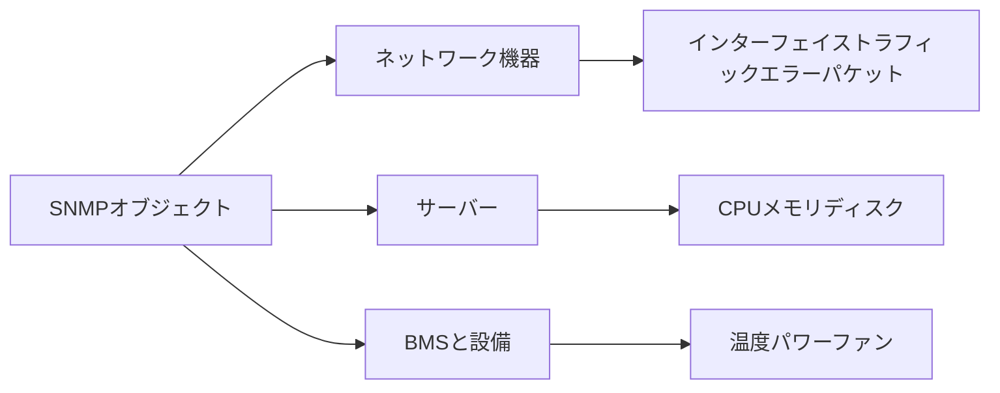

# SNMP で監視できるオブジェクト

SNMP カバレッジは、デバイスによって実際に提供される標準オブジェクトとプライベート オブジェクトによって異なります。

## 重要ポイント

- ネットワーク デバイスの共通オブジェクトには、インターフェイスのステータス、トラフィック、エラー パケット、稼働時間が含まれます。
- サーバーは、エージェント サポートを使用して CPU、メモリ、ディスク、プロセス情報を公開できます。
- BMS、UPS、および設備機器は、温度、電力、ファンなどのステータスを提供できます。
- 監視システムは、デバイスが実装していないオブジェクト、または権限を持たないオブジェクトを読み取ることはできません。

---

## 章末クイズ

この章には5問の四択問題があります。

### 第 1 問

SNMP を介してネットワーク デバイスによって一般的に提供されるオブジェクトの種類は何ですか?

- A. すべての利用者の業務用パスワード
- B. インターフェースのステータス、トラフィック、エラーパケット
- C. 完全な Web ページのソース コード
- D. アンインストールされたアプリの内部データ

回答を選んだ後に解答を開く

正解：B. インターフェースのステータス、トラフィック、エラーパケット

解説：インターフェイス、フロー、エラー パケット、稼働時間、およびハードウェア ステータスは、一般的なネットワーク デバイス オブジェクトです。

### 第 2 問

監視対象から合理的にリストを収集するまでの正しいプロセスは何ですか?

- A. すべての OID を無差別に読み取ります
- B. 最初にメーカー MIB を削除します
- C. オブジェクト名のみに基づいて単位を推測します
- D. 運用および保守の問題を特定し、実際にデバイスによって提供および許可されるオブジェクトを選択します

回答を選んだ後に解答を開く

正解：D. 運用および保守の問題を特定し、実際にデバイスによって提供および許可されるオブジェクトを選択します

解説：収集は運用とメンテナンスの目標に基づいて行われ、デバイスの実装、権限、単位、セマンティクスがチェックされる必要があります。

### 第 3 問

BMS またはファシリティ デバイスの一般的な SNMP オブジェクトは何ですか?

- A. 温度、電力、ファン、コントローラーのステータス
- B. ブラウザのブックマーク
- C. コードリポジトリブランチ
- D. ユーザービデオ再生の進行状況

回答を選んだ後に解答を開く

正解：A. 温度、電力、ファン、コントローラーのステータス

解説：施設の監視では、多くの場合、環境、電源、ハードウェアの健全性に焦点が当てられます。

### 第 4 問

2 つのメーカーのデバイスでは、同じ温度インジケーターの OID が異なります。最も合理的なアプローチは何ですか?

- A. すべてのプライベート OID が同じであると仮定します
- B. レコードユニットを放棄する
- C. デバイスモデルとMIBに従って監視テンプレートを適応させる
- D. 温度を TCP 遅延に置き換えます

回答を選んだ後に解答を開く

正解：C. デバイスモデルとMIBに従って監視テンプレートを適応させる

解説：ベンダーのプライベート オブジェクトは異なる場合があり、モデルの識別とテンプレートのマッピングが必要です。

### 第 5 問

SNMP の機能を超えるステートメントはどれですか?

- A. サーバーのメトリクスはエージェントのサポートに依存します
- B. 監視システムは、一度も実装または認可されていないデバイスの内部情報を読み取ることができます。
- C. オブジェクトには単位と業務上の意味が必要です
- D. コレクションのサイズは負荷に影響します

回答を選んだ後に解答を開く

正解：B. 監視システムは、一度も実装または認可されていないデバイスの内部情報を読み取ることができます。

解説：SNMP は、デバイスが実際に公開してアクセスを許可するオブジェクトのみを読み取ることができます。

<!-- QUIZ_DATA_START
{
  "chapter": "10",
  "questions": [
    {
      "id": 1,
      "question": "SNMP を介してネットワーク デバイスによって一般的に提供されるオブジェクトの種類は何ですか?",
      "options": {
        "A": "すべての利用者の業務用パスワード",
        "B": "インターフェースのステータス、トラフィック、エラーパケット",
        "C": "完全な Web ページのソース コード",
        "D": "アンインストールされたアプリの内部データ"
      },
      "answer": "B",
      "explanation": "インターフェイス、フロー、エラー パケット、稼働時間、およびハードウェア ステータスは、一般的なネットワーク デバイス オブジェクトです。"
    },
    {
      "id": 2,
      "question": "監視対象から合理的にリストを収集するまでの正しいプロセスは何ですか?",
      "options": {
        "A": "すべての OID を無差別に読み取ります",
        "B": "最初にメーカー MIB を削除します",
        "C": "オブジェクト名のみに基づいて単位を推測します",
        "D": "運用および保守の問題を特定し、実際にデバイスによって提供および許可されるオブジェクトを選択します"
      },
      "answer": "D",
      "explanation": "収集は運用とメンテナンスの目標に基づいて行われ、デバイスの実装、権限、単位、セマンティクスがチェックされる必要があります。"
    },
    {
      "id": 3,
      "question": "BMS またはファシリティ デバイスの一般的な SNMP オブジェクトは何ですか?",
      "options": {
        "A": "温度、電力、ファン、コントローラーのステータス",
        "B": "ブラウザのブックマーク",
        "C": "コードリポジトリブランチ",
        "D": "ユーザービデオ再生の進行状況"
      },
      "answer": "A",
      "explanation": "施設の監視では、多くの場合、環境、電源、ハードウェアの健全性に焦点が当てられます。"
    },
    {
      "id": 4,
      "question": "2 つのメーカーのデバイスでは、同じ温度インジケーターの OID が異なります。最も合理的なアプローチは何ですか?",
      "options": {
        "A": "すべてのプライベート OID が同じであると仮定します",
        "B": "レコードユニットを放棄する",
        "C": "デバイスモデルとMIBに従って監視テンプレートを適応させる",
        "D": "温度を TCP 遅延に置き換えます"
      },
      "answer": "C",
      "explanation": "ベンダーのプライベート オブジェクトは異なる場合があり、モデルの識別とテンプレートのマッピングが必要です。"
    },
    {
      "id": 5,
      "question": "SNMP の機能を超えるステートメントはどれですか?",
      "options": {
        "A": "サーバーのメトリクスはエージェントのサポートに依存します",
        "B": "監視システムは、一度も実装または認可されていないデバイスの内部情報を読み取ることができます。",
        "C": "オブジェクトには単位と業務上の意味が必要です",
        "D": "コレクションのサイズは負荷に影響します"
      },
      "answer": "B",
      "explanation": "SNMP は、デバイスが実際に公開してアクセスを許可するオブジェクトのみを読み取ることができます。"
    }
  ]
}
QUIZ_DATA_END -->
