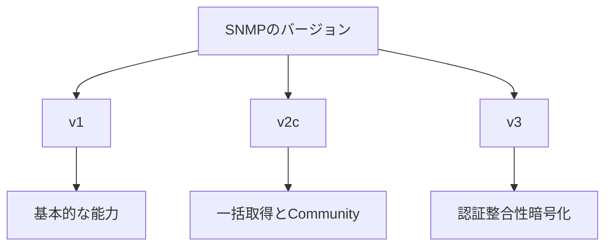

# SNMP バージョンとセキュリティ境界

バージョンの選択により、認証、整合性、および暗号化の機能が決まります。

## 重要ポイント

- SNMPv1 機能ベースは古いデバイスにまだ存在している可能性があります。
- SNMPv2c は GetBulk をサポートしていますが、コミュニティは強力なセキュリティ メカニズムではありません。
- SNMPv3 は、ユーザー認証、メッセージの整合性、および暗号化を提供します。
- 運用環境では、SNMPv3、読み取り専用権限、およびネットワーク アクセス制御が優先されます。

---

## 章末クイズ

この章には5問の四択問題があります。

### 第 1 問

v1 と比較した SNMPv2c の典型的な機能は何ですか?

- A. デフォルトで提供される強力な暗号化
- B. GetBulk バッチ読み取りをサポート
- C. TLS 6514 を自動的に使用する
- D. トラップが失われないようにする

回答を選んだ後に解答を開く

正解：B. GetBulk バッチ読み取りをサポート

解説：GetBulk は v2c 以降の重要な読み取り機能ですが、v2c 自体は最新の強力な暗号化を提供しません。

### 第 2 問

実稼働環境で SNMP セキュリティ防御を確立するための適切な組み合わせは何ですか?

- A. デフォルトのコミュニティのみに依存する
- B. すべてのソースから UDP 161 にオープン アクセス
- C. トラブルシューティングを容易にするために認証情報をログに書き込む
- D. SNMPv3、読み取り専用の最小限の権限、ACL、および資格情報の管理

回答を選んだ後に解答を開く

正解：D. SNMPv3、読み取り専用の最小限の権限、ACL、および資格情報の管理

解説：プロトコル セキュリティ、ネットワーク アクセス制御、および最小特権は、相互に置き換えるのではなく、追加的なものである必要があります。

### 第 3 問

SNMPv3 は何を提供しますか?

- A. ユーザー認証、メッセージの整合性、および暗号化
- B. 業務トランザクションの自動ロールバック
- C. ログのインデックス作成と全文検索
- D. TCPポートの健全性証明書

回答を選んだ後に解答を開く

正解：A. ユーザー認証、メッセージの整合性、および暗号化

解説：v3 における主要なセキュリティの改善点は、認証、整合性保護、およびオプションの暗号化です。

### 第 4 問

古いデバイスは v1 のみをサポートしていますが、業務ではより高いセキュリティが必要です。最も合理的な処分は何でしょうか？

- A. v1 は v3 と同じくらい安全であると主張
- B. コミュニティを公開で共有する
- C. ネットワーク アクセスを制限し、デバイスのアップグレードまたは隔離を計画する
- D. すべての監視をオフにし、リスクを評価しない

回答を選んだ後に解答を開く

正解：C. ネットワーク アクセスを制限し、デバイスのアップグレードまたは隔離を計画する

解説：v3 機能を直接利用できない場合は、分離、ホワイトリスト登録、アップグレード計画を通じてリスクを軽減する必要があります。

### 第 5 問

どちらの理解が間違っていますか?

- A. バージョンの選択はセキュリティ機能に影響します
- B. SNMPv3 を有効にすると、ACL と最小限の権限が不要になります。
- C. 読み取り専用アカウントは侵害の影響を軽減します
- D. 移行にはデバイスとプラットフォームの互換性の検証が必要です

回答を選んだ後に解答を開く

正解：B. SNMPv3 を有効にすると、ACL と最小限の権限が不要になります。

解説：v3 はネットワーク境界や権限制御に代わるものではないため、他のセキュリティ対策と組み合わせて使用する必要があります。

<!-- QUIZ_DATA_START
{
  "chapter": "11",
  "questions": [
    {
      "id": 1,
      "question": "v1 と比較した SNMPv2c の典型的な機能は何ですか?",
      "options": {
        "A": "デフォルトで提供される強力な暗号化",
        "B": "GetBulk バッチ読み取りをサポート",
        "C": "TLS 6514 を自動的に使用する",
        "D": "トラップが失われないようにする"
      },
      "answer": "B",
      "explanation": "GetBulk は v2c 以降の重要な読み取り機能ですが、v2c 自体は最新の強力な暗号化を提供しません。"
    },
    {
      "id": 2,
      "question": "実稼働環境で SNMP セキュリティ防御を確立するための適切な組み合わせは何ですか?",
      "options": {
        "A": "デフォルトのコミュニティのみに依存する",
        "B": "すべてのソースから UDP 161 にオープン アクセス",
        "C": "トラブルシューティングを容易にするために認証情報をログに書き込む",
        "D": "SNMPv3、読み取り専用の最小限の権限、ACL、および資格情報の管理"
      },
      "answer": "D",
      "explanation": "プロトコル セキュリティ、ネットワーク アクセス制御、および最小特権は、相互に置き換えるのではなく、追加的なものである必要があります。"
    },
    {
      "id": 3,
      "question": "SNMPv3 は何を提供しますか?",
      "options": {
        "A": "ユーザー認証、メッセージの整合性、および暗号化",
        "B": "業務トランザクションの自動ロールバック",
        "C": "ログのインデックス作成と全文検索",
        "D": "TCPポートの健全性証明書"
      },
      "answer": "A",
      "explanation": "v3 における主要なセキュリティの改善点は、認証、整合性保護、およびオプションの暗号化です。"
    },
    {
      "id": 4,
      "question": "古いデバイスは v1 のみをサポートしていますが、業務ではより高いセキュリティが必要です。最も合理的な処分は何でしょうか？",
      "options": {
        "A": "v1 は v3 と同じくらい安全であると主張",
        "B": "コミュニティを公開で共有する",
        "C": "ネットワーク アクセスを制限し、デバイスのアップグレードまたは隔離を計画する",
        "D": "すべての監視をオフにし、リスクを評価しない"
      },
      "answer": "C",
      "explanation": "v3 機能を直接利用できない場合は、分離、ホワイトリスト登録、アップグレード計画を通じてリスクを軽減する必要があります。"
    },
    {
      "id": 5,
      "question": "どちらの理解が間違っていますか?",
      "options": {
        "A": "バージョンの選択はセキュリティ機能に影響します",
        "B": "SNMPv3 を有効にすると、ACL と最小限の権限が不要になります。",
        "C": "読み取り専用アカウントは侵害の影響を軽減します",
        "D": "移行にはデバイスとプラットフォームの互換性の検証が必要です"
      },
      "answer": "B",
      "explanation": "v3 はネットワーク境界や権限制御に代わるものではないため、他のセキュリティ対策と組み合わせて使用する必要があります。"
    }
  ]
}
QUIZ_DATA_END -->
