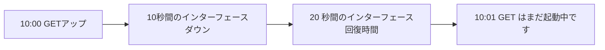

# ポーリング期間、レイテンシ、負荷

SNMP GET のサイクル設計は、検出速度とシステム コストのバランスを考慮して行われます。

## 重要ポイント

- ポーリングではサンプリング時のステータスのみを確認できます。
- サイクルタイムを短縮すると、検出の待ち時間は短縮されますが、デバイス、ネットワーク、プラットフォームの負荷が増加します。
- タイムアウトだけでは、エージェント、ネットワーク、権限、またはデバイスの問題を区別できません。
- 主要なイベントはトラップと組み合わせる必要があり、過去の傾向は引き続き期間 GET によって提供されます。

---

## 章末クイズ

この章には5問の四択問題があります。

### 第 1 問

1 分間のポーリングで 10 秒間の障害を見逃す可能性があるのはなぜですか?

- A. GET は TCP のみを使用できます
- B. 障害が発生し、2 つのサンプリング時点の間に回復する
- C. Trap は履歴を自動的に削除します
- D. OID はステータスを表すことはできません

回答を選んだ後に解答を開く

正解：B. 障害が発生し、2 つのサンプリング時点の間に回復する

解説：ポーリングではサンプリングの瞬間のみが観察され、短期的な変化は完全に 2 つのサンプリング ポイント間で発生する可能性があります。

### 第 2 問

ポーリング期間の短縮に伴う一般的なトレードオフは何ですか?

- A. 同時にシステム全体の負荷を軽減します
- B. トラップ損失をすべて排除
- C. ログを自動的に標準化する
- D. 検出の待ち時間は短縮されますが、デバイス、ネットワーク、プラットフォーム、ストレージの負荷は増加します

回答を選んだ後に解答を開く

正解：D. 検出の待ち時間は短縮されますが、デバイス、ネットワーク、プラットフォーム、ストレージの負荷は増加します

解説：サンプリングをより頻繁に行うと、時間分解能が向上しますが、リクエストとデータ処理のコストが増加します。

### 第 3 問

主要な出来事と歴史的傾向の間の合理的な役割分担は何ですか?

- A. トラップは変化を素早く通知し、GETサイクルは確認してトレンドを形成します
- B. TCPのみを使用してすべてのメトリクスを生成する
- C. Syslog のみを使用して正確なインターフェイス数を計算する
- D. 負荷を避けるために GET を停止します

回答を選んだ後に解答を開く

正解：A. トラップは変化を素早く通知し、GETサイクルは確認してトレンドを形成します

解説：即時通知と定期ステータスは相互に補完し、それぞれイベントの適時性と継続的なデータの問題を解決します。

### 第 4 問

停止中に大量の GET タイムアウトが発生しました。プラットフォームは最初に再試行をどのように処理する必要がありますか?

- A. デバイスが回復するまで無限に再試行します
- B. Mark all timeouts as credential errors
- C. 再試行と同時実行の数を制限し、他の信号の位置決めと組み合わせる
- D. ポーリング期間をゼロに変更します

回答を選んだ後に解答を開く

正解：C. 再試行と同時実行の数を制限し、他の信号の位置決めと組み合わせる

解説：制御された再試行により、障害発生時の増幅効果が回避され、ネットワーク、権限、エージェントの問題を区別するために他の信号が使用されます。

### 第 5 問

どの結論が妥当ではありませんか?

- A. ポーリングにはサンプリング デッド ゾーンがあります
- B. ヒストリカルカーブに異常はないので、サンプリングギャップに問題はまったくありません。
- C. インジケーターごとに異なる期間を使用できる
- D. 容量設計では再試行と同時実行性を考慮する必要があります

回答を選んだ後に解答を開く

正解：B. ヒストリカルカーブに異常はないので、サンプリングギャップに問題はまったくありません。

解説：離散サンプリングでは異常は見られず、サンプリング間隔内の短期間のイベントも除外できません。

<!-- QUIZ_DATA_START
{
  "chapter": "12",
  "questions": [
    {
      "id": 1,
      "question": "1 分間のポーリングで 10 秒間の障害を見逃す可能性があるのはなぜですか?",
      "options": {
        "A": "GET は TCP のみを使用できます",
        "B": "障害が発生し、2 つのサンプリング時点の間に回復する",
        "C": "Trap は履歴を自動的に削除します",
        "D": "OID はステータスを表すことはできません"
      },
      "answer": "B",
      "explanation": "ポーリングではサンプリングの瞬間のみが観察され、短期的な変化は完全に 2 つのサンプリング ポイント間で発生する可能性があります。"
    },
    {
      "id": 2,
      "question": "ポーリング期間の短縮に伴う一般的なトレードオフは何ですか?",
      "options": {
        "A": "同時にシステム全体の負荷を軽減します",
        "B": "トラップ損失をすべて排除",
        "C": "ログを自動的に標準化する",
        "D": "検出の待ち時間は短縮されますが、デバイス、ネットワーク、プラットフォーム、ストレージの負荷は増加します"
      },
      "answer": "D",
      "explanation": "サンプリングをより頻繁に行うと、時間分解能が向上しますが、リクエストとデータ処理のコストが増加します。"
    },
    {
      "id": 3,
      "question": "主要な出来事と歴史的傾向の間の合理的な役割分担は何ですか?",
      "options": {
        "A": "トラップは変化を素早く通知し、GETサイクルは確認してトレンドを形成します",
        "B": "TCPのみを使用してすべてのメトリクスを生成する",
        "C": "Syslog のみを使用して正確なインターフェイス数を計算する",
        "D": "負荷を避けるために GET を停止します"
      },
      "answer": "A",
      "explanation": "即時通知と定期ステータスは相互に補完し、それぞれイベントの適時性と継続的なデータの問題を解決します。"
    },
    {
      "id": 4,
      "question": "停止中に大量の GET タイムアウトが発生しました。プラットフォームは最初に再試行をどのように処理する必要がありますか?",
      "options": {
        "A": "デバイスが回復するまで無限に再試行します",
        "B": "Mark all timeouts as credential errors",
        "C": "再試行と同時実行の数を制限し、他の信号の位置決めと組み合わせる",
        "D": "ポーリング期間をゼロに変更します"
      },
      "answer": "C",
      "explanation": "制御された再試行により、障害発生時の増幅効果が回避され、ネットワーク、権限、エージェントの問題を区別するために他の信号が使用されます。"
    },
    {
      "id": 5,
      "question": "どの結論が妥当ではありませんか?",
      "options": {
        "A": "ポーリングにはサンプリング デッド ゾーンがあります",
        "B": "ヒストリカルカーブに異常はないので、サンプリングギャップに問題はまったくありません。",
        "C": "インジケーターごとに異なる期間を使用できる",
        "D": "容量設計では再試行と同時実行性を考慮する必要があります"
      },
      "answer": "B",
      "explanation": "離散サンプリングでは異常は見られず、サンプリング間隔内の短期間のイベントも除外できません。"
    }
  ]
}
QUIZ_DATA_END -->
