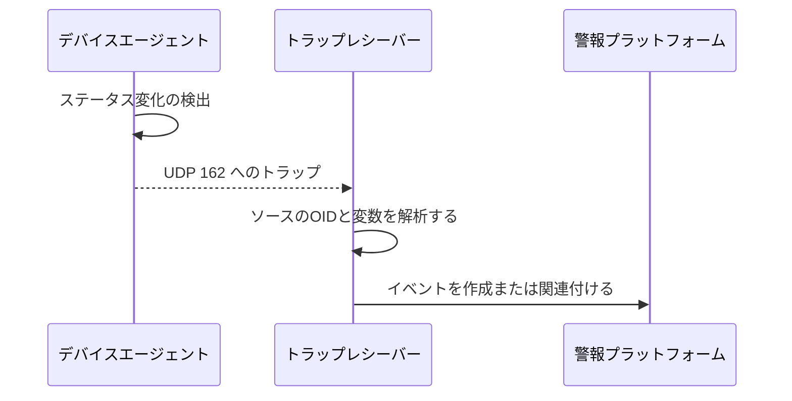

# SNMP Trapのイベントパス

デバイスは変更を検出すると、イベントを一般的な UDP 162 レシーバーに積極的に送信します。

## 重要ポイント

- トラップは通常、マネージャのクエリを待たずにデバイスによって事前に発行されます。
- 通常、受信機は UDP 162 をリッスンします。
- メッセージには、デバイス ソース、イベント OID、時間情報、変数バインディングを含めることができます。
- 受信側は解析を担当し、アラート プラットフォームは重複排除、相関、通知を担当します。

---

## 章末クイズ

この章には5問の四択問題があります。

### 第 1 問

SNMP Trapの主な機能は何ですか?

- A. マネージャーはすべての指標を定期的に読み取ります
- B. デバイスは、変更を検出した後、積極的にイベントを送信します。
- C. アプリケーションが TCP スリーウェイ ハンドシェイクを完了する
- D. ログサーバークエリデータベース

回答を選んだ後に解答を開く

正解：B. デバイスは、変更を検出した後、積極的にイベントを送信します。

解説：トラップとは、デバイスがパスをアクティブに報告し、次の Manager ポーリングを待たないことを意味します。

### 第 2 問

トラップ生成からアラート生成までの正しい順序は何ですか?

- A. プラットフォームはまずイベントとデバイスを削除し、次にマネージャーに問い合わせます。
- B. 受信者が最初に GET を送信し、その後デバイスが起動します
- C. デバイスは HTTP セッションを確立した後に MIB を書き込みます
- D. デバイスは変更を検出し、トラップを送信し、受信者は解析し、プラットフォーム関連のイベントを送信します

回答を選んだ後に解答を開く

正解：D. デバイスは変更を検出し、トラップを送信し、受信者は解析し、プラットフォーム関連のイベントを送信します

解説：イベントは、デバイスの生成、送信、受信と分析、プラットフォームの処理という複数の段階を通過する必要があります。

### 第 3 問

トラップ受信者は通常どのポートをリッスンしますか?

- A. UDP 162
- B. UDP 161
- C. TCP22
- D. TLS443

回答を選んだ後に解答を開く

正解：A. UDP 162

解説：UDP 162 は、トラップの一般的な受信ポートです。実際の展開では、マッピングとポリシーを確認する必要があります。

### 第 4 問

インターフェイス インデックスを含む linkDown トラップを受信した後、プラットフォームにとって最も合理的なアクションは何ですか?

- A. デバイスを直接削除する
- B. インジケーターの保存を停止する
- C. インターフェイスをマップし、イベントを作成し、GET レビューをトリガーします
- D. インデックスを失敗の原因として扱う

回答を選んだ後に解答を開く

正解：C. インターフェイスをマップし、イベントを作成し、GET レビューをトリガーします

解説：インターフェイス インデックスはオブジェクトを見つけるために使用され、GET は現在のステータスを確認するために使用され、プラットフォームはそれを関連付けて通知します。

### 第 5 問

どういう誤解でしょうか？

- A. トラップにはアプリケーション層の確認がない可能性があります
- B. 通常のトラップを送信した後、受信者がそれを正常に処理したかどうかを確実に知ることができます。
- C. 受信リンク自体を監視する必要がある
- D. トラップはイベントを素早くトリガーするのに適しています

回答を選んだ後に解答を開く

正解：B. 通常のトラップを送信した後、受信者がそれを正常に処理したかどうかを確実に知ることができます。

解説：通常のトラップは確認を待機しないため、送信者はメッセージが到着したか、処理されたかがわからない場合があります。

<!-- QUIZ_DATA_START
{
  "chapter": "13",
  "questions": [
    {
      "id": 1,
      "question": "SNMP Trapの主な機能は何ですか?",
      "options": {
        "A": "マネージャーはすべての指標を定期的に読み取ります",
        "B": "デバイスは、変更を検出した後、積極的にイベントを送信します。",
        "C": "アプリケーションが TCP スリーウェイ ハンドシェイクを完了する",
        "D": "ログサーバークエリデータベース"
      },
      "answer": "B",
      "explanation": "トラップとは、デバイスがパスをアクティブに報告し、次の Manager ポーリングを待たないことを意味します。"
    },
    {
      "id": 2,
      "question": "トラップ生成からアラート生成までの正しい順序は何ですか?",
      "options": {
        "A": "プラットフォームはまずイベントとデバイスを削除し、次にマネージャーに問い合わせます。",
        "B": "受信者が最初に GET を送信し、その後デバイスが起動します",
        "C": "デバイスは HTTP セッションを確立した後に MIB を書き込みます",
        "D": "デバイスは変更を検出し、トラップを送信し、受信者は解析し、プラットフォーム関連のイベントを送信します"
      },
      "answer": "D",
      "explanation": "イベントは、デバイスの生成、送信、受信と分析、プラットフォームの処理という複数の段階を通過する必要があります。"
    },
    {
      "id": 3,
      "question": "トラップ受信者は通常どのポートをリッスンしますか?",
      "options": {
        "A": "UDP 162",
        "B": "UDP 161",
        "C": "TCP22",
        "D": "TLS443"
      },
      "answer": "A",
      "explanation": "UDP 162 は、トラップの一般的な受信ポートです。実際の展開では、マッピングとポリシーを確認する必要があります。"
    },
    {
      "id": 4,
      "question": "インターフェイス インデックスを含む linkDown トラップを受信した後、プラットフォームにとって最も合理的なアクションは何ですか?",
      "options": {
        "A": "デバイスを直接削除する",
        "B": "インジケーターの保存を停止する",
        "C": "インターフェイスをマップし、イベントを作成し、GET レビューをトリガーします",
        "D": "インデックスを失敗の原因として扱う"
      },
      "answer": "C",
      "explanation": "インターフェイス インデックスはオブジェクトを見つけるために使用され、GET は現在のステータスを確認するために使用され、プラットフォームはそれを関連付けて通知します。"
    },
    {
      "id": 5,
      "question": "どういう誤解でしょうか？",
      "options": {
        "A": "トラップにはアプリケーション層の確認がない可能性があります",
        "B": "通常のトラップを送信した後、受信者がそれを正常に処理したかどうかを確実に知ることができます。",
        "C": "受信リンク自体を監視する必要がある",
        "D": "トラップはイベントを素早くトリガーするのに適しています"
      },
      "answer": "B",
      "explanation": "通常のトラップは確認を待機しないため、送信者はメッセージが到着したか、処理されたかがわからない場合があります。"
    }
  ]
}
QUIZ_DATA_END -->
