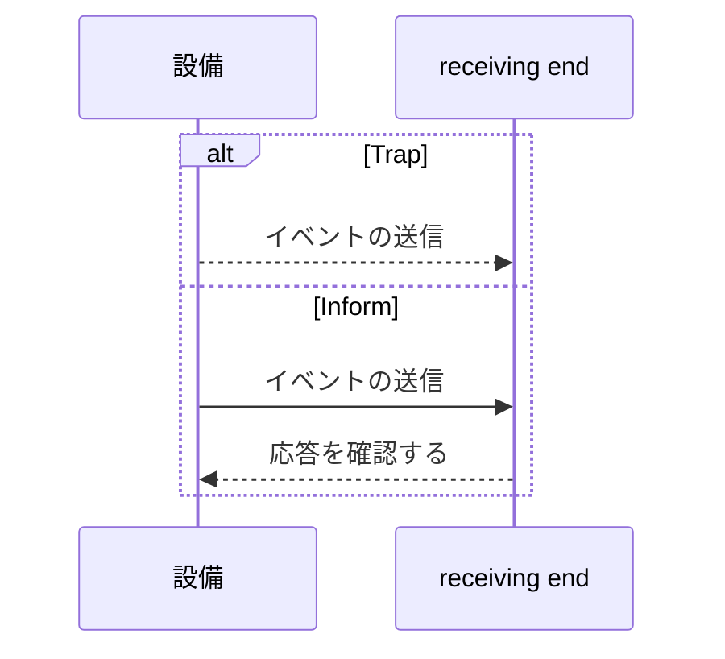

# 罠にかけて知らせる

どちらもイベントを配信しますが、受信確認の処理方法が異なります。

## 重要ポイント

- 通常、トラップは送信後に確認を待機しません。これによりオーバーヘッドは低くなりますが、通知なく失われる可能性があります。
- Inform は受信側からの確認を必要とし、確認されない場合は再試行できます。
- Inform は信頼性が高くなりますが、ステータス、トラフィック、デバイス処理のオーバーヘッドが増加します。
- Inform のサポートは、デバイス、バージョン、構成によって異なります。

---

## 章末クイズ

この章には5問の四択問題があります。

### 第 1 問

Trap と Inform の主な違いは何ですか?

- A. トラップはログテキストのみを転送できます
- B. Inform は受信確認を必要としますが、通常の Trap は通常必要ありません
- C. Inform は CPU の読み取りのみ可能
- D. トラップは TCP 443 を使用する必要があります

回答を選んだ後に解答を開く

正解：B. Inform は受信確認を必要としますが、通常の Trap は通常必要ありません

解説：どちらもイベントを配信できますが、Inform では確認と再試行の可能性が追加されます。

### 第 2 問

Inform の基本的な対話シーケンスは何ですか?

- A. 受信側はまず OID を削除します
- B. デバイスは RST のみを送信します
- C. マネージャーが最初に業務トランザクションを実行します
- D. デバイスは Inform を送信し、受信側は確認を返します。確認が取れない場合は、再試行できます。

回答を選んだ後に解答を開く

正解：D. デバイスは Inform を送信し、受信側は確認を返します。確認が取れない場合は、再試行できます。

解説：確認応答により、送信者は指定された送信が受信されたかどうかを判断できます。

### 第 3 問

プレーントラップの利点は何ですか?

- A. プロセスは軽量で、送信オーバーヘッドが低い
- B. エンドツーエンドのアラート処理が成功したことを確認する
- C. すべてのパフォーマンス傾向を自動的に生成
- D. イベントの嵐を完全に回避する

回答を選んだ後に解答を開く

正解：A. プロセスは軽量で、送信オーバーヘッドが低い

解説：確認を待たないことで Trap は軽量になりますが、サイレントロスのリスクも伴います。

### 第 4 問

イベントの量が多く、デバイスのリソースが限られている場合、Inform を選択する前に何を最も評価する必要がありますか?

- A. Can it replace all Syslog?
- B. MIB定義を変更することはできますか?
- C. 確認と再試行によって発生するデバイスのステータスとトラフィックのオーバーヘッド
- D. ポートを永続的に開いたままにすることはできますか?

回答を選んだ後に解答を開く

正解：C. 確認と再試行によって発生するデバイスのステータスとトラフィックのオーバーヘッド

解説：Inform の信頼性の利点には、確認、ステータス、および再試行のコストが伴います。これらのコストは、特にアラート ストーム時に評価する必要があります。

### 第 5 問

どの記述が間違っていますか?

- A. 指定されたリンクのみがカバーされていることを確認します
- B. Inform が確認を受信すると、その後の解析と通知が失敗しないことが保証されます。
- C. プラットフォーム上での後続の処理は引き続き失敗する可能性があります
- D. どちらの方法でも受信パイプラインの監視が必要です

回答を選んだ後に解答を開く

正解：B. Inform が確認を受信すると、その後の解析と通知が失敗しないことが保証されます。

解説：トランスポートの確認応答は、解析、キューイング、アラート、通知のエンドツーエンドの成功と同等ではありません。

<!-- QUIZ_DATA_START
{
  "chapter": "14",
  "questions": [
    {
      "id": 1,
      "question": "Trap と Inform の主な違いは何ですか?",
      "options": {
        "A": "トラップはログテキストのみを転送できます",
        "B": "Inform は受信確認を必要としますが、通常の Trap は通常必要ありません",
        "C": "Inform は CPU の読み取りのみ可能",
        "D": "トラップは TCP 443 を使用する必要があります"
      },
      "answer": "B",
      "explanation": "どちらもイベントを配信できますが、Inform では確認と再試行の可能性が追加されます。"
    },
    {
      "id": 2,
      "question": "Inform の基本的な対話シーケンスは何ですか?",
      "options": {
        "A": "受信側はまず OID を削除します",
        "B": "デバイスは RST のみを送信します",
        "C": "マネージャーが最初に業務トランザクションを実行します",
        "D": "デバイスは Inform を送信し、受信側は確認を返します。確認が取れない場合は、再試行できます。"
      },
      "answer": "D",
      "explanation": "確認応答により、送信者は指定された送信が受信されたかどうかを判断できます。"
    },
    {
      "id": 3,
      "question": "プレーントラップの利点は何ですか?",
      "options": {
        "A": "プロセスは軽量で、送信オーバーヘッドが低い",
        "B": "エンドツーエンドのアラート処理が成功したことを確認する",
        "C": "すべてのパフォーマンス傾向を自動的に生成",
        "D": "イベントの嵐を完全に回避する"
      },
      "answer": "A",
      "explanation": "確認を待たないことで Trap は軽量になりますが、サイレントロスのリスクも伴います。"
    },
    {
      "id": 4,
      "question": "イベントの量が多く、デバイスのリソースが限られている場合、Inform を選択する前に何を最も評価する必要がありますか?",
      "options": {
        "A": "Can it replace all Syslog?",
        "B": "MIB定義を変更することはできますか?",
        "C": "確認と再試行によって発生するデバイスのステータスとトラフィックのオーバーヘッド",
        "D": "ポートを永続的に開いたままにすることはできますか?"
      },
      "answer": "C",
      "explanation": "Inform の信頼性の利点には、確認、ステータス、および再試行のコストが伴います。これらのコストは、特にアラート ストーム時に評価する必要があります。"
    },
    {
      "id": 5,
      "question": "どの記述が間違っていますか?",
      "options": {
        "A": "指定されたリンクのみがカバーされていることを確認します",
        "B": "Inform が確認を受信すると、その後の解析と通知が失敗しないことが保証されます。",
        "C": "プラットフォーム上での後続の処理は引き続き失敗する可能性があります",
        "D": "どちらの方法でも受信パイプラインの監視が必要です"
      },
      "answer": "B",
      "explanation": "トランスポートの確認応答は、解析、キューイング、アラート、通知のエンドツーエンドの成功と同等ではありません。"
    }
  ]
}
QUIZ_DATA_END -->
