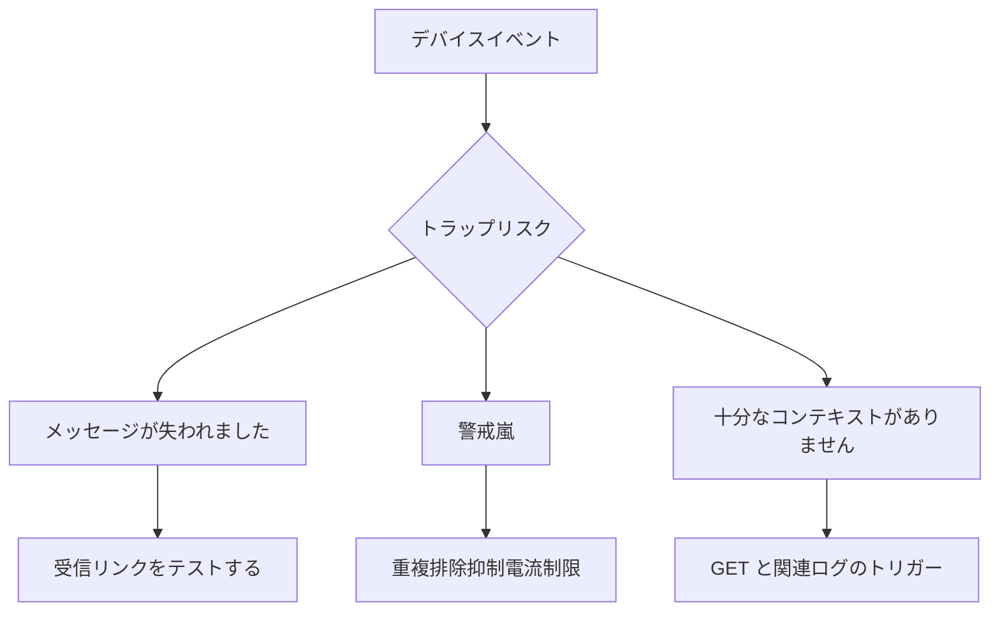

# トラップの喪失、嵐、コンテキストの欠如

即時イベントは貴重ですが、受信リンクは 3 つの典型的なタイプのリスクに直面します。

## 重要ポイント

- UDP トラップはネットワーク上または受信キュー内で失われる可能性があります。
- 多数のイベントが繰り返されると、アラート ストームが発生する可能性があります。
- トラップは結果のみを報告し、原因や現在のステータスを報告しない場合があります。
- リンクの自己チェック、重複排除の抑制、GET レビュー、およびログの関連付けを使用する必要があります。

---

## 章末クイズ

この章には5問の四択問題があります。

### 第 1 問

トラップ 受信リンクに関する 3 つの典型的なリスクは何ですか?

- A. DNS、ページスタイル、画面解像度
- B. メッセージの損失、アラートの嵐、コンテキストの欠如
- C. CPU、メモリ、ディスク容量
- D. 認証、暗号化、証明書のローテーション

回答を選んだ後に解答を開く

正解：B. メッセージの損失、アラートの嵐、コンテキストの欠如

解説：この章では、トラップが到着するかどうか、イベントの量が制御不能であるかどうか、およびメッセージが障害を説明するのに十分であるかどうかに焦点を当てます。

### 第 2 問

トラップリスクに直面した場合の合理的な一連の治療は何ですか?

- A. すべてのデバイスのアラートをオフにする
- B. 電子メール受信者のみを追加する
- C. 各メッセージを個別に最高レベルにアップグレードします
- D. 受信リンクのテスト、重複排除の抑制、GET レビュー、およびログの関連付け

回答を選んだ後に解答を開く

正解：D. 受信リンクのテスト、重複排除の抑制、GET レビュー、およびログの関連付け

解説：リンクの自己チェックは損失を処理し、重複排除の抑制はストーム、GET およびログの補足ステータスと理由を処理します。

### 第 3 問

アラート プラットフォームの重複排除時に何を保持する必要がありますか?

- A. 最初のイベント、繰り返し回数、期間およびステータスの変化
- B. 最後の文字だけを残す
- C. 元のイベントをすべて削除する
- D. 異なるデバイスを同じソースに結合する

回答を選んだ後に解答を開く

正解：A. 最初のイベント、繰り返し回数、期間およびステータスの変化

解説：効果的なノイズ除去では、すべての重複メッセージを単純に破棄するのではなく、イベントの進化の証拠を保存する必要があります。

### 第 4 問

内容の少ない linkDown トラップを受信した場合の最も合理的な補足アクションは何ですか?

- A. デバイスの電源がオフになっていることを直接判断します
- B. インターフェース監視を停止する
- C. 関連する OID の GET を実行し、同じデバイスの Syslog を取得します。
- D. アラートの色のみを変更する

回答を選んだ後に解答を開く

正解：C. 関連する OID の GET を実行し、同じデバイスの Syslog を取得します。

解説：GET は現在のステータスを確認し、Syslog は考えられる原因とタイムラインを提供します。

### 第 5 問

どの結論が危険な誤解ですか?

- A. デバイスの電源がオフの場合、送信が遅すぎる可能性があります
- B. トラップが受信されない場合は、デバイスに障害がないことを意味します。
- C. エージェント設定エラーにより沈黙が発生する可能性がある
- D. 受信キューの障害によりメッセージが失われる可能性がある

回答を選んだ後に解答を開く

正解：B. トラップが受信されない場合は、デバイスに障害がないことを意味します。

解説：パッシブ メッセージがないことは、デバイス、構成、ネットワーク、またはプラットフォームから送信される可能性があり、正常性の証拠としては機能しません。

<!-- QUIZ_DATA_START
{
  "chapter": "15",
  "questions": [
    {
      "id": 1,
      "question": "トラップ 受信リンクに関する 3 つの典型的なリスクは何ですか?",
      "options": {
        "A": "DNS、ページスタイル、画面解像度",
        "B": "メッセージの損失、アラートの嵐、コンテキストの欠如",
        "C": "CPU、メモリ、ディスク容量",
        "D": "認証、暗号化、証明書のローテーション"
      },
      "answer": "B",
      "explanation": "この章では、トラップが到着するかどうか、イベントの量が制御不能であるかどうか、およびメッセージが障害を説明するのに十分であるかどうかに焦点を当てます。"
    },
    {
      "id": 2,
      "question": "トラップリスクに直面した場合の合理的な一連の治療は何ですか?",
      "options": {
        "A": "すべてのデバイスのアラートをオフにする",
        "B": "電子メール受信者のみを追加する",
        "C": "各メッセージを個別に最高レベルにアップグレードします",
        "D": "受信リンクのテスト、重複排除の抑制、GET レビュー、およびログの関連付け"
      },
      "answer": "D",
      "explanation": "リンクの自己チェックは損失を処理し、重複排除の抑制はストーム、GET およびログの補足ステータスと理由を処理します。"
    },
    {
      "id": 3,
      "question": "アラート プラットフォームの重複排除時に何を保持する必要がありますか?",
      "options": {
        "A": "最初のイベント、繰り返し回数、期間およびステータスの変化",
        "B": "最後の文字だけを残す",
        "C": "元のイベントをすべて削除する",
        "D": "異なるデバイスを同じソースに結合する"
      },
      "answer": "A",
      "explanation": "効果的なノイズ除去では、すべての重複メッセージを単純に破棄するのではなく、イベントの進化の証拠を保存する必要があります。"
    },
    {
      "id": 4,
      "question": "内容の少ない linkDown トラップを受信した場合の最も合理的な補足アクションは何ですか?",
      "options": {
        "A": "デバイスの電源がオフになっていることを直接判断します",
        "B": "インターフェース監視を停止する",
        "C": "関連する OID の GET を実行し、同じデバイスの Syslog を取得します。",
        "D": "アラートの色のみを変更する"
      },
      "answer": "C",
      "explanation": "GET は現在のステータスを確認し、Syslog は考えられる原因とタイムラインを提供します。"
    },
    {
      "id": 5,
      "question": "どの結論が危険な誤解ですか?",
      "options": {
        "A": "デバイスの電源がオフの場合、送信が遅すぎる可能性があります",
        "B": "トラップが受信されない場合は、デバイスに障害がないことを意味します。",
        "C": "エージェント設定エラーにより沈黙が発生する可能性がある",
        "D": "受信キューの障害によりメッセージが失われる可能性がある"
      },
      "answer": "B",
      "explanation": "パッシブ メッセージがないことは、デバイス、構成、ネットワーク、またはプラットフォームから送信される可能性があり、正常性の証拠としては機能しません。"
    }
  ]
}
QUIZ_DATA_END -->
