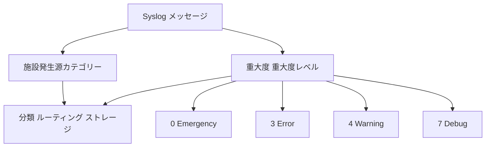

# 設備と重大度

Facility はソース カテゴリを表し、Severity は重大度レベルを表し、両方ともログのルーティングに役立ちます。

## 重要ポイント

- 重大度の値の範囲は 0 ～ 7 で、一般に値が低いほど重大になります。
- 0 は緊急、3 はエラー、4 は警告、7 はデバッグです。
- 機能は、カーネル、メール、ローカル カスタマイズなどのソース カテゴリを区別するために使用されます。
- 本番環境のアラートでは、重大度だけを考慮するだけでなく、設備、イベント、業務への影響も考慮する必要があります。

---

## 章末クイズ

この章には5問の四択問題があります。

### 第 1 問

Syslog 重大度の数値と重大度との一般的な関係は何ですか?

- A. 数字が大きいほど深刻です
- B. 通常、数値が低いほど深刻です
- C. すべての数値の重大度は同じです
- D. 1 と 2 のみが許可されます

回答を選んだ後に解答を開く

正解：B. 通常、数値が低いほど深刻です

解説：重大度の範囲は 0 ～ 7 で、0 が最も重大で、7 は通常デバッグに使用されます。

### 第 2 問

プラットフォームに入った後、ファシリティと重大度は通常どのように使用されますか?

- A. TCP ハンドシェイクを一緒に確立する
- B. 代替デバイスアドレス
- C. 根本原因を自動的に証明
- D. ソース カテゴリと重大度レベルを組み合わせて、分類、ルーティング、および保管を行う

回答を選んだ後に解答を開く

正解：D. ソース カテゴリと重大度レベルを組み合わせて、分類、ルーティング、および保管を行う

解説：Facility は送信元カテゴリを提供し、Severity は送信者タグのレベルを提供します。どちらも処理戦略を支援します。

### 第 3 問

施設とは主に何を意味しますか?

- A. ログソースのカテゴリ
- B. 特定のデバイスはオンラインですか?
- C. ポートが接続を確立するかどうか
- D. SNMPユーザーのパスワード

回答を選んだ後に解答を開く

正解：A. ログソースのカテゴリ

解説：機能は、カーネル、メール、ローカル カスタマイズなどのソース カテゴリを区別するために使用され、ホスト ID と同等ではありません。

### 第 4 問

デバイスは、影響の少ないイベントをエラーとしてマークします。プラットフォームはそれをどのように処理すべきでしょうか?

- A. 無条件に最高レベルのアラートをトリガーします
- B. このデバイスのすべてのログを削除します
- C. インシデントの種類、資産、業務への影響に基づいて優先順位を再マッピングする
- D. エラーをデバッグとして扱う

回答を選んだ後に解答を開く

正解：C. インシデントの種類、資産、業務への影響に基づいて優先順位を再マッピングする

解説：送信者の重大度が入力であり、最終的なアラートの優先順位は組織のリスクおよび業務 モデルと一致する必要があります。

### 第 5 問

どの理解が間違っていますか?

- A. 通常、0 は 7 よりも深刻です
- B. 重大度がエラーの場合は、当直担当者を直ちに起こす必要があります。
- C. プラットフォームは元のレベルを保持する必要があります
- D. 最後の優先事項では、業務への影響も考慮します

回答を選んだ後に解答を開く

正解：B. 重大度がエラーの場合は、当直担当者を直ちに起こす必要があります。

解説：ログ レベルは自動的に職務ポリシーと等しくなるわけではないため、コンテキストおよび組織のルールと組み合わせる必要があります。

<!-- QUIZ_DATA_START
{
  "chapter": "17",
  "questions": [
    {
      "id": 1,
      "question": "Syslog 重大度の数値と重大度との一般的な関係は何ですか?",
      "options": {
        "A": "数字が大きいほど深刻です",
        "B": "通常、数値が低いほど深刻です",
        "C": "すべての数値の重大度は同じです",
        "D": "1 と 2 のみが許可されます"
      },
      "answer": "B",
      "explanation": "重大度の範囲は 0 ～ 7 で、0 が最も重大で、7 は通常デバッグに使用されます。"
    },
    {
      "id": 2,
      "question": "プラットフォームに入った後、ファシリティと重大度は通常どのように使用されますか?",
      "options": {
        "A": "TCP ハンドシェイクを一緒に確立する",
        "B": "代替デバイスアドレス",
        "C": "根本原因を自動的に証明",
        "D": "ソース カテゴリと重大度レベルを組み合わせて、分類、ルーティング、および保管を行う"
      },
      "answer": "D",
      "explanation": "Facility は送信元カテゴリを提供し、Severity は送信者タグのレベルを提供します。どちらも処理戦略を支援します。"
    },
    {
      "id": 3,
      "question": "施設とは主に何を意味しますか?",
      "options": {
        "A": "ログソースのカテゴリ",
        "B": "特定のデバイスはオンラインですか?",
        "C": "ポートが接続を確立するかどうか",
        "D": "SNMPユーザーのパスワード"
      },
      "answer": "A",
      "explanation": "機能は、カーネル、メール、ローカル カスタマイズなどのソース カテゴリを区別するために使用され、ホスト ID と同等ではありません。"
    },
    {
      "id": 4,
      "question": "デバイスは、影響の少ないイベントをエラーとしてマークします。プラットフォームはそれをどのように処理すべきでしょうか?",
      "options": {
        "A": "無条件に最高レベルのアラートをトリガーします",
        "B": "このデバイスのすべてのログを削除します",
        "C": "インシデントの種類、資産、業務への影響に基づいて優先順位を再マッピングする",
        "D": "エラーをデバッグとして扱う"
      },
      "answer": "C",
      "explanation": "送信者の重大度が入力であり、最終的なアラートの優先順位は組織のリスクおよび業務 モデルと一致する必要があります。"
    },
    {
      "id": 5,
      "question": "どの理解が間違っていますか?",
      "options": {
        "A": "通常、0 は 7 よりも深刻です",
        "B": "重大度がエラーの場合は、当直担当者を直ちに起こす必要があります。",
        "C": "プラットフォームは元のレベルを保持する必要があります",
        "D": "最後の優先事項では、業務への影響も考慮します"
      },
      "answer": "B",
      "explanation": "ログ レベルは自動的に職務ポリシーと等しくなるわけではないため、コンテキストおよび組織のルールと組み合わせる必要があります。"
    }
  ]
}
QUIZ_DATA_END -->
