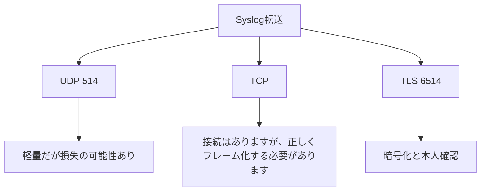

# Syslog 用の UDP、TCP、および TLS

送信方法は、信頼性、オーバーヘッド、機密性に影響します。

## 重要ポイント

- 従来の UDP Syslog は、軽量ではあるものの配信保証のない 514 を使用することがよくあります。
- TCP は接続トランスポートを提供しますが、アプリケーションはメッセージのフレーム化と再接続を正しく処理する必要があります。
- TLS 上の Syslog は多くの場合、送信を保護し、ID 検証をサポートする 6514 を使用します。
- ポートは一般的な値であり、実際の環境ではマッピングまたはポリシーを通じて調整できます。

---

## 章末クイズ

この章には5問の四択問題があります。

### 第 1 問

従来の UDP Syslog に一般的に使用されるポートはどれですか?

- A. UDP 161
- B. UDP 514
- C. UDP 162
- D. TCP 5432

回答を選んだ後に解答を開く

正解：B. UDP 514

解説：514 は従来の Syslog の一般的なポートであり、実際の環境で構成を確認する必要があります。

### 第 2 問

3 つの Syslog トランスポートの正しい比較はどれですか?

- A. UDP 保証された配信、TCP コネクションレス、TLS 非暗号化
- B. 3 つの唯一の違いはポートです
- C. TLS は SNMP OID のみを送信できます
- D. UDP は軽量ですが失われる可能性があり、TCP には接続があり、TLS には暗号化と ID 検証が追加されます。

回答を選んだ後に解答を開く

正解：D. UDP は軽量ですが失われる可能性があり、TCP には接続があり、TLS には暗号化と ID 検証が追加されます。

解説：転送方法は、配信特性、状態のオーバーヘッド、およびセキュリティ保護に影響します。

### 第 3 問

TCP Syslog に依然としてメッセージ フレーム ルールが必要なのはなぜですか?

- A. TCP はバイト ストリームであるため、各ログの境界を明確に定義する必要があります。
- B. TCP ではテキスト送信が許可されていません
- C. TCP は改行を自動的に削除します
- D. TCP は固定長の OID のみをサポートします

回答を選んだ後に解答を開く

正解：A. TCP はバイト ストリームであるため、各ログの境界を明確に定義する必要があります。

解説：接続された送信は、メッセージの境界を自動的に認識することを意味するものではありません。送信側と受信側の両方が一貫したフレーミングを使用する必要があります。

### 第 4 問

ログに機密の監査情報が含まれており、デバイスがそれをサポートしている場合、最初に何を評価する必要がありますか?

- A. UDP 514 をすべてのソースに公開する
- B. ログをTCP Pingへ変更する
- C. TLS 経由の Syslog と証明書管理
- D. 本人確認をオフにする

回答を選んだ後に解答を開く

正解：C. TLS 経由の Syslog と証明書管理

解説：TLS は伝送を保護し、ID 検証をサポートしますが、証明書のローテーションと障害の監視を必要とします。

### 第 5 問

どの記述が間違っていますか?

- A. 接続が中断されてもギャップが生じる可能性がある
- B. TCP を使用した後でもログが失われることはありません
- C. 受信アプリケーションに障害が発生した場合でもメッセージが失われる可能性があります
- D. キューとキャッシュを監視する必要がある

回答を選んだ後に解答を開く

正解：B. TCP を使用した後でもログが失われることはありません

解説：TCP は伝送特性を改善しますが、送信アプリケーションから最終ストレージまでのリンク全体が決して失われないことを保証するものではありません。

<!-- QUIZ_DATA_START
{
  "chapter": "18",
  "questions": [
    {
      "id": 1,
      "question": "従来の UDP Syslog に一般的に使用されるポートはどれですか?",
      "options": {
        "A": "UDP 161",
        "B": "UDP 514",
        "C": "UDP 162",
        "D": "TCP 5432"
      },
      "answer": "B",
      "explanation": "514 は従来の Syslog の一般的なポートであり、実際の環境で構成を確認する必要があります。"
    },
    {
      "id": 2,
      "question": "3 つの Syslog トランスポートの正しい比較はどれですか?",
      "options": {
        "A": "UDP 保証された配信、TCP コネクションレス、TLS 非暗号化",
        "B": "3 つの唯一の違いはポートです",
        "C": "TLS は SNMP OID のみを送信できます",
        "D": "UDP は軽量ですが失われる可能性があり、TCP には接続があり、TLS には暗号化と ID 検証が追加されます。"
      },
      "answer": "D",
      "explanation": "転送方法は、配信特性、状態のオーバーヘッド、およびセキュリティ保護に影響します。"
    },
    {
      "id": 3,
      "question": "TCP Syslog に依然としてメッセージ フレーム ルールが必要なのはなぜですか?",
      "options": {
        "A": "TCP はバイト ストリームであるため、各ログの境界を明確に定義する必要があります。",
        "B": "TCP ではテキスト送信が許可されていません",
        "C": "TCP は改行を自動的に削除します",
        "D": "TCP は固定長の OID のみをサポートします"
      },
      "answer": "A",
      "explanation": "接続された送信は、メッセージの境界を自動的に認識することを意味するものではありません。送信側と受信側の両方が一貫したフレーミングを使用する必要があります。"
    },
    {
      "id": 4,
      "question": "ログに機密の監査情報が含まれており、デバイスがそれをサポートしている場合、最初に何を評価する必要がありますか?",
      "options": {
        "A": "UDP 514 をすべてのソースに公開する",
        "B": "ログをTCP Pingへ変更する",
        "C": "TLS 経由の Syslog と証明書管理",
        "D": "本人確認をオフにする"
      },
      "answer": "C",
      "explanation": "TLS は伝送を保護し、ID 検証をサポートしますが、証明書のローテーションと障害の監視を必要とします。"
    },
    {
      "id": 5,
      "question": "どの記述が間違っていますか?",
      "options": {
        "A": "接続が中断されてもギャップが生じる可能性がある",
        "B": "TCP を使用した後でもログが失われることはありません",
        "C": "受信アプリケーションに障害が発生した場合でもメッセージが失われる可能性があります",
        "D": "キューとキャッシュを監視する必要がある"
      },
      "answer": "B",
      "explanation": "TCP は伝送特性を改善しますが、送信アプリケーションから最終ストレージまでのリンク全体が決して失われないことを保証するものではありません。"
    }
  ]
}
QUIZ_DATA_END -->
