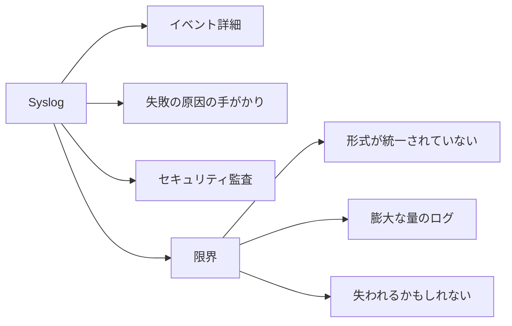

# Syslog の価値と制限

Syslog はイベントを説明するのに優れていますが、標準化されたメトリクスや絶対的な真実と当然同等であるわけではありません。

## 重要ポイント

- Syslog は、ログイン、設定、インターフェイス、ルーティング、ACL、再起動、およびアプリケーション エラーをログに記録します。
- 詳細なタイムラインと監査チェーンを確立するのに適しています。
- 形式の違いにより、解析と正規化のコストが増加します。
- ログがないことはデバイスが正常であることを意味するものではなく、ログの内容も相互検証する必要があります。

---

## 章末クイズ

この章には5問の四択問題があります。

### 第 1 問

純粋なステータス インジケーターと比較して、Syslog の最も優れた値は何ですか?

- A. すべての業務検出を自動的に完了
- B. インシデントの詳細、原因の手がかり、および監査のコンテキストを提供します
- C. 各ログの形式が一貫していることを確認する
- D. TCPハンドシェイク遅延の直接測定

回答を選んだ後に解答を開く

正解：B. インシデントの詳細、原因の手がかり、および監査のコンテキストを提供します

解説：ログを記録することで、イベントの経過を説明し、障害のタイムラインとセキュリティ監査をサポートできます。

### 第 2 問

回復可能な障害タイムラインを確立するための合理的なプロセスは何ですか?

- A. 最新のログのみを保存する
- B. 時間フィールドを削除する
- C. すべてのホスト名を同じ値に変更する
- D. 受付の一元化、時刻の統一、フィールドの解析、デバイスとイベントごとの関連付け

回答を選んだ後に解答を開く

正解：D. 受付の一元化、時刻の統一、フィールドの解析、デバイスとイベントごとの関連付け

解説：時間の一貫性、フィールドの解像度、ソースの相関関係は、信頼できるタイムラインの基礎となります。

### 第 3 問

大量のデータに直面した場合、ロギング プラットフォームはどのような責任を負う必要がありますか?

- A. 受信スループット、ストレージ保持を制御し、ドロップとバックログを監視します
- B. すべてのイベントのログ記録を停止するようにデバイスに指示します
- C. すべてのログを 1 つの TCP 検出に置き換えます
- D. ディスクとキューの容量を無視する

回答を選んだ後に解答を開く

正解：A. 受信スループット、ストレージ保持を制御し、ドロップとバックログを監視します

解説：大量のログには、ノイズによる重要なイベントのマスキングを避けるために、容量、保持、およびパイプラインの健全性管理が必要です。

### 第 4 問

一定期間デバイスログがありませんが、TCP の検出に失敗します。正しい判断とは何でしょうか？

- A. ログが無いので機器は正常なはずです。
- B. TCP 障害は誤検知である必要があります
- C. ログ沈黙は健康を証明するものではありません。送信リンクと受信リンクを引き続き確認する必要があります。
- D. このデバイス資産をすぐに削除します

回答を選んだ後に解答を開く

正解：C. ログ沈黙は健康を証明するものではありません。送信リンクと受信リンクを引き続き確認する必要があります。

解説：送信デバイスの障害、ネットワークの損失、または受信プラットフォームの障害により、ログが沈黙する可能性があります。

### 第 5 問

よくある誤解はどれですか?

- A. 元のメッセージを保持する
- B. 送信者のログの内容を検証せずに絶対的な事実として扱う
- C. GET と TCP による相互検証
- D. ベンダー形式の違いを特定する

回答を選んだ後に解答を開く

正解：B. 送信者のログの内容を検証せずに絶対的な事実として扱う

解説：ログは送信者の視点からのものであり、欠落、不正確な時間、または誤った分類が含まれている可能性があり、他の証拠によって検証する必要があります。

<!-- QUIZ_DATA_START
{
  "chapter": "19",
  "questions": [
    {
      "id": 1,
      "question": "純粋なステータス インジケーターと比較して、Syslog の最も優れた値は何ですか?",
      "options": {
        "A": "すべての業務検出を自動的に完了",
        "B": "インシデントの詳細、原因の手がかり、および監査のコンテキストを提供します",
        "C": "各ログの形式が一貫していることを確認する",
        "D": "TCPハンドシェイク遅延の直接測定"
      },
      "answer": "B",
      "explanation": "ログを記録することで、イベントの経過を説明し、障害のタイムラインとセキュリティ監査をサポートできます。"
    },
    {
      "id": 2,
      "question": "回復可能な障害タイムラインを確立するための合理的なプロセスは何ですか?",
      "options": {
        "A": "最新のログのみを保存する",
        "B": "時間フィールドを削除する",
        "C": "すべてのホスト名を同じ値に変更する",
        "D": "受付の一元化、時刻の統一、フィールドの解析、デバイスとイベントごとの関連付け"
      },
      "answer": "D",
      "explanation": "時間の一貫性、フィールドの解像度、ソースの相関関係は、信頼できるタイムラインの基礎となります。"
    },
    {
      "id": 3,
      "question": "大量のデータに直面した場合、ロギング プラットフォームはどのような責任を負う必要がありますか?",
      "options": {
        "A": "受信スループット、ストレージ保持を制御し、ドロップとバックログを監視します",
        "B": "すべてのイベントのログ記録を停止するようにデバイスに指示します",
        "C": "すべてのログを 1 つの TCP 検出に置き換えます",
        "D": "ディスクとキューの容量を無視する"
      },
      "answer": "A",
      "explanation": "大量のログには、ノイズによる重要なイベントのマスキングを避けるために、容量、保持、およびパイプラインの健全性管理が必要です。"
    },
    {
      "id": 4,
      "question": "一定期間デバイスログがありませんが、TCP の検出に失敗します。正しい判断とは何でしょうか？",
      "options": {
        "A": "ログが無いので機器は正常なはずです。",
        "B": "TCP 障害は誤検知である必要があります",
        "C": "ログ沈黙は健康を証明するものではありません。送信リンクと受信リンクを引き続き確認する必要があります。",
        "D": "このデバイス資産をすぐに削除します"
      },
      "answer": "C",
      "explanation": "送信デバイスの障害、ネットワークの損失、または受信プラットフォームの障害により、ログが沈黙する可能性があります。"
    },
    {
      "id": 5,
      "question": "よくある誤解はどれですか?",
      "options": {
        "A": "元のメッセージを保持する",
        "B": "送信者のログの内容を検証せずに絶対的な事実として扱う",
        "C": "GET と TCP による相互検証",
        "D": "ベンダー形式の違いを特定する"
      },
      "answer": "B",
      "explanation": "ログは送信者の視点からのものであり、欠落、不正確な時間、または誤った分類が含まれている可能性があり、他の証拠によって検証する必要があります。"
    }
  ]
}
QUIZ_DATA_END -->
