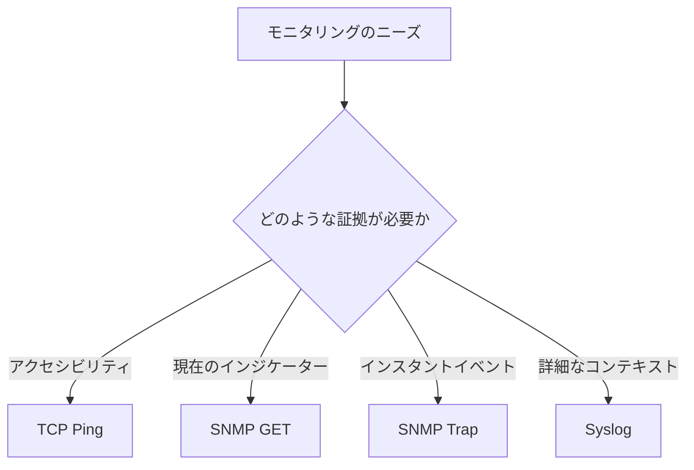

# 4 つの方法の統一比較

方向性、データ、リアルタイムおよび診断機能を備えた選択フレームワークを構築します。

## 重要ポイント

- TCP Ping はサービス ポートをアクティブにチェックし、データは主に成功、失敗、遅延です。
- SNMP GET は、ステータスと傾向に適した構造化された OID をアクティブにポーリングします。
- SNMP Trap は構造化イベントを受動的に受信します。このイベントは高いリアルタイム パフォーマンスを備えていますが、失われる可能性があります。
- Syslog は、強力な診断詳細を含むログを受動的に受信しますが、形式とデータ量はより複雑です。

## 解説のポイント

| 方法 | 方向 | 一般的なポート | ベストアンサー |
| --- | --- | --- | --- |
| TCP Ping | 監視側からターゲットへ | 対象事業港 | ポートは接続できますか？ |
| SNMP GET | マネージャーからエージェントへ | UDP 161 | 現状と傾向 |
| SNMP Trap | デバイスから受信側へ | UDP 162 | 何が起こったのか |
| Syslog | ログを終了するデバイス | 514 または TLS 6514 | イベントの詳細と理由 |

---

## 章末クイズ

この章には5問の四択問題があります。

### 第 1 問

構造化されたステータスを継続的に取得し、傾向をプロットするには、どのアプローチが最適ですか?

- A. TCP Ping
- B. SNMP GET
- C. SNMP Trap
- D. Syslog

回答を選んだ後に解答を開く

正解：B. SNMP GET

解説：GET サイクルは OID 値を読み取ります。これは、履歴の保存や傾向の計算に適しています。

### 第 2 問

要件から証拠の種類を選択するための正しいマッピングは何ですか?

- A. 到達可能性にはログ、インジケーターには TCP、イベントには GET、コンテキストにはトラップを使用します。
- B. 4 つの要件はすべて TCP のみを使用します
- C. 4 つの要件はすべて Syslog のみを使用します
- D. 到達可能性には TCP、現在のメトリクスには GET、即時のイベントにはトラップ、詳細なコンテキストには Syslog を使用します。

回答を選んだ後に解答を開く

正解：D. 到達可能性には TCP、現在のメトリクスには GET、即時のイベントにはトラップ、詳細なコンテキストには Syslog を使用します。

解説：まず、回答する必要がある質問を明確にしてから、その質問に最適なコミュニケーション方法を選択する必要があります。

### 第 3 問

主に成功、失敗、遅延を引き起こす方法はどれですか?

- A. TCP Ping
- B. SNMP GET
- C. SNMP Trap
- D. Syslog

回答を選んだ後に解答を開く

正解：A. TCP Ping

解説：TCP 検出結果は、ポートの接続性と応答時間に重点を置いており、デバイスの内部インジケーターを直接提供するものではありません。

### 第 4 問

変化を素早く検出し、現在の状態を確認するにはどのような組み合わせを使用する必要がありますか?

- A. ログの保存期間のみを短縮します
- B. すべての OID を TCP に置き換えます
- C. トラップトリガーSNMP GET
- D. 次回の手動検査を待っています

回答を選んだ後に解答を開く

正解：C. トラップトリガーSNMP GET

解説：Trap は適時性を提供し、GET は繰り返し確認可能な現在の状態を提供します。

### 第 5 問

一般的なポートに関して正しい理解はどれですか?

- A. すべてのデバイスは永久に固定されており、変更することはできません
- B. これらは一般的なデフォルトであり、実際のポートとマッピングは環境に照らして確認する必要があります。
- C. ポート番号はプロトコルのセキュリティを証明できます
- D. ポートがわかればファイアウォールをチェックする必要がなくなります

回答を選んだ後に解答を開く

正解：B. これらは一般的なデフォルトであり、実際のポートとマッピングは環境に照らして確認する必要があります。

解説：161、162、514、および 6514 は一般的な値であり、運用環境ではマッピングとポリシーが異なる場合があります。

<!-- QUIZ_DATA_START
{
  "chapter": "20",
  "questions": [
    {
      "id": 1,
      "question": "構造化されたステータスを継続的に取得し、傾向をプロットするには、どのアプローチが最適ですか?",
      "options": {
        "A": "TCP Ping",
        "B": "SNMP GET",
        "C": "SNMP Trap",
        "D": "Syslog"
      },
      "answer": "B",
      "explanation": "GET サイクルは OID 値を読み取ります。これは、履歴の保存や傾向の計算に適しています。"
    },
    {
      "id": 2,
      "question": "要件から証拠の種類を選択するための正しいマッピングは何ですか?",
      "options": {
        "A": "到達可能性にはログ、インジケーターには TCP、イベントには GET、コンテキストにはトラップを使用します。",
        "B": "4 つの要件はすべて TCP のみを使用します",
        "C": "4 つの要件はすべて Syslog のみを使用します",
        "D": "到達可能性には TCP、現在のメトリクスには GET、即時のイベントにはトラップ、詳細なコンテキストには Syslog を使用します。"
      },
      "answer": "D",
      "explanation": "まず、回答する必要がある質問を明確にしてから、その質問に最適なコミュニケーション方法を選択する必要があります。"
    },
    {
      "id": 3,
      "question": "主に成功、失敗、遅延を引き起こす方法はどれですか?",
      "options": {
        "A": "TCP Ping",
        "B": "SNMP GET",
        "C": "SNMP Trap",
        "D": "Syslog"
      },
      "answer": "A",
      "explanation": "TCP 検出結果は、ポートの接続性と応答時間に重点を置いており、デバイスの内部インジケーターを直接提供するものではありません。"
    },
    {
      "id": 4,
      "question": "変化を素早く検出し、現在の状態を確認するにはどのような組み合わせを使用する必要がありますか?",
      "options": {
        "A": "ログの保存期間のみを短縮します",
        "B": "すべての OID を TCP に置き換えます",
        "C": "トラップトリガーSNMP GET",
        "D": "次回の手動検査を待っています"
      },
      "answer": "C",
      "explanation": "Trap は適時性を提供し、GET は繰り返し確認可能な現在の状態を提供します。"
    },
    {
      "id": 5,
      "question": "一般的なポートに関して正しい理解はどれですか?",
      "options": {
        "A": "すべてのデバイスは永久に固定されており、変更することはできません",
        "B": "これらは一般的なデフォルトであり、実際のポートとマッピングは環境に照らして確認する必要があります。",
        "C": "ポート番号はプロトコルのセキュリティを証明できます",
        "D": "ポートがわかればファイアウォールをチェックする必要がなくなります"
      },
      "answer": "B",
      "explanation": "161、162、514、および 6514 は一般的な値であり、運用環境ではマッピングとポリシーが異なる場合があります。"
    }
  ]
}
QUIZ_DATA_END -->
