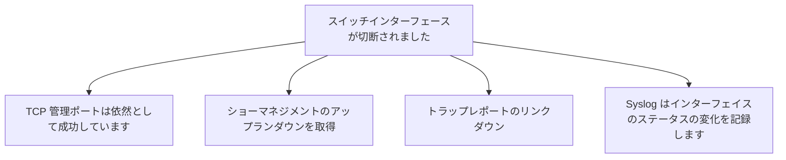

# インターフェース切断時の4つの証拠

同じインターフェイス障害が 4 つの監視方法で異なる証拠として表示されます。

## 重要ポイント

- TCP 22 または 443 が成功した場合は、スイッチ管理プレーンがまだ到達可能であることのみを示します。
- ifAdminStatus が up で、ifOperStatus down の場合は、有効になっているが実際には切断されていることを意味します。
- linkDown Trap は、インターフェイス インデックスをすぐに指摘します。
- Syslog は、インターフェイス名、プロトコル ステータス、およびより詳細なコンテキストを提供します。

---

## 章末クイズ

この章には5問の四択問題があります。

### 第 1 問

インターフェイスがダウンしているときに TCP 22 または 443 が引き続き成功する場合、それは何を意味しますか?

- A. すべての業務 インターフェイスは正常です
- B. スイッチ管理プレーンは監視ポイントから引き続き到達可能です
- C. アップリンクリンクに障害はありません
- D. 下流業務が利用可能である必要がある

回答を選んだ後に解答を開く

正解：B. スイッチ管理プレーンは監視ポイントから引き続き到達可能です

解説：管理ポートが管理パスを正常にカバーしても、障害が発生したサービス インターフェイスが正常であるとは限りません。

### 第 2 問

インターフェイス障害の証拠の組み合わせの合理的な順序は何ですか?

- A. まずトラップを無視してからログを削除します
- B. TCP が根本原因を自動的に示すまで待つだけです
- C. 重大度を使用してインターフェイスのステータスを置き換えます
- D. トラップクイック通知、GET 確認ステータス、Syslog 補足コンテキスト、TCP 検証の影響

回答を選んだ後に解答を開く

正解：D. トラップクイック通知、GET 確認ステータス、Syslog 補足コンテキスト、TCP 検証の影響

解説：4 つの信号はそれぞれ、迅速な発見、ステータスの確認、原因の説明、および影響の境界設定を完了します。

### 第 3 問

AdminStatus がアップで、OperStatus がダウンの場合は何を意味しますか?

- A. インターフェイスは構成され有効になっていますが、実際の動作リンクが切断されています
- B. インターフェイスは管理者によってシャットダウンされ、正常に動作しています
- C. 機器全体の電源を切る必要があります
- D. ログレシーバーが起動されていません

回答を選んだ後に解答を開く

正解：A. インターフェイスは構成され有効になっていますが、実際の動作リンクが切断されています

解説：管理状態は構成の意図を表し、動作状態は実際のリンクを表します。

### 第 4 問

linkDown を受け取りましたが、インターフェイス インデックスは 5 です。読みやすさと信頼性を向上させるための次のステップは何ですか?

- A. インデックス 5 をエラーコードとして扱う
- B. デバイスのCPUのみを確認してください
- C. Map interface names and perform GET review
- D. インターフェーステーブルを無視する

回答を選んだ後に解答を開く

正解：C. Map interface names and perform GET review

解説：インデックスは特定のインターフェイスにマッピングする必要があり、現在の管理および動作ステータスを確認するために GET が使用されます。

### 第 5 問

どの結論が拡大解釈になりますか?

- A. 管理プレーンと業務 インターフェイスは異なる場合があります
- B. スイッチ管理ポートは接続できるため、デバイス全体のすべてのインターフェイスとサービスは正常です。
- C. Syslog はインターフェイス コンテキストを提供します
- D. 複数信号相関により診断機能が向上

回答を選んだ後に解答を開く

正解：B. スイッチ管理ポートは接続できるため、デバイス全体のすべてのインターフェイスとサービスは正常です。

解説：正常な管理ポートは、他のインターフェイス、データ パス、またはダウンストリーム サービスをカバーできません。

<!-- QUIZ_DATA_START
{
  "chapter": "21",
  "questions": [
    {
      "id": 1,
      "question": "インターフェイスがダウンしているときに TCP 22 または 443 が引き続き成功する場合、それは何を意味しますか?",
      "options": {
        "A": "すべての業務 インターフェイスは正常です",
        "B": "スイッチ管理プレーンは監視ポイントから引き続き到達可能です",
        "C": "アップリンクリンクに障害はありません",
        "D": "下流業務が利用可能である必要がある"
      },
      "answer": "B",
      "explanation": "管理ポートが管理パスを正常にカバーしても、障害が発生したサービス インターフェイスが正常であるとは限りません。"
    },
    {
      "id": 2,
      "question": "インターフェイス障害の証拠の組み合わせの合理的な順序は何ですか?",
      "options": {
        "A": "まずトラップを無視してからログを削除します",
        "B": "TCP が根本原因を自動的に示すまで待つだけです",
        "C": "重大度を使用してインターフェイスのステータスを置き換えます",
        "D": "トラップクイック通知、GET 確認ステータス、Syslog 補足コンテキスト、TCP 検証の影響"
      },
      "answer": "D",
      "explanation": "4 つの信号はそれぞれ、迅速な発見、ステータスの確認、原因の説明、および影響の境界設定を完了します。"
    },
    {
      "id": 3,
      "question": "AdminStatus がアップで、OperStatus がダウンの場合は何を意味しますか?",
      "options": {
        "A": "インターフェイスは構成され有効になっていますが、実際の動作リンクが切断されています",
        "B": "インターフェイスは管理者によってシャットダウンされ、正常に動作しています",
        "C": "機器全体の電源を切る必要があります",
        "D": "ログレシーバーが起動されていません"
      },
      "answer": "A",
      "explanation": "管理状態は構成の意図を表し、動作状態は実際のリンクを表します。"
    },
    {
      "id": 4,
      "question": "linkDown を受け取りましたが、インターフェイス インデックスは 5 です。読みやすさと信頼性を向上させるための次のステップは何ですか?",
      "options": {
        "A": "インデックス 5 をエラーコードとして扱う",
        "B": "デバイスのCPUのみを確認してください",
        "C": "Map interface names and perform GET review",
        "D": "インターフェーステーブルを無視する"
      },
      "answer": "C",
      "explanation": "インデックスは特定のインターフェイスにマッピングする必要があり、現在の管理および動作ステータスを確認するために GET が使用されます。"
    },
    {
      "id": 5,
      "question": "どの結論が拡大解釈になりますか?",
      "options": {
        "A": "管理プレーンと業務 インターフェイスは異なる場合があります",
        "B": "スイッチ管理ポートは接続できるため、デバイス全体のすべてのインターフェイスとサービスは正常です。",
        "C": "Syslog はインターフェイス コンテキストを提供します",
        "D": "複数信号相関により診断機能が向上"
      },
      "answer": "B",
      "explanation": "正常な管理ポートは、他のインターフェイス、データ パス、またはダウンストリーム サービスをカバーできません。"
    }
  ]
}
QUIZ_DATA_END -->
