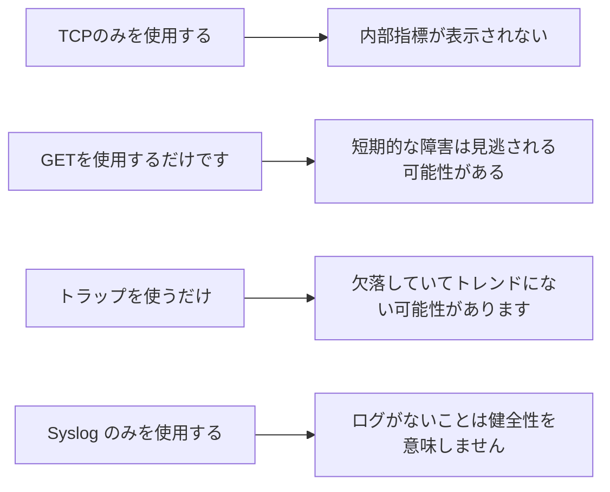

# 1つの監視方法で4種類の死角を実現

各アプローチには、単独では答えられない質問があります。

## 重要ポイント

- TCP は、CPU、メモリ、ファン、および内部インターフェイスのステータスを確認できません。
- GET にはポーリング遅延があり、短期間の例外がサンプリング ギャップ内に収まる可能性があります。
- デバイスの電源が失われると、トラップが失われるか、送信されなくなる場合があります。
- Syslog 形式は均一ではないため、正確なパフォーマンス値を継続的に取得するのには適していません。

---

## 章末クイズ

この章には5問の四択問題があります。

### 第 1 問

TCP のみの監視における主な盲点は何ですか?

- A. ポートの到達可能性を判断できません
- B. CPU、メモリ、ファン、内部インターフェイスのステータスが表示されない
- C. すべてのログが失われます
- D. プローブ遅延をログに記録できません

回答を選んだ後に解答を開く

正解：B. CPU、メモリ、ファン、内部インターフェイスのステータスが表示されない

解説：TCP は外部ポートの到達可能性に優れていますが、デバイスの内部メトリックを直接読み取りません。

### 第 2 問

単一の監視手段とデッドゾーンの正しい組み合わせは何ですか?

- A. GET は即時性を保証し、Trap は傾向を保証し、Syslog は配信を保証します。
- B. TCP はすべての理由を提供し、GET はすべてのサービスを提供します
- C. 4つの手法に死角はない
- D. GET は障害を見逃す可能性があり、トラップは失われる可能性があり、Syslog の沈黙は正常性を意味するものではありません

回答を選んだ後に解答を開く

正解：D. GET は障害を見逃す可能性があり、トラップは失われる可能性があり、Syslog の沈黙は正常性を意味するものではありません

解説：サンプリング、送信、データのセマンティクスは異なり、それぞれのアプローチには明確なギャップがあります。

### 第 3 問

「異常な証拠がないこと」と「正常な証拠が得られること」はなぜ違うのでしょうか?

- A. 前者は監視リンクの沈黙が原因である可能性があり、後者は実際の検査結果に基づいています。
- B. どの場合でもどちらも同じです
- C. 通常の証拠を生成できるのはログだけです
- D. 通常の証拠には期間は必要ありません

回答を選んだ後に解答を開く

正解：A. 前者は監視リンクの沈黙が原因である可能性があり、後者は実際の検査結果に基づいています。

解説：データが欠落している場合は正常に自動的に解釈できず、取得および受信リンクが有効であることを確認する必要があります。

### 第 4 問

デバイスの電源がオフでトラップがない場合、どのような種類の判断を補足するのが最も適切ですか?

- A. 沈黙を通常どおり扱い続ける
- B. 過去の回答解析のみをチェックする
- C. TCP または定期的な GET からの障害証拠を使用して、外部到達不能を確認します
- D. 受信機の電源を切る

回答を選んだ後に解答を開く

正解：C. TCP または定期的な GET からの障害証拠を使用して、外部到達不能を確認します

解説：アクティブ検出は、デバイスの無応答を外部から監視し、パッシブ メッセージを送信できない盲点を埋めることができます。

### 第 5 問

どの設計アイデアが間違っていますか?

- A. 証拠の種類ごとにツールをグループ化する
- B. シンプルなステータス ライトに、発見、根本原因、業務への影響の判断を任せます。
- C. 欠損データと健康データを区別する
- D. Associate multiple signals into events

回答を選んだ後に解答を開く

正解：B. シンプルなステータス ライトに、発見、根本原因、業務への影響の判断を任せます。

解説：単一の信号では状態、原因、結果を確実にカバーすることはできないため、複数の証拠が必要になります。

<!-- QUIZ_DATA_START
{
  "chapter": "22",
  "questions": [
    {
      "id": 1,
      "question": "TCP のみの監視における主な盲点は何ですか?",
      "options": {
        "A": "ポートの到達可能性を判断できません",
        "B": "CPU、メモリ、ファン、内部インターフェイスのステータスが表示されない",
        "C": "すべてのログが失われます",
        "D": "プローブ遅延をログに記録できません"
      },
      "answer": "B",
      "explanation": "TCP は外部ポートの到達可能性に優れていますが、デバイスの内部メトリックを直接読み取りません。"
    },
    {
      "id": 2,
      "question": "単一の監視手段とデッドゾーンの正しい組み合わせは何ですか?",
      "options": {
        "A": "GET は即時性を保証し、Trap は傾向を保証し、Syslog は配信を保証します。",
        "B": "TCP はすべての理由を提供し、GET はすべてのサービスを提供します",
        "C": "4つの手法に死角はない",
        "D": "GET は障害を見逃す可能性があり、トラップは失われる可能性があり、Syslog の沈黙は正常性を意味するものではありません"
      },
      "answer": "D",
      "explanation": "サンプリング、送信、データのセマンティクスは異なり、それぞれのアプローチには明確なギャップがあります。"
    },
    {
      "id": 3,
      "question": "「異常な証拠がないこと」と「正常な証拠が得られること」はなぜ違うのでしょうか?",
      "options": {
        "A": "前者は監視リンクの沈黙が原因である可能性があり、後者は実際の検査結果に基づいています。",
        "B": "どの場合でもどちらも同じです",
        "C": "通常の証拠を生成できるのはログだけです",
        "D": "通常の証拠には期間は必要ありません"
      },
      "answer": "A",
      "explanation": "データが欠落している場合は正常に自動的に解釈できず、取得および受信リンクが有効であることを確認する必要があります。"
    },
    {
      "id": 4,
      "question": "デバイスの電源がオフでトラップがない場合、どのような種類の判断を補足するのが最も適切ですか?",
      "options": {
        "A": "沈黙を通常どおり扱い続ける",
        "B": "過去の回答解析のみをチェックする",
        "C": "TCP または定期的な GET からの障害証拠を使用して、外部到達不能を確認します",
        "D": "受信機の電源を切る"
      },
      "answer": "C",
      "explanation": "アクティブ検出は、デバイスの無応答を外部から監視し、パッシブ メッセージを送信できない盲点を埋めることができます。"
    },
    {
      "id": 5,
      "question": "どの設計アイデアが間違っていますか?",
      "options": {
        "A": "証拠の種類ごとにツールをグループ化する",
        "B": "シンプルなステータス ライトに、発見、根本原因、業務への影響の判断を任せます。",
        "C": "欠損データと健康データを区別する",
        "D": "Associate multiple signals into events"
      },
      "answer": "B",
      "explanation": "単一の信号では状態、原因、結果を確実にカバーすることはできないため、複数の証拠が必要になります。"
    }
  ]
}
QUIZ_DATA_END -->
