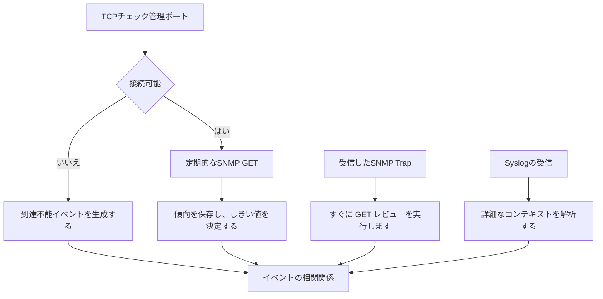

# 推奨されるモニタリング閉ループ

定期的な検出、即時イベント、二次確認、ログの関連付けを完全なプロセスに組み合わせます。

## 重要ポイント

- TCP サイクル チェックは、外部到達可能性の証拠を提供します。
- SNMP GET は、現在のステータスと過去の傾向を保存します。
- トラップが到着した直後に GET がトリガーされ、現在の事実が確認されます。
- Syslog は、デバイスおよび時間ごとに他の信号と相関し、原因と監査情報を補足します。

---

## 章末クイズ

この章には5問の四択問題があります。

### 第 1 問

レコメンデーションのクローズド ループにおいて、トラップが到着した直後の最も重要なアクションは何ですか?

- A. トラップの削除
- B. Perform an SNMP GET to review the current status
- C. 投票を 1 日停止します
- D. 成功通知のみを送信する

回答を選んだ後に解答を開く

正解：B. Perform an SNMP GET to review the current status

解説：Trap は変化の瞬間を表し、GET はイベントが発生した後に現在の事実を確認するために使用されます。

### 第 2 問

完全な監視閉ループへの合理的なパスは何ですか?

- A. アラートなしで収集のみ
- B. 警告のみを発し、回復は確認しません
- C. 各プロトコルは独立して通知され、関連付けられることはありません
- D. 周期的な検出とイベントの受信を統合および関連付けて、アラート、処理、検証リカバリを実行します。

回答を選んだ後に解答を開く

正解：D. 周期的な検出とイベントの受信を統合および関連付けて、アラート、処理、検証リカバリを実行します。

解説：閉ループは検出と検証から始まり、相関と処理を経て、最後に回復を検証する必要があります。

### 第 3 問

イベント相関コンポーネントは主に何を行う必要がありますか?

- A. デバイス、オブジェクト、時間、イベントの種類ごとに複数の証拠を組み合わせる
- B. デバイスの物理配線を変更する
- C. すべてのセキュリティ制御をオーバーライドします
- D. 過去のトレンドを削除する

回答を選んだ後に解答を開く

正解：A. デバイス、オブジェクト、時間、イベントの種類ごとに複数の証拠を組み合わせる

解説：相関では、TCP、GET、トラップ、およびログが結合され、より完全で反復性の少ないイベントになります。

### 第 4 問

同じデバイスから到達不能なイベントと電源ログを受信した場合、プラットフォームにとって最も合理的な行動は何ですか?

- A. 多数の重複アラートを個別に送信する
- B. 電力ログを無視する
- C. 証拠を関連付けて、同じ時間枠で共通の根本原因を評価します
- D. 到達不能をインターフェース流量へ変更する

回答を選んだ後に解答を開く

正解：C. 証拠を関連付けて、同じ時間枠で共通の根本原因を評価します

解説：相関関係により、外部の影響と内部原因の手がかりを組み合わせて、アラートの操作性を向上させることができます。

### 第 5 問

監視の閉ループではないのはどれですか?

- A. トラップトリガーGET
- B. トリガーされた場合にのみ警告が発せられ、修復後にはそれ以上のチェックは実行されません。
- C. ログ参加理由の分析
- D. 復旧後のやり直し状況と業務検証

回答を選んだ後に解答を開く

正解：B. トリガーされた場合にのみ警告が発せられ、修復後にはそれ以上のチェックは実行されません。

解説：回復の検証がなければ、問題が本当に解決されたことを確認する方法がなく、プロセスは終了しません。

<!-- QUIZ_DATA_START
{
  "chapter": "23",
  "questions": [
    {
      "id": 1,
      "question": "レコメンデーションのクローズド ループにおいて、トラップが到着した直後の最も重要なアクションは何ですか?",
      "options": {
        "A": "トラップの削除",
        "B": "Perform an SNMP GET to review the current status",
        "C": "投票を 1 日停止します",
        "D": "成功通知のみを送信する"
      },
      "answer": "B",
      "explanation": "Trap は変化の瞬間を表し、GET はイベントが発生した後に現在の事実を確認するために使用されます。"
    },
    {
      "id": 2,
      "question": "完全な監視閉ループへの合理的なパスは何ですか?",
      "options": {
        "A": "アラートなしで収集のみ",
        "B": "警告のみを発し、回復は確認しません",
        "C": "各プロトコルは独立して通知され、関連付けられることはありません",
        "D": "周期的な検出とイベントの受信を統合および関連付けて、アラート、処理、検証リカバリを実行します。"
      },
      "answer": "D",
      "explanation": "閉ループは検出と検証から始まり、相関と処理を経て、最後に回復を検証する必要があります。"
    },
    {
      "id": 3,
      "question": "イベント相関コンポーネントは主に何を行う必要がありますか?",
      "options": {
        "A": "デバイス、オブジェクト、時間、イベントの種類ごとに複数の証拠を組み合わせる",
        "B": "デバイスの物理配線を変更する",
        "C": "すべてのセキュリティ制御をオーバーライドします",
        "D": "過去のトレンドを削除する"
      },
      "answer": "A",
      "explanation": "相関では、TCP、GET、トラップ、およびログが結合され、より完全で反復性の少ないイベントになります。"
    },
    {
      "id": 4,
      "question": "同じデバイスから到達不能なイベントと電源ログを受信した場合、プラットフォームにとって最も合理的な行動は何ですか?",
      "options": {
        "A": "多数の重複アラートを個別に送信する",
        "B": "電力ログを無視する",
        "C": "証拠を関連付けて、同じ時間枠で共通の根本原因を評価します",
        "D": "到達不能をインターフェース流量へ変更する"
      },
      "answer": "C",
      "explanation": "相関関係により、外部の影響と内部原因の手がかりを組み合わせて、アラートの操作性を向上させることができます。"
    },
    {
      "id": 5,
      "question": "監視の閉ループではないのはどれですか?",
      "options": {
        "A": "トラップトリガーGET",
        "B": "トリガーされた場合にのみ警告が発せられ、修復後にはそれ以上のチェックは実行されません。",
        "C": "ログ参加理由の分析",
        "D": "復旧後のやり直し状況と業務検証"
      },
      "answer": "B",
      "explanation": "回復の検証がなければ、問題が本当に解決されたことを確認する方法がなく、プロセスは終了しません。"
    }
  ]
}
QUIZ_DATA_END -->
